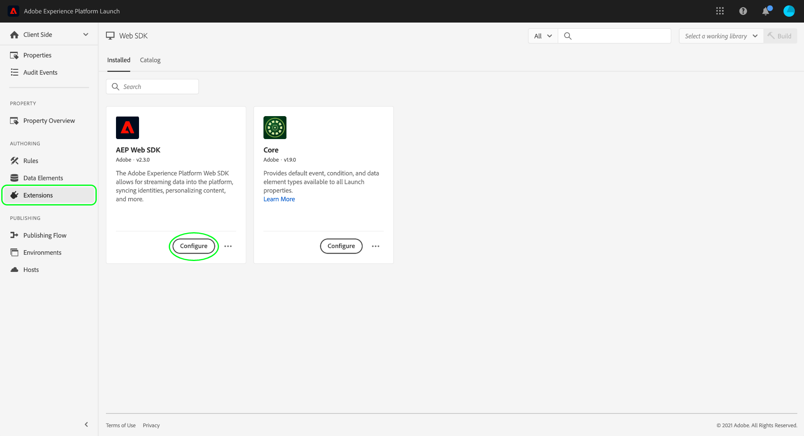
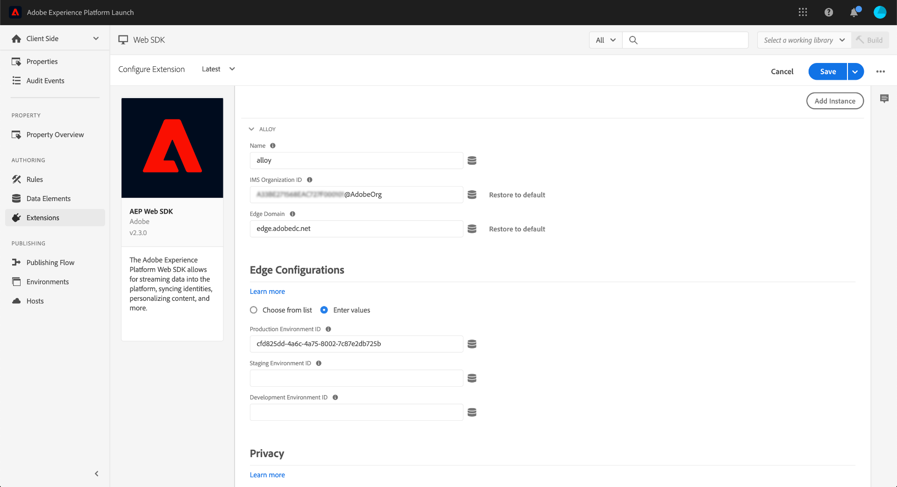
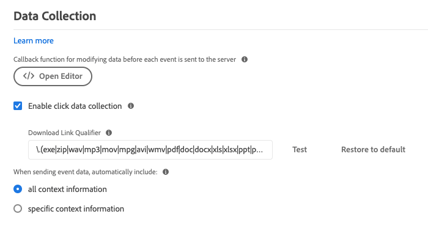

# 設定Adobe Experience Platform Web SDK標籤擴充功能

Adobe Experience Platform Web SDK標籤擴充功能會透過Adobe Experience Cloud Edge Network，將資料從Web屬性傳送至Adobe Experience Platform。 擴充功能可讓您將資料串流至Platform、同步身分、處理客戶同意訊號，以及自動收集內容資料。

本文介紹如何在UI中設定擴充功能。

## 快速入門

如果已經為屬性安裝了Platform Web SDK擴充功能，請在UI中開啟屬性並選取 **[!UICONTROL 擴充功能]** 標籤。 在Platform Web SDK底下，選取 **[!UICONTROL 設定]**.

如果您尚未安裝擴充功能，請選取 **[!UICONTROL 目錄]** 標籤。 從可用擴充功能清單中，找到Platform Web SDK擴充功能，然後選取「 」 **[!UICONTROL 安裝]**.

在這兩種情況下，您都會進入Platform Web SDK的設定頁面。 以下各節將說明擴充功能的設定選項。

## 一般組態選項

頁面頂端的設定選項可告知Adobe Experience Platform將資料路由到何處，以及要在伺服器上使用哪些設定。

### [!UICONTROL 名稱]

Adobe Experience Platform Web SDK擴充功能支援頁面上的多個執行個體。 此名稱可用來透過標籤設定，將資料傳送至多個組織。

擴充功能的名稱預設為&quot;[!DNL alloy]「。 不過您可將例項名稱變更為任何有效的 JavaScript 物件名稱。

### **[!UICONTROL IMS 組織 ID]**

此 [!UICONTROL IMS組織ID] 是您要在Adobe傳送資料的組織。 大部分時間都會使用自動填入的預設值。 頁面上有多個例項時，請找到您要傳送資料的第二個組織，以該組織的值填入此欄位。

### **[!UICONTROL 邊緣網域]**

此 [!UICONTROL 邊緣網域] 是Adobe Experience Platform擴充功能傳送及接收資料的網域。 Adobe建議對此擴充功能使用第一方網域(CNAME)。 預設的第三方網域適用於開發環境，但不適用於生產環境。若需設定第一方 CNAME 的相關說明，請參閱[此處](https://experienceleague.adobe.com/docs/core-services/interface/ec-cookies/cookies-first-party.html?lang=zh-Hant)。

## [!UICONTROL 資料串流]

當請求傳送至Adobe Experience Platform Edge Network時，會使用資料串流ID來參考伺服器端設定。 您可以更新設定，而無須在網站上變更程式碼。

請參閱以下指南： [資料串流](../../../../datastreams/overview.md) 以取得詳細資訊。

## [!UICONTROL 隱私]

此 [!UICONTROL 隱私權] 區段可讓您設定SDK如何處理來自您網站的使用者同意訊號。 具體來說，如果沒有提供其他明確的同意偏好設定，這可讓您選取使用者假設的預設同意等級。 預設同意層級不會儲存到使用者的設定檔。 下表劃分每個選項的涵義：

| [!UICONTROL 預設同意層級] | 說明 |
| --- | --- |
| [!UICONTROL 在] | 收集在使用者提供同意偏好設定之前發生的事件。 |
| [!UICONTROL 輸出] | 捨棄在使用者提供同意偏好設定之前發生的事件。 |
| [!UICONTROL 擱置中] | 在使用者提供同意偏好設定之前發生的佇列事件。 提供同意偏好設定時，系統會根據提供的偏好設定收集或捨棄事件。 |
| [!UICONTROL 資料元素提供] | 預設同意層級是由您定義的個別資料元素所決定。 使用此選項時，您必須使用提供的下拉式選單指定資料元素。 |

如果您的業務操作需要明確的使用者同意，請使用「退出」或「擱置中」。

## [!UICONTROL 身分]

### [!UICONTROL 從VisitorAPI移轉ECID]

此選項已預設啟用。啟用此功能後，SDK就能讀取AMCV和s_ecid Cookie，並設定Visitor.js使用的AMCV Cookie。 移轉至Adobe Experience Platform Web SDK時，此功能很重要，因為有些頁面可能仍使用Visitor.js。 它可讓SDK繼續使用相同的ECID，因此不會將使用者識別為兩個不同的使用者。

### [!UICONTROL 使用第三方Cookie]

此選項可讓SDK嘗試將使用者識別碼儲存在第三方Cookie中。 如果成功，則會在使用者瀏覽多個網域時將其識別為單一使用者，而不是在每個網域上將其識別為個別使用者。 如果已啟用此選項，如果瀏覽器不支援第三方Cookie或使用者已設定不允許第三方Cookie，SDK仍可能無法將使用者識別碼儲存在第三方Cookie中。 在此情況下，SDK只會將識別碼儲存在第一方網域中。

## [!UICONTROL 個人化]

如果要在載入個人化內容時隱藏網站的特定部分，您可以在預先隱藏樣式編輯器中指定要隱藏的元素。 接著，您可以複製提供的預設預先隱藏程式碼片段，並將其貼到中 `<head>`HTML網站的元素。

## [!UICONTROL 資料收集]

### [!UICONTROL 回呼函式]

擴充功能中提供的回呼函式也稱為 [`onBeforeEventSend` 函式](https://experienceleague.adobe.com/docs/experience-platform/edge/fundamentals/configuring-the-sdk.html?lang=zh-Hant) 在程式庫中。 此函式可讓您在事件傳送至Adobe Edge Network之前，先全域修改事件。 如需如何使用此函式的詳細資訊，請參閱 [此處](https://experienceleague.adobe.com/docs/experience-platform/edge/fundamentals/tracking-events.html?lang=en#modifying-events-globally).

### [!UICONTROL 按一下資料收集]

SDK可以自動收集您的連結點選資訊。 依預設，此功能已啟用，但可使用此選項加以停用。 如果連結包含下列其中一個下載運算式，也會標示為下載連結： [!UICONTROL 下載連結限定詞] 文字方塊。 Adobe提供您一些預設的下載連結限定詞，但這些限定詞可隨時編輯。

### [!UICONTROL 自動收集的內容資料]

依預設，SDK會收集關於裝置、網頁、環境和地標內容的特定內容資料。 如果您想檢視Adobe收集的資訊清單，可以找到 [此處](https://experienceleague.adobe.com/docs/experience-platform/edge/data-collection/automatic-information.html?lang=en). 如果您不想要收集這些資料，或只想要收集某些類別的資料，您可以變更這些選項。

## [!UICONTROL 資料流設定覆寫]

資料流覆寫可讓您定義資料流的額外設定，這些設定會透過 Web SDK 傳遞到 Edge Network。

這可協助您觸發和預設行為不同的資料流行為，且無須建立新的資料流或修改現有設定。

資料流設定覆寫的流程包含兩個步驟：

1. 首先，您必須在[資料流設定頁面](../../../../datastreams/configure.md)中定義您的資料流設定覆寫。
2. 接著，您必須透過 Web SDK 命令或使用 Web SDK 標記擴充功能將覆寫傳送至 Edge Network。

檢視資料流 [設定覆寫檔案](../../../../datastreams/overrides.md) 以取得有關如何覆寫資料流設定的詳細說明。

除了透過Web SDK命令傳遞覆寫之外，您也可以在下面顯示的標籤擴充功能畫面中設定覆寫。

>[!IMPORTANT]
>
> 資料流覆寫必須根據環境進行設定。 開發、測試和生產環境都有不同的覆寫。 您可以使用下方畫面中顯示的專用選項，複製設定值。

## [!UICONTROL 進階設定]

### [!UICONTROL 邊緣基底路徑]

如果您需要變更用來與Adobe Edge Network互動的基本路徑，請使用此欄位。 這應該不需要更新，但在您參與Beta或Alpha的情況下，Adobe可能會要求您變更此欄位。
