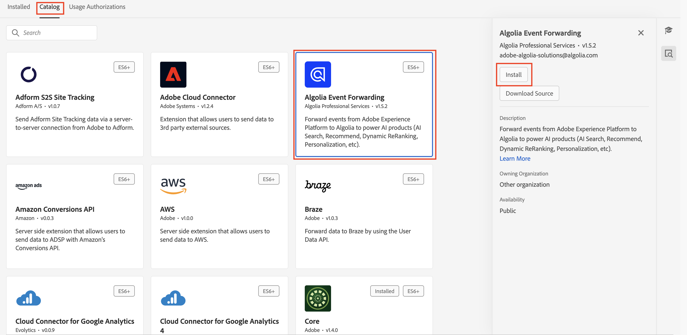

# [!DNL Algolia]事件轉送擴充功能概觀 {#overview}

>[!NOTE]
>
>Adobe Experience Platform Launch現在是Adobe Experience Platform資料收集技術的一部分。 因此，產品說明檔案中的術語已更新。 如需這些變更的完整清單，請參閱[術語更新指南](../../../../tags/term-updates.md)。

使用[!DNL Algolia]提供快速、相關和個人化的搜尋體驗。 透過AI支援的最佳化，您可以增強搜尋結果和推薦，以協助使用者快速找到他們需要的產品、內容或資訊。

使用[!DNL Algolia]事件轉寄延伸功能，透過[!DNL Insights API]將使用者行為事件傳送至[!DNL Algolia]。 此行為資料可啟用AI支援的建議、個人化體驗和智慧型搜尋功能。

## 先決條件 {#prerequisites}

在安裝擴充功能之前，請確定您有[!DNL Algolia]帳戶可以存取[!DNL Insights API]。 如果您沒有帳戶，請[註冊](https://dashboard.algolia.com/users/sign_up)並啟用API的存取權。

也請確定您瞭解如何使用[!DNL Algolia] [!DNL Insights API]。 如需如何傳送事件的概述，請參閱[使用Insights API傳送事件](https://www.algolia.com/doc/guides/sending-events/getting-started/)。

從您的[!DNL Algolia]帳戶儀表板收集下列值：
- **[!UICONTROL 應用程式識別碼]**
- **[!UICONTROL 搜尋API金鑰]**
- **[!UICONTROL 索引名稱]**

## 安裝擴充功能 {#install}

若要安裝[!DNL Algolia]擴充功能，請遵循下列步驟：

在[!DNL Adobe Experience Platform]中導覽至&#x200B;**[!UICONTROL 資料彙集]**。 選取&#x200B;**[!UICONTROL 擴充功能]**&#x200B;標籤。

開啟&#x200B;**[!UICONTROL 目錄]**&#x200B;並找到&#x200B;**[!UICONTROL Algolia事件轉送]**&#x200B;擴充功能，然後選取&#x200B;**[!UICONTROL 安裝]**。

### 設定擴充功能 {#configure-extension}

若要設定[!DNL Algolia]事件轉送擴充功能，請瀏覽至&#x200B;**[!UICONTROL 擴充功能]**&#x200B;標籤，選取&#x200B;**[!UICONTROL Algolia]**&#x200B;擴充功能，然後選取&#x200B;**[!UICONTROL 設定]**。

在Adobe Experience Platform中設定Algolia事件轉送擴充功能的

| 屬性 | 說明 |
|----------|-------------|
| **[!UICONTROL 應用程式識別碼]** | 輸入[API金鑰](https://www.algolia.com/account/api-keys/all)區段下的Algolia儀表板中的[!UICONTROL 應用程式ID]。 |
| **[!UICONTROL 搜尋API金鑰]** | 輸入[API金鑰](https://www.algolia.com/account/api-keys/all)區段下的Algolia儀表板中的[!UICONTROL 搜尋API金鑰]。 |
| **[!UICONTROL 索引名稱]** | 輸入包含產品或內容的[!UICONTROL 索引名稱]。 此索引會作為預設值使用。 |

{style="table-layout:auto"}

## [!DNL Algolia]個事件轉寄擴充功能動作型別 {#action-types}

[!DNL Algolia]事件轉送擴充功能提供可在規則的&#x200B;**[!UICONTROL Then]**&#x200B;區段中使用的單一動作型別：

### 傳送事件 {#send-event}

設定&#x200B;**[!UICONTROL 傳送事件]**&#x200B;動作，將事件轉送至[!DNL Algolia]：

選取&#x200B;**[!UICONTROL 規則]** > **[!UICONTROL 新增規則]**&#x200B;或選取現有規則。 在規則的&#x200B;**[!UICONTROL Then]**&#x200B;部分中，新增動作並選取&#x200B;**[!UICONTROL 擴充功能]**： [!DNL Algolia]事件轉送> **[!UICONTROL 動作型別]**： **[!UICONTROL 傳送事件]**。

![ Algolia事件轉送擴充功能中[傳送事件]動作的設定。](../../../images/extensions/server/algolia/send-event.png)

## 實作[!DNL Algolia]事件欄位群組 {#algolia-field-group}

在使用[!DNL Algolia]事件轉送擴充功能之前，請確定您已將[!DNL Algolia]事件欄位群組新增到結構描述。 這是透過Experience Platform提供的標準欄位群組之一。

### 將[!DNL Algolia]事件欄位群組新增至您的結構描述 {#add-algolia-field-group}

若要新增[!DNL Algolia]事件欄位群組：

瀏覽至&#x200B;**[!UICONTROL 結構描述]**&#x200B;並選取&#x200B;**[!UICONTROL 瀏覽]**。

新增結構描述或更新您用來傳送網頁事件的現有結構描述，並將滑鼠游標停留在「**[!UICONTROL 新增]**」圖示上。 在搜尋方塊中輸入&#x200B;*[!DNL Algolia]*&#x200B;以縮小結果範圍。

選取&#x200B;**[!DNL Algolia]事件詳細資料**&#x200B;欄位群組> **[!UICONTROL 新增欄位群組]**&#x200B;按鈕> **[!UICONTROL 儲存]**。

Experience Platform中的

### 使用[!UICONTROL 資料彙集]標籤對應及傳送資料

[!DNL Algolia]事件轉送擴充功能可與&#x200B;**[!DNL Adobe Experience Platform Web SDK]**&#x200B;搭配使用，以將資料從您的網站傳送至[!DNL Algolia]。 這是透過建立標籤屬性、將資料對應至[!DNL XDM]物件，以及設定傳送事件的規則來完成。

#### 步驟1：使用網頁SDK建立標籤屬性

1. 建立標籤屬性。
2. 安裝[!DNL Adobe Experience Platform Web SDK]擴充功能。
3. 使用此擴充功能將資料從HTML對應至&#x200B;**[!DNL Algolia]事件**&#x200B;欄位群組。

#### 步驟2：建立[!DNL XDM]對應的資料元素

1. 使用&#x200B;**[!DNL Adobe Experience Platform Web SDK]**&#x200B;建立[!UICONTROL 資料元素]。
2. 選取&#x200B;**[!UICONTROL XDM物件]**&#x200B;做為資料元素型別。
3. 將您的資料對應至適當的[!DNL XDM]欄位，確保已填入[!DNL Algolia]特定欄位。

#### 步驟3：建立規則以傳送事件

1. 在您的標籤屬性中建立新規則。
2. 新增必要的事件觸發器，例如頁面載入或按一下事件。
3. 使用&#x200B;**[!DNL Adobe Experience Platform Web SDK]**&#x200B;新增動作。
4. 選取&#x200B;**[!UICONTROL 傳送事件]**&#x200B;作為動作型別。
5. 設定動作以使用您的[!DNL XDM]資料元素。

#### 步驟4：發佈和測試

1. 將規則和擴充功能變更發佈至您的目標環境。
2. 使用[!DNL Adobe Experience Platform Debugger]驗證資料已傳送至Adobe Experience Platform並轉送至[!DNL Algolia]。

### 驗證[!DNL Algolia]中的事件

設定[!DNL Algolia]事件轉送擴充功能後，您可以依照下列步驟確認事件是否正確傳送及接收：

導覽至您的[!DNL Algolia]儀表板，然後前往&#x200B;**[!UICONTROL 資料來源>事件>偵錯工具]**。

選取符合從[!DNL Algolia]的事件轉送延伸傳送之事件的事件，並確認事件中存在預期的資料。

## 常見實作案例

使用[!DNL Algolia]事件轉送延伸功能，針對各種使用案例擷取並傳送使用者互動資料，增強搜尋相關性和個人化。

### 追蹤產品或內容檢視

使用擴充功能來追蹤使用者檢視產品或內容頁面的時間，協助[!DNL Algolia]瞭解使用者興趣。

### 追蹤轉換事件

追蹤購物車新增事件、購買和其他轉換事件，以最佳化[!DNL Algolia]的AI支援建議。

## 疑難排解

如果您在實作[!DNL Algolia]事件轉送擴充功能時遇到問題，請考慮下列疑難排解步驟：

### 事件未出現在[!DNL Algolia]中

如果事件未出現在[!DNL Algolia]中，請檢查下列專案：

- **驗證API認證**：確定&#x200B;**[!UICONTROL 應用程式識別碼]**&#x200B;和&#x200B;**[!UICONTROL API金鑰]**&#x200B;符合您[!DNL Algolia]儀表板中的值。
- **檢查事件偵錯工具**：使用[!DNL Algolia]事件偵錯工具確認是否收到事件。 如果沒有，請確認事件轉送規則設定。
- **檢查XDM對應**：確定[!DNL Algolia]結構描述中的所有必要欄位在[!DNL XDM]物件中都已正確對應。

### 不正確的事件資料

- 確定您的[!DNL XDM]物件資料元素已正確對應至[!DNL Algolia]結構描述，以及所有必要欄位。
- 確認事件引數符合[!DNL Algolia]的Insights API檔案中列出的預期格式和結構。

## 後續步驟

本指南說明如何使用[!DNL Algolia Event Forwarding Extension]將資料傳送至[!DNL Algolia]。 如需[!DNL Adobe Experience Platform]中事件轉送功能的詳細資訊，請閱讀[事件轉送概觀](../../../ui/event-forwarding/overview.md)。

如需如何使用Experience Platform Debugger和「事件轉送監視」工具對實作進行偵錯的詳細資訊，請閱讀[Adobe Experience Platform Debugger概觀](../../../../debugger/home.md)和[監視事件轉送中的活動](../../../ui/event-forwarding/monitoring.md)。

## 其他資源

- [[!DNL Algolia] 深入分析API檔案](https://www.algolia.com/doc/rest-api/insights/)
- [[!DNL Algolia] 事件檔案](https://www.algolia.com/doc/guides/sending-events/getting-started/)
- [[!DNL Adobe Experience Platform] 事件轉送檔案](https://experienceleague.adobe.com/docs/experience-platform/tags/event-forwarding/overview.html)
- [[!DNL Algolia] AI功能總覽](https://www.algolia.com/products/ai-search/)
