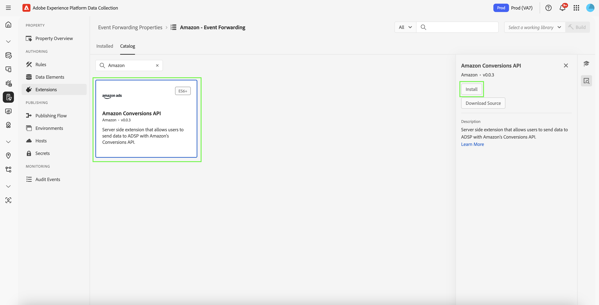

# [!DNL Amazon]網站事件API擴充功能總覽

[!DNL Amazon] Conversions API擴充功能會在來自廣告商伺服器的行銷資料與[!DNL Amazon]之間建立直接連線。 它可讓廣告商評估促銷活動的成效，無論轉換位置為何，並據此將促銷活動最佳化。 此擴充功能提供完整的歸因、資料可靠性和最佳化傳送方式。

## [!DNL Amazon]必要條件 {#prerequisites}

在安裝及設定[!DNL Amazon] Conversions API擴充功能之前，請先完成下列先決條件步驟，以確保正確驗證及資料存取：

### 建立機密和資料元素 {#secret}

建立新的[!DNL Amazon] [事件轉送密碼](../../../ui/event-forwarding/secrets.md)，並提供代表驗證成員的唯一名稱。 這將用於驗證與您的帳戶的連線，同時保持值的安全。

接著，[使用[!UICONTROL Core]擴充功能和[!UICONTROL Secret]資料元素型別，建立資料元素](../../../ui/managing-resources/data-elements.md#create-a-data-element)以參考您剛才建立的`Amazon`密碼。

### 收集必要的設定詳細資料 {#configuration-details}

若要將Experience Platform連線至[!DNL Amazon]，請輸入下列詳細資料：

| 金鑰型別 | 說明 |
| --- | --- |
| 帳戶 ID | [!DNL Amazon]帳戶的唯一帳戶識別碼。 |
| 實體ID | 與廣告商帳戶相關聯之設定檔的識別碼。 這可以在Campaign Manager入口網站URL中找到，其前置詞為`entity`。 |
| 存取權杖 | 您應用程式不會到期的存取權杖，用於透過OAuth驗證[!DNL Amazon] API。 如需指引，請參閱有關驗證[&#128279;](https://developer.amazon.com/docs/app-porting/device-messaging-fit-obtain-api-key.html)的Amazon API檔案。 |

## 安裝並設定[!DNL Amazon]擴充功能 {#install-configure}

請依照下列步驟安裝和設定[!DNL Amazon] Conversions API擴充功能：

1. 建立或編輯事件轉送屬性。
2. 導覽至左側導覽面板中的&#x200B;**擴充功能**，然後在「目錄」標籤中選取[!DNL Amazon]擴充功能。
3. 選取&#x200B;**安裝**。

   

4. 使用下列詳細資料設定擴充功能：
   - **存取Token**：您的資料元素密碼包含OAuth 2權杖。

     

   - **實體ID**：您的實體ID （可在帶有「實體」首碼的Campaign Manager入口網站URL中找到）。

     

5. 選取&#x200B;**儲存**&#x200B;以完成設定。

## 設定事件轉送規則 {#config-rule}

設定好所有資料元素後，請建立事件轉送規則，以判斷將事件傳送至[!DNL Amazon]的時間和方式。

1. 導覽至&#x200B;**規則**&#x200B;並建立新的事件轉送規則。
2. 在&#x200B;**動作**&#x200B;底下，選取&#x200B;**Amazon Conversions API Extension**。
3. 將&#x200B;**動作型別**&#x200B;設定為&#x200B;**匯入轉換事件**。

   ![事件轉送規則組態介面，其動作型別設定為[匯入轉換事件]。](../../../images/extensions/server/amazon/amazon-import-conversion-events.png)

### 設定轉換事件資料 {#conversion-event-data}

轉換事件資料對於追蹤使用者互動和評估行銷活動的成效至關重要。 透過將此資料轉送至[!DNL Amazon]，您可以深入瞭解使用者行為、最佳化行銷活動，並確保轉換的準確歸因。

下表概述設定和轉寄轉換事件資料所需的主要屬性：

| 輸入 | 說明 | 必填 | 範例 |
| --- | --- | --- | --- |
| `name` | 匯入事件的名稱。 | 是 | `My Event Name` |
| `eventType` | 與事件相關聯並用於報告的標準Amazon事件型別。 | 是 | `Add to Shopping Cart` |
| `eventActionSource` | 事件的來源平台。 | 是 | `WEBSITE` |
| `clientDedupeId` | 廣告商為轉換事件指定的`id`。 對於具有相同`clientDedupeId`的事件，只會保留第一個事件，並捨棄所有後續事件。 | 選填 | `3234A398932` |
| `timestamp` | 事件發生的報告時間戳記。 傳送事件之前，時間戳記最多可有7天。 系統不會處理7天以前的資料。 | 是 | `2023-05-08T14:04:28Z` |
| `matchKeys` | 陣列代表要用於歸因流量事件的客戶和裝置識別碼型別/值。 | 是 | — |
| `matchKeys > type` | 用於歸因的識別碼型別。 | 是 | — |
| `matchKeys > value` | 用於歸因的識別碼值。 | 是 | 執行事件之客戶的SHA-256雜湊識別碼值清單。 |
| `value` | 事件的值。 | 選填 | `5`或`0.99` |
| `currencyCode` | 以ISO-4217格式與事件的`value`相關聯的貨幣代碼。 僅適用於關閉Amazon購買事件型別。 若未提供，則會使用轉換定義上的貨幣代碼設定。 | 選填 | `USD`、`EUR`、`GBP`等 |
| `unitsSold` | 購買的專案數。 僅適用於關閉Amazon購買事件型別。 如果未在轉換事件上提供，將會套用預設值`1`。 | 選填 | — |
| `countryCode` | 此值是根據ISO 3166-1 alpha-2，以ISO 3166-1定義的兩字母國家/地區代碼，屬於國際標準化組織(ISO)發佈的ISO 3166標準，代表國家/地區、附屬地區和地理上感興趣的特殊區域。 | 是 | — |
| `dataProcessingOptions` | 表示廣告資料使用的使用者同意。 | 選填 | LIMITED_DATA_USE |

- 選取&#x200B;**[!UICONTROL 保留變更]**&#x200B;以儲存規則。

![事件引數設定介面中反白顯示[保留變更]按鈕。](../../../images/extensions/server/amazon/event-parameters.png)

![其他事件引數設定介面中反白顯示[保留變更]按鈕。](../../../images/extensions/server/amazon/additional-event-parameters.png)

## 事件重複資料刪除 {#deduplication}

重複資料刪除是確保正確報告，並在同時使用[!DNL Amazon] Advertising標籤(AAT)和[!DNL Amazon]轉換API擴充功能追蹤相同事件時，防止膨脹的轉換計數的必要專案。

### 何時需要重複資料刪除？

- **必要**：如果從使用者端(AAT)和伺服器(Conversions API)同時傳送相同事件。
- **不需要**：如果從使用者端和伺服器傳送的相異事件型別沒有任何重疊。

### 如何啟用重複資料刪除

若要啟用重複資料刪除，請在每個共用事件中包含`clientDedupeId`欄位。 此唯一識別碼可讓[!DNL Amazon]區分使用者端和伺服器端事件，並防止重複專案。

透過正確設定重複資料刪除，您可以確保最佳化資料保持準確，且您的報告不會受到負面影響。

如需詳細資訊，請參閱[Amazon事件重複資料刪除指南](https://advertising.amazon.com/)。

## 後續步驟 {#next-steps}

本指南說明如何使用[!DNL Amazon] Conversions API擴充功能來設定轉換事件並傳送給[!DNL Amazon]。 如需[!DNL Adobe Experience Platform]中事件轉送功能的詳細資訊，請參閱[事件轉送概觀](../../../ui/event-forwarding/overview.md)。

如需使用Experience Platform Debugger和「事件轉送監視」工具對實作除錯的詳細資訊，請閱讀[Adobe Experience Platform Debugger概觀](/help/debugger/home.md)和[事件轉送中的監視活動](../../../ui/event-forwarding/monitoring.md)。
