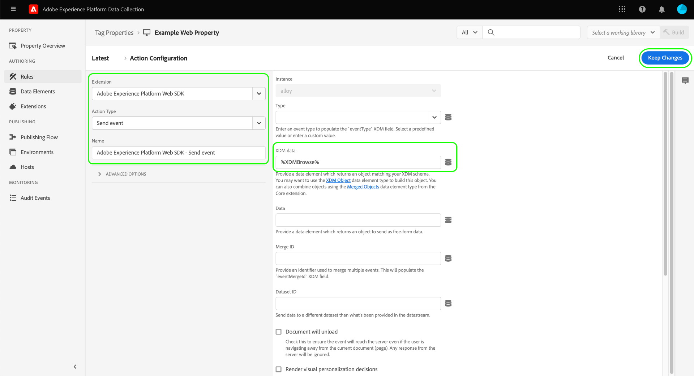

# [!DNL Braze Track Events API] 事件轉送擴充功能

[[!DNL Braze]](https://www.braze.com) 是客戶互動平台，可即時提供消費者與品牌之間以客戶為中心的互動。 使用 [!DNL Braze]，您可以執行下列動作：

* 根據目標使用者的語言偏好、位置偏好等，將資料（例如行銷訊息）傳送給目標使用者，以提高轉換率並支援關鍵業務目標。
* 在適當的時間以客戶偏好的語言，跨多個通道傳送客戶個人化訊息，包括電子郵件、推播通知和應用程式內訊息。
* 定位行銷和促銷促銷活動的特定使用者，以增加重複客戶的數量。
* 透過自訂訊息研究使用者行為和模式以鎖定特定對象，進而有助於提高收入。

此 [!DNL Braze Track Events API] [事件轉送](../../../ui/event-forwarding/overview.md) 擴充功能可讓您運用Adobe Experience Platform邊緣網路中擷取的資料，並將其傳送至 [!DNL Braze] 以伺服器端事件的形式，使用 [[!DNL Braze User Identify]](https://www.braze.com/docs/api/endpoints/user_data/post_user_identify) 和 [[!DNL Braze User Track]](https://www.braze.com/docs/api/endpoints/user_data/post_user_track) API。

本檔案說明擴充功能的使用案例、如何在事件轉送程式庫中安裝擴充功能，以及如何在事件轉送中運用其功能 [規則](../../../ui/managing-resources/rules.md).

## 使用案例

如果您想要使用來自邊緣網路的資料，應使用此擴充功能。 [!DNL Braze] 以善用其客戶分析和鎖定功能。

例如，假設零售組織有多頻道存在（網站和行動裝置），並從其網站和行動平台擷取交易式或對話式輸入作為事件資料。 使用各種 [標籤](../../../home.md) 規則，則此資料會即時傳送至邊緣網路。 從這裡， [!DNL Braze] 事件轉送擴充功能會自動將相關事件傳送至 [!DNL Braze] 從伺服器端。

傳送資料後，組織的分析團隊便可運用 [!DNL Braze's] 可處理資料集並衍生業務見解，以產生圖表、控制面板或其他視覺效果，通知業務利害關係人。 請參閱 [[!DNL Braze] 客戶](https://www.braze.com/customers) 頁面，以取得平台各種使用案例的詳細資訊。

## [!DNL Braze] 先決條件和護欄 {#prerequisites}

您必須有 [!DNL Braze] 來使用其技術。 如果您沒有帳戶，請導覽至 [快速入門頁面](https://www.braze.com/get-started/) on [!DNL Braze] 連接到 [!DNL Braze Sales] 並啟動帳戶建立過程。

### API護欄

擴充功能使用 [!DNL Braze]的API及其限制概述如下：

| API | 比率限制 |
| --- | --- |
| [!DNL User Track] | 每分鐘50,000個請求。  請參閱 [[!DNL User Track] API檔案](https://www.braze.com/docs/api/endpoints/user_data/post_user_track#rate-limit) 以取得詳細資訊。 |
| [!DNL User Identify] | 每分鐘20,000個請求。  請參閱 [[!DNL User Identify] API檔案](https://www.braze.com/docs/api/endpoints/user_data/post_user_identify#rate-limit) 以取得詳細資訊。 |

>[!NOTE]
>
>請參閱 [[!DNL Braze] API限制](https://www.braze.com/docs/api/api_limits/) 以進一步了解他們施加的限制。

### 了解使用者設定檔生命週期

[!DNL Braze] 使用唯一標識符建立匿名用戶配置檔案， `deviceId`，設定者 [!DNL Braze]. 一旦借由提供使用者ID來識別使用者，便會建立已識別的使用者設定檔。

在指派 `external_id` 所有現有的使用者設定檔資料和任何匿名事件都會移轉至新的使用者設定檔。 共用相同的匿名使用者設定檔 `deviceId` 也會將別名傳送至已識別的使用者設定檔。

[!DNL Braze] 將合併並保留與僅別名配置檔案關聯的所有資料。 但是，任何後續的匿名使用者資料都將成為孤立狀態。 請參閱 [!DNL Braze] 檔案頁面 [識別的使用者設定檔](https://www.braze.com/docs/user_guide/data_and_analytics/user_data_collection/user_profile_lifecycle/#identified-user-profiles) 和 [資料收集最佳實務](https://www.braze.com/docs/user_guide/data_and_analytics/user_data_collection/best_practices/#overview) 以取得更多資訊。

### 計費資料點

傳送其他自訂屬性至 [!DNL Braze] 會增加 [!DNL Braze] 資料點耗用量。 請諮詢您的 [!DNL Braze] 帳戶管理員，再傳送其他自訂屬性。 請參閱 [!DNL Braze] 檔案 [計費資料點](https://www.braze.com/docs/user_guide/onboarding_with_braze/data_points/#billable-data-points) 以取得更多資訊。

### 收集所需配置詳細資訊 {#configuration-details}

為了將邊緣網路連接到 [!DNL Braze]，需要下列輸入：

| 鍵類型 | 說明 | 範例 |
| --- | --- | --- |
| [!DNL Braze] 例項 | 與 [!DNL Braze] 帳戶。 請參閱 [!DNL Braze] 檔案 [例項](https://www.braze.com/docs/user_guide/administrative/access_braze/braze_instances) 以取得指引。 | `rest.iad-03.braze.com` |
| API 密鑰 | 此 [!DNL Braze] 與 [!DNL Braze] 帳戶。  請參閱 [!DNL Braze] 檔案 [重設API金鑰](https://www.braze.com/docs/api/basics/#rest-api-key) 以取得指引。 | `YOUR-BRAZE-REST-API-KEY` |

## Experience Cloud必要條件

本節涵蓋所有實作的Experience Cloud必備步驟。 視您的個別實作需求而定，在設定擴充功能之前設定下列建構可能會有所幫助：

1. A [綱要](../../../../xdm/schema/composition.md) 說明要擷取至Experience Cloud的資料結構
1. A [資料流](https://experienceleague.adobe.com/docs/platform-learn/data-collection/event-forwarding/set-up-a-datastream.html) 將傳入資料路由至適當的Adobe Experience Cloud應用程式
1. A [資料集](https://experienceleague.adobe.com/docs/platform-learn/tutorials/data-ingestion/create-datasets-and-ingest-data.html) 儲存所收集的資料

對於所有實施，Experience Cloud端都需要：

1. [建立機密](#create-a-secret)
1. [設定標籤屬性](#set-up-tag-properties)
1. [在標籤屬性中新增資料元素](#add-data-elements-within-tag-properties)
1. [在標籤屬性中新增規則](#add-rules-within-tag-properties)

### 建立機密

建立新 [事件轉送密碼](../../../ui/event-forwarding/secrets.md) 並將值設為 [[!DNL Braze] API金鑰](#configuration-details). 這將用於驗證帳戶的連線，同時保持值安全。

### 設定標籤屬性

[建立標籤屬性](https://experienceleague.adobe.com/docs/platform-learn/implement-in-websites/configure-tags/create-a-property.html?lang=en) 或選擇要編輯的現有屬性。 此屬性將配置為收集 [!DNL Braze] 會先匯入邊緣網路，再透過事件轉送傳送。

### 在標籤屬性中新增資料元素

若您的網站使用 [!DNL Braze] SDK，您必須 [建立資料元素](../../../ui/managing-resources/data-elements.md) 使用 **[!UICONTROL Cookie]** 類型(由提供 [[!UICONTROL 核心] 標籤擴充功能](../../client/core/overview.md))所以 [!DNL Braze] `deviceId` 可從cookie讀取。

此 **[!UICONTROL Cookie名稱]** 值必須符合 [!DNL Braze] 網站的cookie名稱。 名稱的格式應與 `ab.storage.deviceId.{BRAZE_PROJECT_TOKEN_FOR_WEBSITE}`. 選擇 **[!UICONTROL 儲存]** 完成時。

對於第二個資料元素，將類型設為 **[!UICONTROL XDM物件]** (從 [Adobe Experience Platform Web SDK擴充功能](../../client/sdk/overview.md))，並將其對應至先前建立的架構。 對應資料時，請確定 `deviceId` 資料元素(包含 [!DNL Braze] `deviceId` 值)，則會在其中一個結構欄位內作為值參考。

>[!NOTE]
>
>如果您的網站未執行 [!DNL Braze] SDK、Adobe Experience Cloud ID(ECID)將作為備援 `deviceId` 值，與傳送至的事件一併傳遞 [!DNL Braze].

根據您的案例，您可能需要建立另一個資料元素，可用來對應至結構中的事件名稱。 您可以使用 **[!UICONTROL 常數]** 由提供的類型 [!UICONTROL 核心] 擴充功能。

### 在標籤屬性中新增規則

安裝前的最後一步 [!DNL Braze] 擴充功能是建立標籤 [規則](../../../ui/managing-resources/rules.md) （或多個標籤規則），會針對受追蹤的使用者識別事件（例如登入、註冊、註冊等）觸發。

設定 **[!UICONTROL 事件]** 針對規則，選取將觸發規則的適當事件類型。 以下是在使用者點按時觸發登入規則的事件範例：

最後，選取 **[!UICONTROL 動作]** 針對規則，選取 **[!UICONTROL 傳送事件]** Web SDK擴充功能提供的動作類型。 在 **[!UICONTROL XDM資料]**，請選取 [!UICONTROL XDM物件] 您建立的資料類型 [較早](#add-data-elements-within-tag-properties).

## 安裝並設定 [!DNL Braze] 擴充功能 {#install}

若要安裝擴充功能， [建立事件轉送屬性](../../../ui/event-forwarding/overview.md#properties) 或選擇要編輯的現有屬性。

選擇 **[!UICONTROL 擴充功能]** 的下一頁。 在 **[!UICONTROL 目錄]** 索引標籤，選取 **[!UICONTROL 安裝]** 在 [!DNL Braze] 擴充功能。

![安裝 [!DNL Braze] 擴充功能。](../../../images/extensions/server/braze/install-extension.png)

在下一個畫面中輸入下列內容 [組態值](#configuration-details) 您之前從 [!DNL Braze]:

* **[!UICONTROL Braze Rest端點URL]**:您可以輸入 [!DNL Braze] rest端點URL在提供的輸入中為純文字。
* **[!UICONTROL API金鑰]**:選取 [機密資料元素](#create-a-secret) 以前建立的，其中包含 [!DNL Braze] API金鑰。

選擇 **[!UICONTROL 儲存]** 完成時。

![此 [!DNL Braze] 擴充功能設定頁面。](../../../images/extensions/server/braze/configure-extension.png)

## 設定事件轉送資料元素

安裝和設定擴充功能後，下一步是建立事件轉送資料元素，以擷取將傳送至的必要資料建構 [!DNL Braze].

### 建立 `deviceId` 資料元素

若您的網站已設定 [!DNL Braze] SDK，則您已定義 [機密資料元素](#add-data-elements-within-tag-properties) 包含 [!DNL Braze] `deviceId` 在標籤屬性上。 現在，您必須在事件轉送下設定個別的資料元素，以XDM格式傳送時，該元素會指向此值。

建立資料元素時，請選取 **[!UICONTROL 核心]** 對於擴充功能，請選取 **[!UICONTROL 路徑]** （適用於資料元素類型）。 對於值，請將點記號路徑輸入至 `deviceId` 欄位，因為它存在於您的架構中。 選擇 **[!UICONTROL 儲存]** 完成時。

### 建立 `EventName` 資料元素

在事件轉送屬性中，建立使用 **[!UICONTROL 路徑]** 從 **[!UICONTROL 核心]** 擴充功能。 對於值，請將點記號路徑輸入至事件名稱，因為它存在於您的架構中。

### 建立事件和購買的資料元素

此 [[!DNL Braze User Track] API](https://www.braze.com/docs/api/endpoints/user_data/post_user_track) 支援兩種不同的動作：自訂 [事件](https://www.braze.com/docs/api/objects_filters/event_object/#what-is-the-event-object) 和 [購買](https://www.braze.com/docs/api/objects_filters/purchase_object/#what-is-a-purchase-object). API也支援 [屬性](https://www.braze.com/docs/api/objects_filters/user_attributes_object/) 對應 [!DNL Braze] 資料點。

適用於 `deviceId` 和 `EventName` 自訂事件和購買都需要，但事件類型中可包含其他資料元素。 下面列出了這些項目。

>[!NOTE]
>
>下列所有資料元素都應使用 **[!UICONTROL 路徑]** 類型，讓他們能如 **架構路徑** 欄。

#### 自訂事件

| [!DNL Braze] key | 架構路徑 | 說明 | 必要 |
| --- | --- | --- | --- |
| [!DNL Braze] 裝置ID | `arc.event.xdm._extconndev.brazeDeviceId` | `deviceId` 識別執行事件的使用者。 `deviceId` 必須在每個事件上指定，因為它對 [!DNL Braze] 執行分析。 | 是 |
| 活動類型 | `arc.event.xdm._extconndev.event_Type` | 事件的名稱。 | 是 |
| 使用者識別碼 | `arc.event.xdm._extconndev.userId` | 使用者的電子郵件或登入ID（如果有）。 |  |
| 應用程式 ID | `arc.event.xdm._extconndev.appId` | 指出事件觸發位置的字串。 |  |
| 事件欄位 | `arc.event.xdm._extconndev.event_Properties` | 代表事件所有屬性的JSON物件。 |  |

{style="table-layout:auto"}

#### 購買

| [!DNL Braze] key | 架構路徑 | 說明 | 必要 |
| --- | --- | --- | --- |
| [!DNL Braze] 裝置ID | `arc.event.xdm._extconndev.brazeDeviceId` | `deviceId` 識別執行事件的使用者。 `deviceId` 必須在每個事件上指定，因為它對 [!DNL Braze] 執行分析。 | 是 |
| 活動類型 | `arc.event.xdm._extconndev.event_Type` | 事件的名稱。 | 是 |
| 使用者識別碼 | `arc.event.xdm._extconndev.userId` | 使用者的電子郵件或登入ID（如果有）。 |  |
| 應用程式 ID | `arc.event.xdm._extconndev.appId` | 指出事件觸發位置的字串。 |  |
| 產品 ID | `arc.event.xdm._extconndev.product_Id` | 購買的識別碼，例如UPC、ISBN、產品類別或產品名稱。 | 是 |
| 貨幣 | `arc.event.xdm._extconndev.currency` | 用於購買的貨幣，單位為 [ISO 4217代碼格式](https://www.iso.org/iso-4217-currency-codes.html). | 是 |
| 價格 | `arc.event.xdm._extconndev.price` | 購買的值，用數字表示。 | 是 |
| 數量 | `arc.event.xdm._extconndev.quantity` | 購買的產品數量。 | 是 |
| 其他欄位 | `arc.event.xdm._extconndev.event_Properties` | 代表事件其他屬性的JSON物件。 請參閱 [[!DNL Braze] 檔案](https://www.braze.com/docs/user_guide/onboarding_with_braze/data_points/#billable-data-points) 以取得計費資料點的詳細資訊。 |  |

{style="table-layout:auto"}

## 設定事件轉送規則

設定完所有資料元素後，您就可以開始建立事件轉送規則，以決定自訂事件和購買的傳送時間和方式 [!DNL Braze].

由於 [!DNL Braze User Track] API支援自訂事件和購買作為兩個不同的動作，您至少必須建立兩個規則，才能 [!DNL Braze's] 可適當運用每個分析。

因此， [!DNL Braze] 擴充功能可讓您將下列動作類型新增至規則：

* **[!UICONTROL 佈雷茲事件]**
* **[!UICONTROL 品牌購買事件]**

>[!IMPORTANT]
>
>您至少必須有一個規則，且動作類型為 **[!UICONTROL 佈雷茲事件]**. 若沒有此規則，邊緣網路將不會將事件傳送至 [!DNL Braze].

### 建立 [!DNL Track Event] 規則 {#tracking-rule}

開始在事件轉送屬性中建立新規則。 在 **[!UICONTROL 條件]**，新增 **[!UICONTROL 值比較]** 條件類型(由 [!UICONTROL 核心] 擴充功能)，以檢查 `EventName` 不是 `Purchase`. 這可確保將事件與正確的物件裝載一起傳送至 [!DNL Braze] API。

在 **[!UICONTROL 動作]**，新增動作並將擴充功能設為 **[!UICONTROL 佈雷茲]**. 接下來，將動作類型設為 **[!UICONTROL 佈雷茲事件]** 若要將Adobe Experience Edge Network事件傳送至 [!DNL Braze].

從這裡，您必須對應 **[!UICONTROL 事件名稱]** 欄位至傳入的事件名稱屬性，以及 **[!UICONTROL 事件時間]**. 其他選用欄位包括 [!UICONTROL 外部用戶ID], [!UICONTROL Braze使用者ID], [!UICONTROL 別名標籤], [!UICONTROL 別名]，和 [!UICONTROL 應用程式識別碼].

>[!NOTE]
>
>此 **[!UICONTROL 佈雷茲事件]** 動作只需要 **[!UICONTROL 事件名稱]** 和 **[!UICONTROL 事件時間]** ，但您應在其餘欄位中納入盡可能多的資訊。 如需 [!DNL Braze] 事件物件，請參閱 [官方檔案](https://www.braze.com/docs/api/objects_filters/event_object/).

一旦 [!UICONTROL 佈雷茲事件] 動作即會新增至規則，您也可以包含 **[!UICONTROL Braze購買]** 動作（如果您追蹤的事件恰好是購買事件）。 購買動作的範例設定如下所示：

>[!NOTE]
>
>如需 [!DNL Braze] 購買物件，請參閱 [官方檔案](https://www.braze.com/docs/api/objects_filters/purchase_object/).

此 [!DNL Track Event] 規則已完成，看起來應類似於下圖。 選擇 **[!UICONTROL 儲存]** 將規則新增至程式庫。

>[!IMPORTANT]
>
>若您的網站使用 [!DNL Braze] SDK，您可以繼續 [在 [!DNL Braze]](#validate). 如果您未使用 [!DNL Braze] SDK，您必須 [建立個別身分追蹤規則](#create-an-identity-tracking-rule) 確保有適當的 `deviceId` 值傳送至 [!DNL Braze] 當發生使用者識別事件時。

### 建立身分追蹤規則

如果您未使用 [!DNL Braze SDK]，下一步是建立另一個規則，此規則會同時使用 **[!UICONTROL 佈雷茲事件]** 和 **[!UICONTROL 佈雷茲別名]** 動作類型。 此規則可確保每當網站上發生使用者識別事件（例如登入、註冊、註冊等）時，都會有適當的事件和 `deviceId` 值傳送至 [!DNL Braze].

開始定義要追蹤身分事件的新規則。 在此範例中，系統會針對註冊事件專門定義規則。

類似於 [!DNL Track Event] 規則，在 **[!UICONTROL 條件]**，包括 **[!UICONTROL 值比較]** 檢查的條件類型 `EventName` 等於 `Registration`. 這可確保此事件只會針對註冊事件觸發。

![的動作設定 [!DNL Braze] 動作類型別名和識別。](../../../images/extensions/server/braze/ef-registration-condition.png)

確保 [!DNL Braze] 可自動合併使用者身分，您必須將下列動作類型新增至規則，兩者皆由 [!DNL Braze] 擴充功能：

* **[!UICONTROL 佈雷茲事件]**
* **[!UICONTROL 佈雷茲別名事件]**

設定 **[!UICONTROL 佈雷茲事件]** 以與 [事件追蹤規則](#tracking-rule)，包括提供欄位中盡可能多的資訊。

![設定 [!DNL Braze] 事件動作](../../../images/extensions/server/braze/registration-braze-event.png)

此  **[!UICONTROL 佈雷茲別名事件]** 動作需要 [使用者識別碼](https://www.braze.com/docs/api/objects_filters/aliases_to_identify)，您可以選擇提供 [應用程式識別碼](https://www.braze.com/docs/api/identifier_types/) 如果合適。

![設定 [!DNL Braze] 別名操作](../../../images/extensions/server/braze/registration-braze-alias.png)

將兩個動作新增至規則後，請選取 **[!UICONTROL 儲存]** 將規則新增至工作程式庫的方式。 從這裡，您可以將程式庫建置到其中一個環境，以驗證其是否如預期般運作。

![兩者 [!DNL Braze] 動作會新增至規則](../../../images/extensions/server/braze/registration-rule-complete.png)

## 在內驗證資料 [!DNL Braze] {#validate}

如果事件集合和 [!DNL Adobe Experience Platform] 整合成功，您會在中看到事件 [!DNL Braze] 主控台 [檢視使用者設定檔](https://www.braze.com/docs/user_guide/engagement_tools/segments/user_profiles/). 具體而言，是傳送至的新事件資料 [!DNL Braze] 反映在 [!DNL Purchases] 特定使用者的區段 [概述標籤](https://www.braze.com/docs/user_guide/engagement_tools/segments/user_profiles/#overview-tab).

## 後續步驟

本指南說明如何將轉換事件傳送至 [!DNL Braze] 使用事件轉送。 如需傳送至之事件資料之下游應用程式的詳細資訊 [!DNL Braze]，請參閱 [官方檔案](https://www.braze.com/docs).

如需Experience Platform中事件轉送功能的詳細資訊，請參閱 [事件轉送概觀](../../../ui/event-forwarding/overview.md).