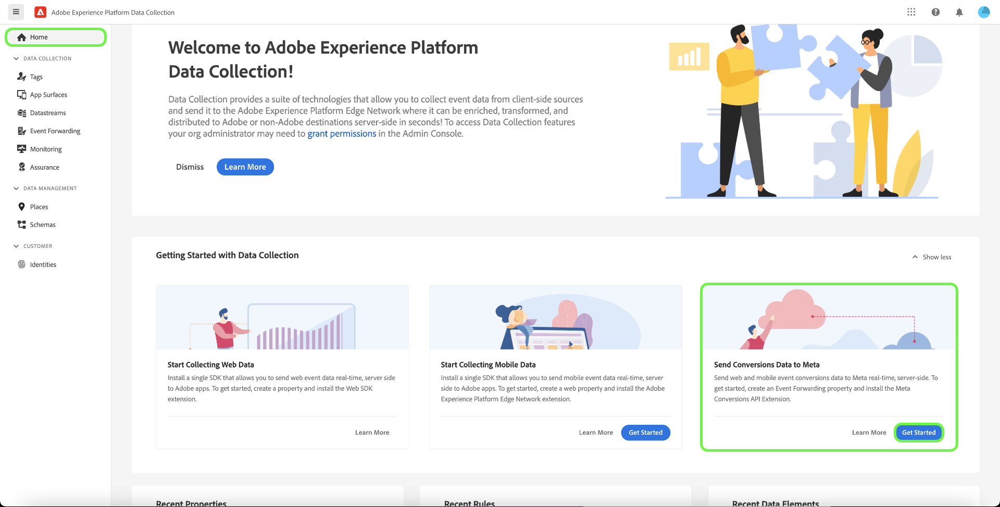

# [!DNL Meta Conversions API] 擴充功能概觀

此 [[!DNL Meta Conversions API]](https://developers.facebook.com/docs/marketing-api/conversions-api/) 可讓您將伺服器端行銷資料連結至 [!DNL Meta] 技術協助您最佳化廣告目標定位、降低每個動作的成本以及評估結果。 事件連結至 [[!DNL Meta Pixel]](https://developers.facebook.com/docs/meta-pixel/) ID和的處理方式與使用者端事件類似。

使用 [!DNL Meta Conversions API] 擴充功能上，您可在以下位置運用API的功能： [事件轉送](../../../ui/event-forwarding/overview.md) 資料傳送至的規則 [!DNL Meta] 來自Adobe Experience Platform Edge Network。 本文介紹如何安裝擴充功能，以及在事件轉送中使用其功能 [規則](../../../ui/managing-resources/rules.md).

## 先決條件

強烈建議使用 [!DNL Meta Pixel] 和 [!DNL Conversions API] 以分別從使用者端和伺服器端共用及傳送相同的事件，因為這有助於復原未擷取的事件 [!DNL Meta Pixel]. 安裝之前 [!DNL Conversions API] 擴充功能方面，請參閱 [[!DNL Meta Pixel] 副檔名](../../client/meta/overview.md) ，瞭解將其整合至使用者端標籤實作的步驟。

>[!NOTE]
>
>上的區段 [事件重複資料刪除](#deduplication) 本檔案稍後將說明確保同一個事件不會使用兩次的步驟，因為同時可能從瀏覽器和伺服器接收該事件。

為了使用 [!DNL Conversions API] 擴充功能上，您必須有權存取事件轉送，並具備有效的 [!DNL Meta] 有權存取的帳戶 [!DNL Ad Manager] 和 [!DNL Event Manager]. 具體而言，您必須複製現有 [[!DNL Meta Pixel]](https://www.facebook.com/business/help/952192354843755?id=1205376682832142) (或 [建立新的 [!DNL Pixel]](https://www.facebook.com/business/help/952192354843755) 而是)，以便將擴充功能設定給您的帳戶。

>[!INFO]
>
>如果您打算將此擴充功能搭配行動應用程式資料使用，或是您同時處理離線事件資料，請 [!DNL Meta] 行銷活動，您必須透過現有應用程式建立資料集，並選取 **從畫素ID建立** 出現提示時。 請參閱文章 [決定適合您企業的資料集建立選項](https://www.facebook.com/business/help/5270377362999582?id=490360542427371) 以取得詳細資訊。 請參閱 [應用程式事件的轉換API](https://developers.facebook.com/docs/marketing-api/conversions-api/app-events) 所有必要和選用應用程式追蹤引數的檔案。

## 安裝擴充功能

若要安裝 [!DNL Meta Conversions API] 擴充功能之前，請導覽至資料收集UI或Experience Platform UI並選取「 」 **[!UICONTROL 事件轉送]** 從左側導覽。 從這裡，選取要新增擴充功能的屬性，或改為建立新屬性。

選取或建立所需的屬性後，選取 **[!UICONTROL 擴充功能]** 在左側導覽中，然後選取 **[!UICONTROL 目錄]** 標籤。 搜尋 [!UICONTROL 中繼轉換API] 卡片，然後選取 **[!UICONTROL 安裝]**.

![此 [!UICONTROL 安裝] 按鈕已選取用於 [!UICONTROL 中繼轉換API] 資料收集UI中的擴充功能。](../../../images/extensions/server/meta/install.png)

在出現的組態檢視中，您必須提供 [!DNL Pixel] 您先前複製的ID可將擴充功能連結至您的帳戶。 您可以直接將ID貼入輸入中，也可以改用資料元素。

您也需要提供存取權杖才能使用 [!DNL Conversions API] 具體來說。 請參閱 [!DNL Conversions API] 檔案： [產生存取權杖](https://developers.facebook.com/docs/marketing-api/conversions-api/get-started#access-token) 以瞭解如何取得此值的步驟。

完成後，選取 **[!UICONTROL 儲存]**

![此 [!DNL Pixel] 在擴充功能組態檢視中作為資料元素提供的ID。](../../../images/extensions/server/meta/configure.png)

擴充功能已安裝，您現在可以在事件轉送規則中運用其功能。

## 設定事件轉送規則 {#rule}

本節涵蓋如何使用 [!DNL Conversions API] 一般事件轉送規則中的擴充功能。 實際上，您應該設定數個規則，以便傳送所有已接受的專案 [標準事件](https://developers.facebook.com/docs/meta-pixel/reference) via [!DNL Meta Pixel] 和 [!DNL Conversions API]. 如需行動應用程式資料，請參閱必填欄位、應用程式資料欄位、客戶資訊引數和自訂資料詳細資訊 [此處](https://developers.facebook.com/docs/marketing-api/conversions-api/app-events).

>[!NOTE]
>
>事件應為 [已即時傳送](https://www.facebook.com/business/help/379226453470947?id=818859032317965) 或儘可能接近即時，以取得更好的廣告促銷活動最佳化。

開始建立新的事件轉送規則，並視需要設定其條件。 選取規則的動作時，選取 **[!UICONTROL 中繼轉換API擴充功能]** 針對擴充功能，然後選取「 」 **[!UICONTROL 傳送轉換API事件]** （適用於動作型別）。

![此 [!UICONTROL 傳送頁面檢視] 在資料收集UI中為規則選取的動作型別。](../../../images/extensions/server/meta/select-action.png)

會出現可讓您設定要傳送至之事件資料的控制項 [!DNL Meta] 透過 [!DNL Conversions API]. 這些選項可以直接輸入到提供的輸入中，或者您可以選取現有的資料元素來代表值。 設定選項分為四個主要區段，如下所述。

| 設定區段 | 說明 |
| --- | --- |
| [!UICONTROL 伺服器事件引數] | 有關事件的一般資訊，包括發生時間和觸發事件的來源動作。 請參閱 [!DNL Meta] 開發人員檔案，以瞭解有關 [標準事件引數](https://developers.facebook.com/docs/marketing-api/conversions-api/parameters/server-event) 已接受 [!DNL Conversions API].  如果您同時使用 [!DNL Meta Pixel] 和 [!DNL Conversions API] 若要傳送事件，請務必同時包含 **[!UICONTROL 事件名稱]** (`event_name`)和 **[!UICONTROL 事件ID]** (`event_id`)，因為這些值是用於 [事件重複資料刪除](#deduplication).  您也可選擇 **[!UICONTROL 啟用有限資料使用]** 協助遵守客戶選擇退出的規定。 請參閱 [!DNL Conversions API] 檔案： [資料處理選項](https://developers.facebook.com/docs/marketing-apis/data-processing-options/) 以取得此功能的詳細資訊。 |
| [!UICONTROL 客戶資訊引數] | 用於將事件歸因於客戶的使用者身分資料。 在將其中某些值傳送至API之前，必須先進行雜湊處理。  為確保良好的通用API連線和高事件比對品質(EMQ)，建議您傳送所有 [接受的客戶資訊引數](https://developers.facebook.com/docs/marketing-api/conversions-api/parameters/customer-information-parameters) 以及伺服器事件。 這些引數也應 [已根據其重要性及其對EMQ的影響排定優先順序](https://www.facebook.com/business/help/765081237991954?id=818859032317965). |
| [!UICONTROL 自訂資料] | 用於廣告傳送最佳化的其他資料，以JSON物件的形式提供。 請參閱 [[!DNL Conversions API] 檔案](https://developers.facebook.com/docs/marketing-api/conversions-api/parameters/custom-data) 以取得此物件接受之屬性的詳細資訊。  如果您要傳送購買事件，必須使用此區段來提供必要的屬性 `currency` 和 `value`. |
| [!UICONTROL 測試事件] | 此選項用於驗證您的設定是否造成伺服器事件由接收 [!DNL Meta] 如預期。 若要使用此功能，請選取 **[!UICONTROL 以測試事件傳送]** 核取方塊，然後在下列輸入中提供您選擇的測試事件程式碼。 在部署事件轉送規則後，如果您已正確設定擴充功能和動作，您應該會看到活動出現在 **[!DNL Test Events]** 檢視位置 [!DNL Meta Events Manager]. |

{style="table-layout:auto"}

完成後，選取 **[!UICONTROL 保留變更]** 將動作新增至規則設定。

![[!UICONTROL 保留變更] 被選取進行動作設定。](../../../images/extensions/server/meta/keep-changes.png)

當您對規則感到滿意時，請選取 **[!UICONTROL 儲存至程式庫]**. 最後，發佈新的事件轉送 [版本編號](../../../ui/publishing/builds.md) 以啟用程式庫的變更。

## 事件重複資料刪除 {#deduplication}

如 [必要條件區段](#prerequisites)，建議您兩者都使用 [!DNL Meta Pixel] 標籤擴充功能和 [!DNL Conversions API] 事件轉送擴充功能，可在備援設定中從使用者端和伺服器傳送相同事件。 這有助於復原其中一個擴充功能未擷取的事件。

如果您從使用者端和伺服器傳送不同的事件型別，且兩者之間沒有重疊，則不需要重複資料刪除。 不過，如果兩個共用任何單一事件 [!DNL Meta Pixel] 和 [!DNL Conversions API]時，您必須確保這些多餘的事件不會重複刪除，以免對報表造成負面影響。

傳送共用事件時，請務必加入事件ID和名稱，以及您從使用者端和伺服器傳送的每個事件。 收到多個具有相同ID和名稱的事件時， [!DNL Meta] 自動採用數個策略來去除重複資料，並保留最相關的資料。 請參閱 [!DNL Meta] 檔案： [去重複化 [!DNL Meta Pixel] 和 [!DNL Conversions API] 事件](https://www.facebook.com/business/help/823677331451951?id=1205376682832142) 以取得此程式的詳細資訊。

## 快速入門工作流程：中繼轉換API擴充功能(Beta) {#quick-start}

>[!IMPORTANT]
>
>* 已購買Real-Time CDP Prime和Ultimate套件的客戶可以使用快速入門功能。 如需詳細資訊，請聯絡您的Adobe代表。
>* 此功能適用於全新實作，目前不支援在現有標籤和事件轉送屬性上自動安裝擴充功能和設定。

快速入門功能可協助您使用中繼轉換API和中繼畫素擴充功能輕鬆而高效地完成設定。 此工具會自動執行在Adobe標籤和事件轉送中執行的多個步驟，大幅縮短設定時間。

此功能會在新自動產生的標籤上自動安裝及設定中繼轉換API和中繼畫素擴充功能，並使用必要的規則和資料元素來設定事件轉送屬性。 此外，也會自動安裝及設定Experience Platform Web SDK和資料流。 最後，快速入門功能會自動將程式庫發佈到開發環境中的指定URL，如此即可透過事件轉送和Experience Platform邊緣網路即時啟用使用者端資料收集和伺服器端事件轉送。

以下影片介紹快速入門功能。

>[!VIDEO](https://video.tv.adobe.com/v/3416939?quality=12&learn=on)

### 安裝快速入門功能

>[!NOTE]
>
>此功能旨在協助您開始實施事件轉送。 它不會提供端對端、功能齊全的實施，以配合所有使用案例。

此設定會自動安裝中繼轉換API和中繼畫素擴充功能。 Meta建議使用此混合式實作，以收集並轉寄事件轉換伺服器端。
快速設定功能旨在協助客戶開始事件轉送實作，而非旨在提供因應所有使用案例的端對端完整功能實作。

若要安裝此功能，請選取 **[!UICONTROL 開始使用]** 的 **[!DNL Send Conversions Data to Meta]** 在Adobe Experience Platform資料彙集 **[!UICONTROL 首頁]** 頁面。

輸入您的 **[!UICONTROL 網域]**，然後選取 **[!UICONTROL 下一個]**. 此網域將用作您自動產生的標籤和事件轉送屬性、規則、資料元素、資料串流等的命名慣例。

在 **[!UICONTROL 初始設定]** 對話方塊輸入您的 **[!UICONTROL 中繼畫素ID]**， **[!UICONTROL 中繼轉換API存取權杖]**、和 **[!UICONTROL 資料層路徑]**，然後選取 **[!UICONTROL 下一個]**.

請等候數分鐘以完成初始設定程式，然後選取 **[!UICONTROL 下一個]**.

從 **[!UICONTROL 在您的網站上新增程式碼]** 對話方塊複製使用複製功能提供的程式碼  函式並貼到 `<head>` 您的來源網站的。 實作之後，選取 **[!UICONTROL 開始驗證]**

此 [!UICONTROL 驗證結果] 對話方塊會顯示中繼擴充功能實作結果。 選取&#x200B;**[!UICONTROL 「下一步」]**。您也可以選取「 」，檢視其他驗證結果 **[!UICONTROL 保證]** 連結。

此 **[!UICONTROL 後續步驟]** 熒幕顯示確認完成設定。 從這裡，您可以選擇新增事件以最佳化實施，如下節所示。

如果您不想新增其他事件，請選取「 」 **[!UICONTROL 關閉]**.

#### 新增其他事件

若要新增事件，請選取 **[!UICONTROL 編輯您的標籤網頁屬性]**.

選取與您要編輯之中繼事件對應的規則。 例如， **MetaConversion_AddToCart**.

>[!NOTE]
>
>如果沒有事件，此規則將不會執行。 這適用於所有規則，包含 **MetaConversion_PageView** 規則為例外。

若要新增事件，請選取 **[!UICONTROL 新增]** 在 [!UICONTROL 活動] 標題。

選取 [!UICONTROL 事件型別]. 在此範例中，我們已選取 [!UICONTROL 按一下] 事件並設定為在 **.add-to-cart-button** 已選取。 選取&#x200B;**[!UICONTROL 「保留變更」]**。

已儲存新事件。 選取 **[!UICONTROL 選取工作程式庫]** 並選取您要建置的程式庫。

接著，選取旁邊的下拉式清單 **[!UICONTROL 儲存至程式庫]** 並選取 **[!UICONTROL 儲存至程式庫並建置]**. 這會在程式庫中發佈變更。

對您要設定的任何其他中繼轉換事件重複這些步驟。

#### 資料層設定 {#configuration}

>[!IMPORTANT]
>
>您更新此全域資料層的方式取決於您的網站架構。 單一頁面應用程式將與伺服器端轉譯應用程式不同。 此外，您可能將完全負責在Tags產品內建立和更新此資料。 在任何情況下，執行每一個 `MetaConversion_* rules`. 如果您未更新規則之間的資料，也可能遇到傳送上次過時資料的情況 `MetaConversion_* rule` 在目前的 `MetaConversion_* rule`.

在設定期間，系統會詢問您資料層的所在位置。 依預設，這會 `window.dataLayer.meta`，並在內 `meta` 物件，您的資料應如下所示。

這點很重要，因為 `MetaConversion_*` 規則會使用此資料結構，將相關的資料片段傳遞至 [!DNL Meta Pixel] 擴充功能和 [!DNL Meta Conversions API]. 請參閱以下檔案： [標準事件](https://developers.facebook.com/docs/meta-pixel/reference#standard-events) 以取得不同中繼事件所需資料的詳細資訊。

例如，如果您想使用 `MetaConversion_Subscribe` 規則，您必須更新 `window.dataLayer.meta.currency`， `window.dataLayer.meta.predicted_ltv`、和 `window.dataLayer.meta.value` 根據上檔案所述的物件屬性 [標準事件](https://developers.facebook.com/docs/meta-pixel/reference#standard-events).

以下範例說明執行規則前，需要在網站上執行哪些動作以更新資料層。

根據預設， `<datalayerpath>.conversionData.eventId` 「產生新事件ID」動作會隨機產生於任何一個 `MetaConversion_* rules`.

如需資料層外觀的本機參考資訊，您可以在 `MetaConversion_DataLayer` 屬性上的資料元素。

## 後續步驟

本指南說明如何將伺服器端事件資料傳送至 [!DNL Meta] 使用 [!DNL Meta Conversions API] 副檔名。 從這裡，建議您連線更多以擴大整合 [!DNL Pixels] 並共用更多事件（如適用）。 執行下列任一項作業有助於進一步改善廣告效能：

* 連線任何其他 [!DNL Pixels] 尚未連線至 [!DNL Conversions API] 整合。
* 如果您只透過傳送特定事件 [!DNL Meta Pixel] 在使用者端，將這些相同的事件傳送至 [!DNL Conversions API] 從伺服器端。

請參閱 [!DNL Meta] 檔案： [的最佳作法 [!DNL Conversions API]](https://www.facebook.com/business/help/308855623839366?id=818859032317965) 以取得如何有效實作整合的詳細指引。 如需Adobe Experience Cloud中標籤和事件轉送的一般詳細資訊，請參閱 [標籤總覽](../../../home.md).
