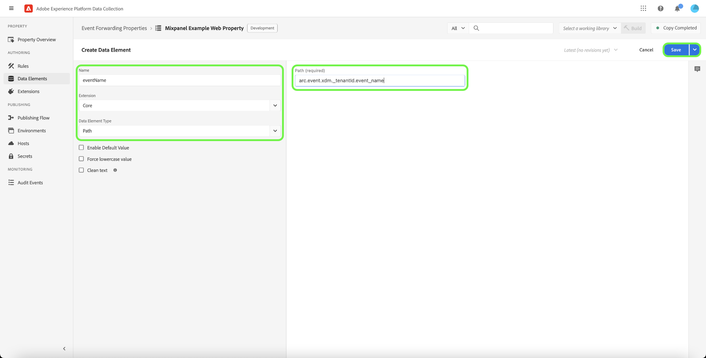

# [!DNL Mixpanel Track Events] API事件轉送擴充功能

[[!DNL Mixpanel]](https://www.mixpanel.com) 是產品分析工具，可讓您擷取使用者與數位產品互動的相關資料。 您可以透過簡單的互動式報表來分析產品資料，只需按幾下即可查詢並視覺化資料。 [!DNL Mixpanel] 旨在讓每個人都能即時分析使用者資料，以識別趨勢、了解使用者行為，並決定您的產品，進而提高團隊的效率。

[!DNL Mixpanel] 採用以事件為基礎、以使用者為中心的模型，將每個互動連結至單一使用者。 此 [!DNL Mixpanel] 資料模型是以使用者、事件和屬性的概念為基礎所建置。

>[!NOTE]
>
>請參閱 [!DNL Mixpanel] 檔案 [身分管理](https://help.mixpanel.com/hc/en-us/articles/360041039771-Getting-Started-with-Identity-Management) 了解 [!DNL Mixpanel] 合併事件以建立身份群集。 此外，建議您檢閱 [不重複ID](https://help.mixpanel.com/hc/en-us/articles/115004509426-Distinct-ID-Creation-JavaScript-iOS-Android-) 了解如何在事件資料中識別使用者。

此 [!DNL Mixpanel Track Events] API擴充功能可讓您同時運用這兩項功能 [事件轉送](../../../ui/event-forwarding/overview.md) 和 [標籤](../../../home.md) 擷取Adobe Experience Platform邊緣網路中的事件資訊，並傳送至 [!DNL Mixpanel] 使用 [[!DNL Track Events] API](https://developer.mixpanel.com/reference/track-event). 本檔案說明擴充功能的使用案例、如何安裝，以及如何將其功能整合至事件轉送 [規則](../../../ui/managing-resources/rules.md).

## 使用案例

如果您想要使用來自邊緣網路的資料，應使用此擴充功能。 [!DNL Mixpanel] 以運用其產品分析功能。

例如，假設零售組織有多頻道存在（網站和行動裝置）。 組織會從其平台擷取交易式或對話式輸入作為事件資料，並載入至 [!DNL Mixpanel] 使用事件轉送擴充功能。

分析團隊便可運用 [!DNL Mixpanel's] 可處理資料集並衍生業務深入分析的功能，可用來產生圖形、控制面板或其他視覺化，以通知業務利害關係人。

如需特定使用案例的詳細資訊，請參閱 [!DNL Mixpanel]，請參閱下列檔案：

* [新增至 [!DNL Mixpanel]](https://help.mixpanel.com/hc/en-us/sections/360008533532-New-to-Mixpanel)
* [什麼是 [!DNL Mixpanel]？](https://developer.mixpanel.com/docs)
* [12次必試 [!DNL Mixpanel] 功能](https://mixpanel.com/blog/12-things-you-probably-didnt-know-you-could-do-with-mixpanel/)

## [!DNL Mixpanel] 必要條件 {#prerequisites-mixpanel}

您必須具備有效 [!DNL Mixpanel] 帳戶，以便使用此擴充功能。 前往 [[!DNL Mixpanel] 註冊頁面](https://mixpanel.com/register/) 註冊並建立帳戶（如果尚未註冊）。

確保 [[!DNL Identity Merge]](https://help.mixpanel.com/hc/en-us/articles/9648680824852-ID-Merge-Implementation-Best-Practices) 已為您的專案啟用設定。 導覽至 **[!DNL Settings]** > **[!DNL Project Setting]** > **[!DNL Identity Merge]** 並切換設定。

<!-- (If these don't apply, do we need to include here at all?)
### API guardrails {#guardrails}

Refer to the [[!DNL Mixpanel] documentation](https://developer.mixpanel.com/reference/import-events#rate-limits) for limits and response codes. As [!DNL Mixpanel] only sends live events these limits should not apply.
-->

### 收集所需配置詳細資訊 {#configuration-details}

將Experience Platform連結至 [!DNL Mixpanel] 您必須具備下列輸入：

| 鍵類型 | 說明 | 範例 |
| --- | --- | --- |
| 專案代號 | 與您的 [!DNL Mixpanel] 帳戶。 請參閱 [!DNL Mixpanel] 檔案 [找到專案代號](https://help.mixpanel.com/hc/en-us/articles/115004502806-Find-Project-Token-) 以取得指引。 | `25470xxxxxxxxxxxxxxxxxxx1289` |

## Experience Cloud必要條件

本節涵蓋所有實作的Experience Cloud必備步驟。 視您的個別實作需求而定，在設定擴充功能之前設定下列建構可能會有所幫助：

1. A [綱要](../../../../xdm/schema/composition.md) 說明要擷取至Experience Cloud的資料結構
1. A [資料流](https://experienceleague.adobe.com/docs/platform-learn/data-collection/event-forwarding/set-up-a-datastream.html) 將傳入資料路由至適當的Adobe Experience Cloud應用程式
1. A [資料集](https://experienceleague.adobe.com/docs/platform-learn/tutorials/data-ingestion/create-datasets-and-ingest-data.html) 儲存所收集的資料

對於所有實施，Experience Cloud端都需要：

1. [建立機密](#create-a-secret)
1. [設定標籤屬性](#set-up-tag-properties)
1. [在標籤屬性中新增資料元素](#add-data-elements-within-tag-properties)
1. [在標籤屬性中新增規則](#add-rules-within-tag-properties)

### 建立機密

建立新 [事件轉送密碼](../../../ui/event-forwarding/secrets.md) 並將值設為 [[!DNL Mixpanel] 專案代號](#configuration-details). 這將用於驗證帳戶的連線，同時保持值安全。

### 設定標籤屬性

[建立標籤屬性](https://experienceleague.adobe.com/docs/platform-learn/implement-in-websites/configure-tags/create-a-property.html?lang=en) 或選擇要編輯的現有屬性。 此屬性將配置為收集 [!DNL Mixpanel] 會先匯入邊緣網路，再透過事件轉送傳送。

### 在標籤屬性中新增資料元素

若您的網站使用 [[!DNL Mixpanel] SDK](https://developer.mixpanel.com/docs/nodejs)，您必須 [建立資料元素](../../../ui/managing-resources/data-elements.md) 使用 **[!UICONTROL Cookie]** 類型(由提供 [[!UICONTROL 核心] 標籤擴充功能](../../client/core/overview.md))所以 [!DNL Mixpanel] `distinct_id` 可從cookie讀取。

此 **[!UICONTROL Cookie名稱]** 值必須符合 [!DNL Mixpanel] 網站的cookie名稱。 名稱的格式應與 `mp_{MIXPANEL_PROJECT_TOKEN_FOR_WEBSITE}_mixpanel`. 選擇 **[!UICONTROL 儲存]** 完成時。

>[!IMPORTANT]
>
>上述資料元素的名稱(`distinctId` 在此範例中)應符合架構中相同欄位所使用的名稱。 這也適用於您稍後將建立的事件轉送資料元素。

對於第二個資料元素，將類型設為 **[!UICONTROL XDM物件]** (從 [Adobe Experience Platform Web SDK擴充功能](../../client/sdk/overview.md))，並將其對應至先前建立的架構。 對應資料時，請確定 `distinct_id` 資料元素(包含 [!DNL Mixpanel] `distinct_id` 值)，則會在其中一個結構欄位內作為值參考。

>[!NOTE]
>
>如果您的網站未執行 [!DNL Mixpanel] SDK、Adobe Experience Cloud ID(ECID)將作為備援 `distinct_id` 值，與傳送至的事件一併傳遞 [!DNL Mixpanel].

根據您的案例，您可能需要建立另一個資料元素，可用來對應至結構中的事件名稱。 您可以使用 **[!UICONTROL DOM屬性]** 由提供的類型 [!UICONTROL 核心] 擴充功能。

### 在標籤屬性中新增規則

設定資料元素後，您就可以開始建立規則，以判斷哪些事件會導致將資料傳送至 [!DNL Mixpanel].

首先，建立會針對使用者識別事件觸發的規則。 這可以代表登入、註冊、註冊，或您要用於使用者識別的任何其他事件。

在 **[!UICONTROL 事件]**，新增會觸發識別事件的條件（專屬於您的網站）。 以下是在使用者點按時觸發登入規則的範例：

選擇 **[!UICONTROL 保留變更]** 將事件新增至規則。

下一個，下 **[!UICONTROL 動作]**，新增您要規則在引發時採取的結果動作。 這些行動中必須包括 **[!UICONTROL 傳送事件]** 平台網頁SDK擴充功能提供，此功能會將事件傳送至邊緣網路，事件轉送擴充功能(例如 [!DNL Mixpanel].

設定動作時，請在 **[!UICONTROL XDM資料]** 選取 [您先前建立的資料元素](#add-data-elements-within-tag-properties) 包含 `distinct_id` 值。

選擇 **[!UICONTROL 保留變更]** 若要新增事件至規則，請選取 **[!UICONTROL 儲存]** 將規則新增至標籤程式庫。 從這裡，你可以 [建立新組建，並將其部署至您的網站](../../../ui/publishing/overview.md).

## 安裝並設定 [!DNL Mixpanel] 擴充功能 {#install}

若要安裝擴充功能， [建立事件轉送屬性](../../../ui/event-forwarding/overview.md#properties) 或選擇要編輯的現有屬性。

選擇 **[!UICONTROL 擴充功能]** 的下一頁。 在 **[!UICONTROL 目錄]** 索引標籤，選取 **[!UICONTROL 安裝]** 在 [!DNL Mixpanel] 擴充功能。

![安裝 [!DNL Mixpanel] 擴充功能。](../../../images/extensions/server/mixpanel/install-extension.png)

## 設定事件轉送資料元素

安裝擴充功能後，下一步是建立事件轉送資料元素，以擷取要傳送至的必要資料建構 [!DNL Mixpanel].

### 建立 `distinctId` 資料元素

在事件轉送下新增資料元素。 若網站已設定 [[!DNL Mixpanel] SDK](https://developer.mixpanel.com/docs/nodejs) the [標籤屬性資料元素](#setup-tag-properties-data-element) 會被定義。 對於事件轉送資料元素，您現在會提供 **[!UICONTROL 路徑]** 。

### 建立 `event_type` 資料元素

以下是已針對事件類型定義的資料元素範例：

### 建立其他資料元素對應

此 `distinctId` 和 `event_type` 將資料傳送至時都需要資料元素 [!DNL Mixpanel]，但也建議在每個事件中加入已知使用者ID和自訂資料物件（若有）。 請參閱 [[!DNL Mixpanel Track Events] REST API](https://developer.mixpanel.com/reference/track-event) 以取得其他指導。

建議的資料元素對應概述如下。

>[!IMPORTANT]
>
>下列所有資料元素都應使用 **[!UICONTROL 路徑]** 類型，讓他們能如 **架構路徑** 欄。
>
>對於架構路徑，您必須取代 `{TENANT_ID}` 預留位置 [租用戶ID](../../../../xdm/api/getting-started.md#know-your-tenant_id)，可作為貴組織定義之自訂欄位的命名空間。

| [!DNL Mixpanel] key | 架構路徑 | 說明 | 必要 |
| --- | --- | --- | --- |
| [!DNL Mixpanel Distinct ID] | `arc.event.xdm._{TENANT_ID}.distinct_id` | `distinct_id` 識別執行事件的使用者。 `distinct_id` 必須在每個事件上指定，因為它對 [!DNL Mixpanel] 正確且有效地執行行為分析，包括不重複使用者、漏斗、保留、同類群組等。 | 是 |
| [!DNL Event Type] | `arc.event.xdm._{TENANT_ID}.event_type` | 這是事件的名稱。 [!DNL Mixpanel] 建議將唯一事件名稱的數量保持相對較小，並針對附加至事件的任何變數內容使用屬性。  例如，建議您不要追蹤名稱為「付費註冊」和「免費註冊」的事件，而要追蹤名為「註冊」的事件，並使用名為「帳戶類型」的屬性來追蹤潛在值「付費」和「免費」。 | 是 |
| [!DNL Known User ID] | `arc.event.xdm._{TENANT_ID}.LoginID` | 使用者的電子郵件或登入ID（如果有）。 | 無 |
| [!DNL Data] | `arc.event.xdm._{TENANT_ID}.properties` | 代表事件所有屬性的JSON物件。 資料會截斷為255個字元。 | 無 |

{style="table-layout:auto"}

## 設定事件轉送規則

設定好所有資料元素後，您就可以開始建立事件轉送規則，以決定事件的傳送時間和方式 [!DNL Mixpanel]. 不過，在設定規則之前，請務必了解身分叢集在中的運作方式 [!DNL Mixpanel] 以便將您傳送的事件正確歸因於個別使用者。

### 了解 [!DNL Mixpanel]

在 [!DNL Mixpanel]，則身分叢集包含 `distinct_id` 連線至個別使用者的值。 [!DNL Mixpanel] 處理每個用戶的身份聚類，解析單個標準 `distinct_id` 從每個要用於報告的叢集。 您也可以包含自己的識別碼(稱為本機 `distinct_id`)，適用於在使用者識別事件之前發生的匿名事件。

[!DNL Mixpanel] 透過兩種方法解析身分叢集：

* **識別** : [!DNL Mixpanel] 將您選擇的標識符連接到匿名 `distinct_id`. 若 [!DNL Mixpanel] SDK已在您的網站上設定，Platform會使用 `distinct_id` 指派給目前登入的使用者。
* **別名**: [!DNL Mixpanel] 合併兩個非匿名 `distinct_id`若傳遞了其他合併條件，則會合併。

>[!NOTE]
>
>請參閱 [!DNL Mixpanel] 文檔 [身分管理](https://help.mixpanel.com/hc/en-us/articles/360041039771-Getting-Started-with-Identity-Management#user-identification) 以取得這些方法的詳細資訊。
>
>確認您已啟用 [[!DNL Mixpanel] 身分合併功能](#prerequisites-mixpanel) 以確保正確解析身份群集。

因此， [!DNL Mixpanel] 事件轉送擴充功能支援 **[!UICONTROL 追蹤事件]** 規則設定的動作類型。

>[!IMPORTANT]
>
>對於每個規則，無論使用的身分叢集解析方法為何，其中一個動作都必須使用 **[!UICONTROL 追蹤事件]** 類型。 若沒有此動作類型，規則將不會將Adobe Experience Edge Network事件傳送至 [!DNL Mixpanel].

### 建立事件追蹤規則

開始在事件轉送屬性中建立新規則。 在 **[!UICONTROL 動作]**，新增動作並將擴充功能設為 **[!UICONTROL Mixpanel]**. 接下來，將動作類型設為 **[!UICONTROL 追蹤事件]** 若要將Adobe Experience Edge Network事件傳送至 [!DNL Mixpanel].

| 輸入 | 說明 |
| --- | --- |
| [!UICONTROL 專案代號] | 此欄位應對應至與您的 [!DNL Mixpanel] 帳戶。 |
| [!UICONTROL 事件類型] | 事件名稱。 |
| [!UICONTROL 事件時間] | 事件時間。 |
| [!UICONTROL Mixpanel不重複ID] | 此欄位應對應至 `distinctId` 您先前建立的資料元素。 |
| [!UICONTROL 插入ID] | 此欄位應對應至 `insertId` 資料元素。 |
| [!UICONTROL 事件屬性] | 從提供原始JSON或使用簡化的鍵值輸入集進行選取。 |

>[!NOTE]
>
>如需 [!DNL Mixpanel] 事件，請參閱 [官方檔案](https://developer.mixpanel.com/reference/import-events#event).

一旦 [!UICONTROL 追蹤事件] 動作會新增至規則中，您可以設定規則的條件，使其只針對特定事件引發，或將條件區段保留為空白，讓規則為所有事件引發。

>[!IMPORTANT]
>
>若您的網站使用 [!DNL Mixpanel] SDK，您可以繼續 [在 [!DNL Mixpanel]](#validate). 如果您未使用 [!DNL Mixpanel] SDK，您必須 [建立個別身分追蹤規則](#create-an-identity-tracking-rule) 確保有適當的 `distinct_id` 值傳送至 [!DNL Mixpanel] 當發生使用者識別事件時。

### 建立身分追蹤規則

如果您未使用 [!DNL Mixpanel SDK]，下一步是建立其他規則。 此規則可確保每當網站上發生使用者識別事件（例如登入、註冊、註冊等）時，都會有適當的事件和 `distinct_id` 值傳送至 [!DNL Mixpanel].

開始建立新規則的程式。 若 [!UICONTROL 條件] 區段中，新增條件以檢查事件是否為使用者識別事件。 在下列範例中，條件使用 [!UICONTROL 值比較] (從 [!UICONTROL 核心] 擴充功能)，以檢查傳入事件的事件名稱是否等於 `signin`，表示使用者登入事件。

![顯示的操作配置 [!DNL Mixpanel] 動作類型別名和識別。](../../../images/extensions/server/mixpanel/ef-rule-condition.png)

將適當條件新增至規則後，您必須建立 [!UICONTROL 傳送事件] 若要將Adobe Experience Edge Network事件傳送至 [!DNL Mixpanel].

>[!NOTE]
>
>如需有關 [!DNL Mixpanel]，請參閱 [官方檔案](https://developer.mixpanel.com/reference/create-identity).

將動作新增至規則後，請選取 **[!UICONTROL 儲存]** 將規則新增至事件轉送程式庫。 從這裡，你可以 [建立新組建並啟用變更](../../../ui/publishing/overview.md).

![為新增事件轉送規則 [!DNL Mixpanel] 動作類型別名和識別。](../../../images/extensions/server/mixpanel/ef-rule-complete.png)

## 在內驗證資料 [!DNL Mixpanel] {#validate}

如果您的實作成功且已收集事件，您會在 [[!DNL Mixpanel] 主控台](https://help.mixpanel.com/hc/en-us/articles/4402837164948).

檢查 [!DNL Mixpanel] 已合併填入電子郵件值的貼文登入事件，與使用 **[!UICONTROL 傳送事件]**. 如果實作正確， [!DNL Mixpanel] 會將它們與單一 [使用者設定檔](https://help.mixpanel.com/hc/en-us/articles/115004501966).

## 後續步驟

本指南說明如何將轉換事件傳送至 [!DNL Mixpanel] 使用事件轉送。 此事件轉送擴充功能會利用 [!DNL Mixpanel] SDK和JavaScript API。 有關這些基礎技術的詳細資訊，請參閱官方檔案：

* [[!DNL Mixpanel] SDK](https://developer.mixpanel.com/docs/nodejs)
* [[!DNL Mixpanel] JavaScript API](https://developer.mixpanel.com/docs/javascript-full-api-reference#mixpanelidentify)

如需Experience Platform中事件轉送功能的詳細資訊，請參閱 [事件轉送概觀](../../../ui/event-forwarding/overview.md).
