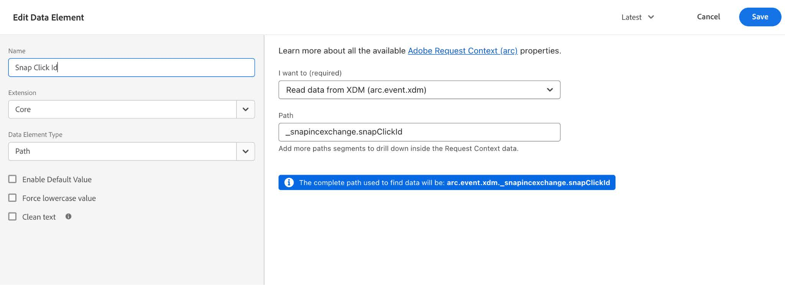

# [!DNL Snapchat]轉換API擴充功能概觀

[!DNL Snap]轉換API擴充功能是安全的[Edge Network伺服器API](/help/server-api/overview.md)介面，可讓您直接與[!DNL Snapchat]共用您網站上使用者動作的資訊。 您可以使用&#x200B;**[!DNL Snap]**&#x200B;轉換API擴充功能，運用事件轉送規則，將資料從&#x200B;**[!DNL Adobe Experience Platform Edge Network]**&#x200B;傳送至&#x200B;**[!DNL Snapchat]**。

## [!DNL Snapchat]必要條件 {#prerequisites}

若要使用[!DNL Snapchat] Conversions API，您必須在Adobe Experience Platform中設定[事件轉送屬性](https://experienceleague.adobe.com/en/docs/experience-platform/tags/event-forwarding/getting-started)，並擁有[編輯屬性所需的許可權](https://experienceleague.adobe.com/en/docs/experience-platform/collection/permissions)。

建立[資料串流](/help/tags/ui/event-forwarding/getting-started.md)，並將[事件轉送服務](/help/tags/ui/event-forwarding/getting-started#enable-event-forwarding)新增至其中。

需要&#x200B;**[!DNL Snapchat]** [Business Manager](https://business.snapchat.com/)帳戶才能使用轉換API。 Business Manager可協助廣告商整合&#x200B;**[!DNL Snapchat]**&#x200B;在其整個企業中的行銷工作，並與外部合作夥伴整合。 如果您沒有Business Manager帳戶，請參閱有關建立帳戶的&#x200B;**[!DNL Snapchat]** [說明中心文章](https://businesshelp.snapchat.com/s/article/get-started?language=en_US)。

必須在Snapchat廣告管理員中設定&#x200B;**[!DNL Snap Pixel]**(https://businesshelp.snapchat.com/s/article/pixel-website-install?language=en_US)，而且您必須具有檢視`Pixel ID`的存取權。 `Pixel ID`可以在&#x200B;**[!UICONTROL 事件管理員]**(https://businesshelp.snapchat.com/s/article/events-manager?language=en_US)區段中找到。

您需要一個靜態、生命週期較長的API Token。 請參閱[[!DNL Snapchat] 轉換API檔案](https://developers.snap.com/api/marketing-api/Conversions-API/GetStarted#access-token)以取得此Token。

## 安裝及設定[!DNL Snapchat]網頁事件API擴充功能 {#install}

若要安裝擴充功能，請瀏覽至&#x200B;**[!UICONTROL 資料彙集]**>**[!UICONTROL 事件轉送]**。 選取您要安裝擴充功能的屬性。

選取所需的屬性後，請依照下列步驟操作：

1. 在左側導覽面板中，選取&#x200B;**[!UICONTROL 擴充功能]**。
2. 搜尋&#x200B;**[!UICONTROL 快照轉換API延伸模組]**&#x200B;並選取&#x200B;**[!UICONTROL 安裝]**。

   。

3. 在設定畫面上，輸入下列值：

* **[!UICONTROL 畫素識別碼]**
* **[!UICONTROL API Token]**

完成後，選取&#x200B;**[!UICONTROL 儲存]**。

。
<!-- 
![[!DNL Snap] configuration screen for the [!DNL Snap] conversion API extension.](../../../images/extensions/server/snap/configure.png) -->

## 建立資料元素 {#create-data-elements}

若要將資料點作為引數傳遞至[!DNL Snapchat] Conversions API擴充功能，您必須為每個資料點建立[個資料元素](https://experienceleague.adobe.com/en/docs/platform-learn/implement-web-sdk/event-forwarding/setup-event-forwarding#create-an-event-forwarding-data-element)。 請依照下列步驟操作：

1. 導覽至您屬性的&#x200B;**[!UICONTROL 屬性資訊]**&#x200B;畫面中的&#x200B;**[!UICONTROL 製作]**>**[!UICONTROL 資料元素]**，然後選取&#x200B;**[!UICONTROL 新增資料元素]**。

   。

2. 輸入資料元素的名稱。

3. 選取&#x200B;**[!UICONTROL 核心]**&#x200B;作為延伸，選取&#x200B;**[!UICONTROL 路徑]**&#x200B;作為資料元素型別。

4. 從下拉式功能表中選取適當的專案，然後填寫右側面板中的[!UICONTROL 路徑]欄位，以在結構描述中參照所需的資料。

   。

例如，如果您正在建立參照下列結構描述中`snapClickId`的資料元素：

的影像。

您必須設定資料元素，因為`snapClickId`位於XDM結構描述中的`_snap.inc.exchange`下。

。

如需建立資料元素的詳細資訊，請參閱[事件轉送屬性檔案](/help/tags/ui/event-forwarding/overview#data-elements.md)。

## 建立規則以將轉換事件傳送至快照 {#create-snap-rules}

[規則](https://experienceleague.adobe.com/en/docs/platform-learn/implement-web-sdk/event-forwarding/setup-event-forwarding#create-an-event-forwarding-rule)是用來在Platform中觸發擴充功能。 本節概述如何在事件轉送屬性中建立規則，以使用轉換API擴充功能將轉換事件傳送至Snap。

### 建立新規則

1. 導覽至您的事件轉送屬性，並從[撰寫]功能表選取&#x200B;**[!UICONTROL 規則]**。 然後，按一下&#x200B;**[!UICONTROL 建立新規則]**。

   。

2. 為規則命名，並設定觸發Snap事件的條件。 例如，若要在事件包含訂單編號時傳送`PURCHASE`事件，請設定條件以檢查使用者互動是否包含有效的採購單編號。

   。

3. 儲存條件後，新增動作以觸發「快照轉換API」 。 在左側面板中：

   * 將[!UICONTROL 擴充功能]下拉式功能表設定為[!UICONTROL 快照轉換API擴充功能]。

   * 將[!UICONTROL 動作型別]下拉式功能表設定為[!UICONTROL 報告Web轉換]。

   * 為規則命名。

   。

4. 設定您要為右側面板上&#x200B;**[!UICONTROL 資料繫結]**&#x200B;區段中的事件傳送的[CAPI引數值](https://developers.snap.com/api/marketing-api/Conversions-API/Parameters)。 擴充功能中的欄位會對應至CAPI引數，如下所示。 如需每個引數的詳細資訊，請參閱[Snapchat Conversions API檔案](https://developers.snap.com/api/marketing-api/Conversions-API/Parameters)。

| 資料繫結欄位 | 貼齊CAPI引數 |
| --- | --- |
| 事件型別（必要） | `event_name` |
| 電子郵件 | `em` |
| 電話號碼 | `ph` |
| 使用者代理 | `client_user_agent` |
| IP位址 | `client_ip_address` |
| 點按ID | `sc_click_id` |
| Cookie1 | `so_cookie1` |
| 名字 | `fn` |
| 姓氏 | `ln` |
| 性別 | `ge` |
| 城市 | `ph` |
| 狀態 | `st` |
| 郵遞區號 | `zp` |
| 國家/地區 | `country` |
| 外部 ID | `external_id` |
| 合作夥伴ID | `partner_id` |
| 訂閱ID | `subscription_id` |
| 銷售機會ID | `lead_id` |
| 專案或類別 | `content_category` |
| 內容名稱 | `content_ids` |
| 內容類型 | `content_name` |
| 內容 | `contents` |
| 說明 | `description` |
| 事件標籤 | `event_tag` |
| 項目數 | `num_items` |
| 價格 | `value` |
| 貨幣 | `currency` |
| 交易 ID | `order_id` （也為`event_id`傳送以取代`client dedup idD`） |
| 預計LTV | `predicted_ltv` |
| 搜尋字串 | `search_string` |
| 註冊方法 | `sign_up_method` |
| 使用者端重複資料刪除ID | `event_id` |
| 有限的資料使用 | `data_processing_options` |
| 頁面Url | `event_source_url` |

### 必要和選用欄位

* 必填欄位：

   * 所有事件都會將`event_source`設為`WEB`。

   * 比對至少需要下列其中一個欄位或組合：

      * 電子郵件
      * 電話號碼
      * IP位址和使用者代理程式

**其他附註：**

* `Purchase`事件需要`Currency`和`Price`欄位。

* 啟用&#x200B;**[!UICONTROL 測試模式]**&#x200B;核取方塊會以測試事件的形式傳送事件，這些事件會出現在測試事件工具中，而非標準報告。 如需詳細資訊，請參閱此[商務說明中心文章](https://businesshelp.snapchat.com/s/article/capi-event-testing?language=en_US#:~:text=Snap&#39;s%20Conversions%20API%20(CAPI)%20Test,being%20processed%20as%20production%20results.)。

* `contents`引數應該是JSON字串，其中至少包含下列其中一個欄位：

   * `id`
   * `item_category`
   * `brand`
   * `delivery_category`
   * `item_price`
   * `quantity`

範例：

```json
{
  "id": "id1",
  "brand": "brand1",
  "delivery_category": "c1",
  "item_price": 2.00,
  "quantity": 2
}
```

若要使用[自訂轉換值和ROAS報告](https://businesshelp.snapchat.com/s/article/custom-conversions-value-roas?language=en_US)，請在`contents`欄位中包含相關引數。 例如，`brand`，`item_price`，`id`。

`Purchase`事件的設定範例：

[顯示資料繫結的影像](../../../images/extensions/server/snap/data_bindings.png)

可設定選用欄位，如下所示：

[顯示選擇性欄位的影像](../../../images/extensions/server/snap/optional_fields.png)

依照上述方式設定規則名稱、條件和動作後，請儲存規則並確認已啟用。

[顯示已啟用規則的影像](../../../images/extensions/server/snap/enabled_rule.png)

您現在可以將這些變更發佈至屬性。 如需詳細資訊，請參閱[發佈流程](https://experienceleague.adobe.com/en/docs/experience-platform/tags/publish/overview)的相關檔案。

## 疑難排解 {#troubleshoot}

若要進行疑難排解與最佳化設定，請檢閱[事件品質分數建議](https://businesshelp.snapchat.com/s/article/event-quality-score)，以確保您的事件達到最高的匹配率和效能結果。

如果您遇到有關&#x200B;**事件品質分數**&#x200B;的問題，請在[這裡](https://businesshelp.snapchat.com/s/article/esq-issues-recommendations?language=en_US)進一步瞭解我們建議的改善方法。

## 後續步驟 {#next-steps}

本指南說明如何使用&#x200B;**[!DNL Snap Conversions API]**&#x200B;擴充功能將伺服器端事件資料傳送至&#x200B;**[!DNL Snap]**。 如需Platform中事件轉送功能的詳細資訊，請參閱[事件轉送概觀](../../../ui/event-forwarding/overview.md)。
