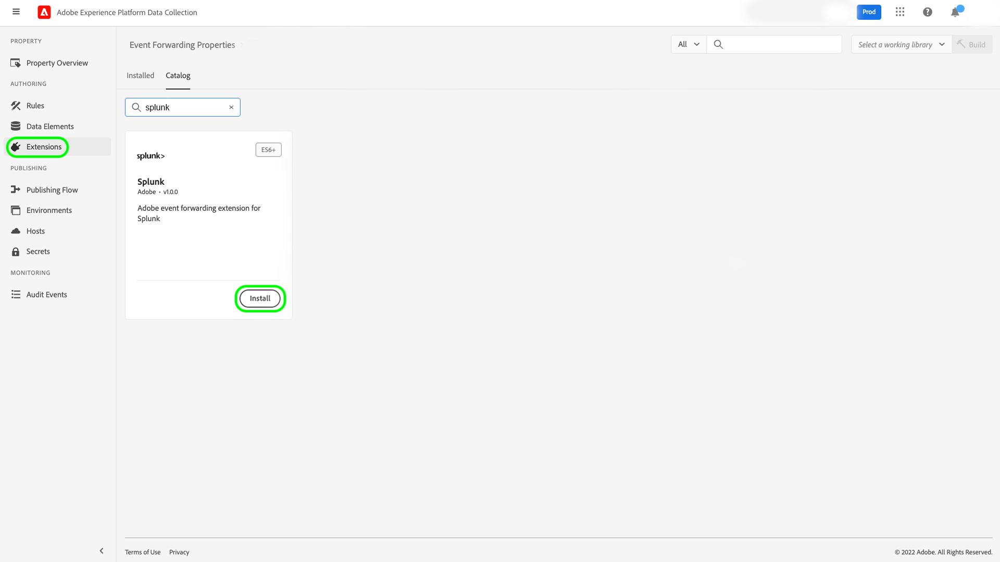

# Splunk擴充功能概觀

[Splunk](https://www.splunk.com) 是可觀察的平台，可提供搜尋、分析和視覺化效果，以便對您的資料進行可操作的深入分析。 蘇靈克 [事件轉送](../../../ui/event-forwarding/overview.md) 擴充功能可運用 [Splunk HTTP事件收集器REST API](https://docs.splunk.com/Documentation/Splunk/8.2.5/Data/HECRESTendpoints) 將事件從Adobe Experience Platform邊緣網路傳送至 [Splunk HTTP事件收集器](https://docs.splunk.com/Documentation/Splunk/8.2.5/Data/UsetheHTTPEventCollector).

Splunk使用承載權杖作為驗證機制，以與Splunk事件收集器API通訊。

## 使用案例 {#use-cases}

行銷團隊可針對下列使用案例使用擴充功能：

| 使用案例 | 說明 |
| --- | --- |
| 客戶行為分析 | 組織可從其網站擷取客戶互動事件資料，並將相關事件轉送至Splunk。 然後，行銷和分析團隊可在Splunk平台內執行後續分析，以了解關鍵使用者互動和行為。 Splunk平台可用來產生圖形、控制面板或其他視覺化，以通知業務利害關係人。 |
| 大型資料集上的可擴充搜尋 | 組織可以擷取交易式或對話式輸入，作為來自網站的事件資料，並將事件轉送至Splunk。 然後，Analytics團隊便能運用Splunk的可擴充索引功能，篩選及處理大型資料集，以衍生任何業務分析並做出明智的決策。 |

{style="table-layout:auto"}

## 先決條件 {#prerequisites}

您必須有Splunk帳戶才能使用此擴充功能。 您可以在 [Splunk首頁](https://www.splunk.com/page/sign_up).

>[!NOTE]
>
> Splunk擴充功能同時支援Splunk Cloud和Splunk企業執行個體。 本指南會記錄實作，使用 [Splunk雲](https://www.splunk.com/en_us/products/splunk-cloud-platform.html) 作為參考。 的設定程式 [Splunk Enterprise](https://www.splunk.com/en_us/products/splunk-enterprise.html) 類似，但需要Splunk企業管理員的特定指引。

您也必須具備下列技術值才能設定擴充功能：

* 安 [事件收集器代號](https://docs.splunk.com/Documentation/Splunk/8.2.5/Data/UsetheHTTPEventCollector#Create_an_Event_Collector_token_on_Splunk_Cloud_Platform). 代號通常為UUIDv4格式，如下所示： `12345678-1234-1234-1234-1234567890AB`.
* 貴組織的Splunk平台實例地址和埠。 平台實例地址和埠通常具有以下格式： `mysplunkserver.example.com:443`.
   >[!IMPORTANT]
   >
   > 事件轉送中引用的Splunk端點應僅使用埠 `443`. 事件轉送實施目前不支援非標準埠。

## 安裝Splunk擴充功能 {#install}

若要在UI中安裝「Splunk事件收集器」擴充功能，請導覽至 **事件轉送** 並選取屬性以新增擴充功能至，或改為建立新屬性。

選取或建立所需屬性後，請導覽至 **擴充功能** > **目錄**. 搜索「[!DNL Splunk]「 」，然後選取 **[!DNL Install]** 在Splunk擴充功能上。

## 設定Splunk擴充功能 {#configure_extension}

>[!IMPORTANT]
>
>視您的實作需求而定，在設定擴充功能之前，您可能需要先建立結構、資料元素和資料集。 開始之前，請先檢閱所有設定步驟，以判斷您需要針對使用案例設定哪些實體。

選擇 **擴充功能** 的下一頁。 在 **已安裝**，選取 **設定** 在Splunk擴充功能上。

針對 **[!UICONTROL HTTP事件收集器URL]**，輸入您的Splunk平台實例地址和埠。 在 **[!UICONTROL 存取權杖]**，請輸入 [!DNL Event Collector Token] 值。 完成後，請選取 **[!UICONTROL 儲存]**.

## 設定事件轉送規則 {#config_rule}

開始建立新的事件轉送規則 [規則](../../../ui/managing-resources/rules.md) 並視需要設定其條件。 選取規則的動作時，請選取 [!UICONTROL Splunk] 擴充功能，然後選取 [!UICONTROL 建立事件] 動作類型。 其他控制項則會顯示，以進一步設定Splunk事件。

下一步是將Splunk事件屬性對應至您先前建立的資料元素。 以下提供可設定之輸入事件資料所支援的選用對應。 請參閱 [Splunk檔案](https://docs.splunk.com/Documentation/Splunk/8.2.5/Data/FormateventsforHTTPEventCollector#Event_metadata) 以取得詳細資訊。

| 欄位名稱 | 說明 |
| --- | --- |
| [!UICONTROL 事件&#x200B;]  **（必要）** | 指出您要如何提供事件資料。 事件資料可指派給 `event` 索引鍵（位於HTTP要求的JSON物件中），或可能是原始文字。 此 `event` 索引鍵與中繼資料索引鍵位於JSON事件封包中的相同層級。 在 `event` 索引鍵值大括弧，資料可以是您需要的任何形式（例如字串、數字、其他JSON物件等）。 |
| [!UICONTROL Host] | 您要從中傳送資料的用戶端主機名稱。 |
| [!UICONTROL 來源類型] | 要指派給事件資料的來源類型。 |
| [!UICONTROL 來源] | 要指派給事件資料的來源值。 例如，如果您要從正在開發的應用程式傳送資料，請將此索引鍵設為應用程式的名稱。 |
| [!UICONTROL 索引] | 事件資料的索引的名稱。 如果令牌已設定索引參數，則此處指定的索引必須位於允許的索引清單內。 |
| [!UICONTROL 時間] | 事件時間。 預設時間格式為UNIX時間(格式為 `<sec>.<ms>`)，並取決於您的當地時區。 例如， `1433188255.500` 表示大紀元後的1433188255秒和500毫秒，或2015年6月1日星期一的7:50:55 PM GMT。 |
| [!UICONTROL 欄位] | 指定原始JSON物件或一組索引鍵值配對，其中包含要在索引時定義的明確自訂欄位。  此 `fields` 金鑰不適用於原始資料。  包含 `fields` 屬性必須傳送至 `/collector/event` 端點，否則不會為它們編列索引。 如需詳細資訊，請參閱 [索引欄位擷取](https://docs.splunk.com/Documentation/Splunk/8.2.5/Data/IFXandHEC). |

### 驗證Splunk中的資料 {#validate}

建立並執行事件轉送規則後，驗證傳送至Splunk API的事件是否如預期顯示在Splunk UI中。 如果事件收集和Experience Platform整合成功，您會在Splunk主控台中看到事件，如下所示：

## 後續步驟

本檔案說明如何在UI中安裝和設定Splunk事件轉送擴充功能。 如需在Splunk中收集事件資料的詳細資訊，請參閱官方檔案：

* [在Splunk Web中設定和使用HTTP事件收集器 ](https://docs.splunk.com/Documentation/Splunk/8.2.5/Data/UsetheHTTPEventCollector)
* [使用Token設定驗證](https://docs.splunk.com/Documentation/Splunk/8.2.5/Security/Setupauthenticationwithtokens#Prerequisites_for_activating_tokens)
* [疑難排解HTTP事件收集器](https://docs.splunk.com/Documentation/Splunk/8.2.5/Data/TroubleshootHTTPEventCollector) (還列有 [可能的錯誤代碼](https://docs.splunk.com/Documentation/Splunk/8.2.5/Data/TroubleshootHTTPEventCollector#Possible_error_codes))
