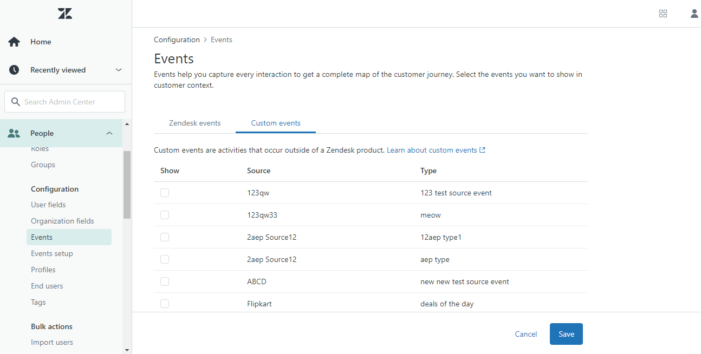

# [!DNL Zendesk] Events API擴充功能概述

[Zendesk](https://www.zendesk.com) 是客戶服務解決方案與銷售工具。 Zendesk [事件轉送](../../../ui/event-forwarding/overview.md) 擴充功能可運用 [[!DNL Zendesk Events API]](https://developer.zendesk.com/api-reference/custom-data/events-api/events-api/) 將事件從Adobe Experience Platform Edge Network傳送到Zendesk進行進一步處理。 您可以使用擴充功能來收集客戶設定檔互動，以用於下游分析和動作。

本文介紹如何在UI中安裝和設定擴充功能。

## 先決條件

您必須擁有Zendesk帳戶才能使用此擴充功能。 您可以在以下網址註冊Zendesk帳戶： [Zendesk網站](https://www.zendesk.com/register/).

您也必須為您的Zendesk設定收集以下詳細資訊：

| 金鑰型別 | 說明 | 範例 |
| --- | --- | --- |
| 子網域 | 在註冊程式中， **子網域** 是專屬於該帳戶所建立。 請參閱 [Zendesk檔案](https://developer.zendesk.com/documentation/ticketing/working-with-oauth/creating-and-using-oauth-tokens-with-the-api/) 以取得詳細資訊。 | `xxxxx.zendesk.com` (其中 `xxxxx` 是在建立帳戶期間提供的值) |
| API權杖 | Zendesk使用持有人權杖作為驗證機制，與Zendesk API通訊。 登入Zendesk入口網站後，產生API權杖。 請參閱 [Zendesk檔案](https://support.zendesk.com/hc/en-us/articles/4408889192858-Generating-a-new-API-token) 以取得詳細資訊。 | `cwWyOtHAv12w4dhpiulfe9BdZFTz3OKaTSzn2QvV` |

{style="table-layout:auto"}

最後，您必須為API權杖建立事件轉送密碼。 將密碼型別設為 **[!UICONTROL Token]**，並將值設為您從Zendesk設定收集的API權杖。 請參閱以下檔案： [事件轉送中的秘密](../../../ui/event-forwarding/secrets.md) 以取得有關設定密碼的詳細資訊。

## 安裝擴充功能 {#install}

若要在UI中安裝Zendesk擴充功能，請導覽至 **事件轉送** 並選取要新增擴充功能的屬性，或改為建立新屬性。

選取或建立所需的屬性後，導覽至 **擴充功能** > **目錄**. 搜尋&quot;[!DNL Zendesk]&quot;，然後選取 **[!DNL Install]** 在Zendesk Extension上。

## 設定擴充功能 {#configure}

>[!IMPORTANT]
>
>根據您的實作需求，您可能需要在設定擴充功能前建立結構、資料元素和資料集。 開始之前，請先檢閱所有設定步驟，以決定您需要為使用案例設定的實體。

選取 **擴充功能** ，位於左側導覽器中。 在 **已安裝**，選取 **設定** 在Zendesk擴充功能上。

在 **[!UICONTROL Zendesk網域]**，請輸入您Zendesk子網域的值。 在 **[!UICONTROL Zendesk權杖]**，選取您先前建立且包含API權杖的密碼。

## 設定事件轉送規則

開始建立新的事件轉送規則 [規則](../../../ui/managing-resources/rules.md) 並視需要設定其條件。 選取規則的動作時，選取 [!UICONTROL Zendesk] 擴充功能，然後選取 [!UICONTROL 建立事件] 動作型別。

設定動作設定時，系統會提示您為將傳送至Zendesk的各種屬性指派資料元素。

這些資料元素應對應，如下所示。

### `event` 金鑰

`event` 是JSON物件，代表使用者觸發的事件。 請參閱Zendesk檔案，位於 [事件剖析](https://developer.zendesk.com/documentation/custom-data/events/anatomy-of-an-event/) 以取得擷取之屬性的詳細資訊， `event` 物件。

下列索引鍵可在 `event` 物件對應至資料元素時：

| `event` key | 類型 | 平台路徑 | 說明 | 強制 | 限制 |
| --- | --- | --- | --- | --- | --- |
| `source` | 字串 | `arc.event.xdm._extconndev.event_source` | 傳送事件的應用程式。 | 是 | 不要使用 `Zendesk` 作為值，因為這是Zendesk標準事件的受保護來源名稱。 嘗試使用它將會導致錯誤。 值長度不得超過40個字元。 |
| `type` | 字串 | `arc.event.xdm._extconndev.event_type` | 事件型別的名稱。 您可以使用此欄位來表示特定來源的不同型別事件。 例如，您可以為使用者登入建立一個事件集，並為購物車建立另一個事件集。 | 是 | 值長度不得超過40個字元。 |
| `description` | 字串 | `arc.event.xdm._extconndev.description` | 事件的說明。 | 無 | （不適用） |
| `created_at` | 字串 | `arc.event.xdm.timestamp` | 反映事件建立時間的ISO-8601時間戳記。 | 無 | （不適用） |
| `properties` | 物件 | `arc.event.xdm._extconndev.EventProperties` | 包含事件詳細資料的自訂JSON物件。 | 是 | （不適用） |

{style="table-layout:auto"}

>[!NOTE]
>
>請參閱 [[!DNL Zendesk Events API] 檔案](https://developer.zendesk.com/api-reference/custom-data/events-api/events-api/) 以取得事件屬性的其他指引。

### `profile` 金鑰

`profile` 是JSON物件，代表觸發事件的使用者。 請參閱Zendesk檔案，位於 [個人資料剖析](https://developer.zendesk.com/documentation/ticketing/profiles/anatomy-of-a-profile/) 以取得擷取之屬性的詳細資訊， `profile` 物件。

下列索引鍵可在 `profile` 物件對應至資料元素時：

| `profile` key | 類型 | 平台路徑 | 說明 | 強制 | 限制 |
| --- | --- | --- | --- | --- | --- |
| `source` | 字串 | `arc.event.xdm._extconndev.profile_source` | 與設定檔相關聯的產品或服務，例如 `Support`， `CompanyName`，或 `Chat`. | 是 | （不適用） |
| `type` | 字串 | `arc.event.xdm._extconndev.profile_type` | 設定檔型別的名稱。 您可以使用此欄位為特定來源建立不同型別的設定檔。 例如，您可以為客戶建立一組公司設定檔，為員工建立另一組公司設定檔。 | 是 | 設定檔型別長度不得超過40個字元。 |
| `name` | 字串 | `arc.event.xdm._extconndev.name` | 個人資料中的人員名稱 | 無 | （不適用） |
| `user_id` | 字串 | `arc.event.xdm._extconndev.user_id` | 此人在Zendesk中的使用者ID。 | 無 | （不適用） |
| `identifiers` | 陣列 | `arc.event.xdm._extconndev.identifiers` | 包含至少一個識別碼的陣列。 每個識別碼都包含型別和值。 | 是 | 請參閱 [Zendesk檔案](https://developer.zendesk.com/api-reference/ticketing/users/profiles_api/profiles_api/#identifiers-array) 有關詳細資訊，請參閱 `identifiers` 陣列。 所有欄位和值都必須是唯一的。 |
| `attributes` | 物件 | `arc.event.xdm._extconndev.attrbutes` | 包含使用者定義之個人相關屬性的物件。 | 無 | 請參閱 [Zendesk檔案](https://developer.zendesk.com/documentation/ticketing/profiles/anatomy-of-a-profile/#attributes) 以取得設定檔屬性的詳細資訊。 |

{style="table-layout:auto"}

## 驗證Zendesk中的資料 {#validate}

如果事件收集和Adobe Experience Platform整合成功，則Zendesk主控台中的事件應會顯示如下。 這表示整合成功。

設定檔：

事件：

## 請求限制 {#limits}

根據帳戶型別，Zendesk [!DNL Events API] 可處理下列每分鐘要求數：

| [!DNL Account Type] | 每分鐘要求數 |
| --- | --- |
| [!DNL Team] | 250 |
| [!DNL Growth] | 250 |
| [!DNL Professional] | 500 |
| [!DNL Enterprise] | 750 |
| [!DNL Enterprise Plus] | 1000 |

{style="table-layout:auto"}

請參閱 [Zendesk檔案](https://developer.zendesk.com/api-reference/ticketing/account-configuration/usage_limits/#:~:text=API%20requests%20made%20by%20Zendesk%20apps%20are%20subject,sources%20for%20the%20account%2C%20including%20internal%20product%20requests.) 以取得這些限制的詳細資訊。

## 錯誤與疑難排解 {#errors-and-troubleshooting}

使用或設定擴充功能時，Zendesk Events API可能會傳回下列錯誤：

| 錯誤碼 | 說明 | 解決方法 | 範例 |
|---|---|---|---|
| 400 | **無效的設定檔長度：** 當設定檔屬性的長度包含超過40個字元時，就會發生此錯誤。 | 設定檔屬性資料的長度上限為40個字元。 | `{"error": [{"code":"InvalidProfileTypeLength","title": "Profile type length > 40 chars"}]}` |
| 401 | **找不到路由：** 當提供了無效的網域時，就會發生這個錯誤。 | 請確認已提供下列格式的有效網域： `{subdomain}.zendesk.com` | `{"error": [{"description": "No route found for host {subdomain}.zendesk.com","title": "RouteNotFound"}]}` |
| 401 | **驗證無效或遺失：** 當存取權杖無效、遺失或過期時，就會發生此錯誤。 | 確認存取權杖有效且尚未過期。 | `{"error": [{"code":"MissingOrInvalidAuthentication","title": "Invalid or Missing Authentication"}]}` |
| 403 | **許可權不足：** 當沒有提供存取資源的足夠許可權時，就會發生此錯誤。 | 驗證是否已提供所需的許可權。 | `{"error": [{"code":"PermissionDenied","title": "Insufficient permisssions to perform operation"}]}` |
| 429 | **太多請求：** 當超過端點物件記錄限制時，會發生此錯誤。 | 請參閱以上章節： [請求限制](#limits) 以取得每個限制臨界值的詳細資訊。 | `{"error": [{"code":"TooManyRequests","title": "Too Many Requests"}]}` |

{style="table-layout:auto"}

## 後續步驟

本檔案說明如何在UI中安裝和設定Zendesk事件轉送擴充功能。 如需在Zendesk中收集事件資料的詳細資訊，請參閱官方檔案：

* [事件快速入門](https://developer.zendesk.com/documentation/custom-data/events/getting-started-with-events/)
* [Zendesk Events API](https://developer.zendesk.com/api-reference/ticketing/users/events-api/events-api/)
* [關於事件API](https://developer.zendesk.com/documentation/custom-data/events/about-the-events-api/)
* [事件剖析](https://developer.zendesk.com/documentation/custom-data/events/anatomy-of-an-event/)
* [Zendesk設定檔API](https://developer.zendesk.com/api-reference/ticketing/users/events-api/events-api/#profile-object)
* [關於設定檔API](https://developer.zendesk.com/documentation/ticketing/profiles/about-the-profiles-api/)
* [個人資料剖析](https://developer.zendesk.com/documentation/ticketing/profiles/anatomy-of-a-profile/)
