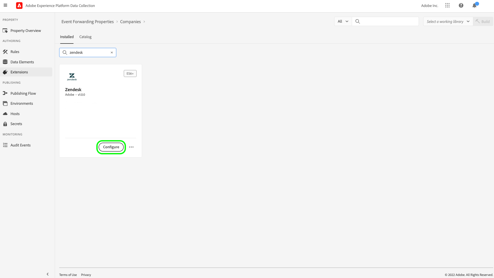
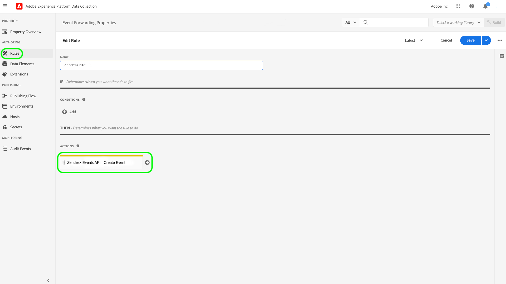

# [!DNL Zendesk]事件API擴充功能概觀

[Zendesk](https://www.zendesk.com)是客戶服務解決方案和銷售工具。 Zendesk [事件轉送](../../../ui/event-forwarding/overview.md)擴充功能會利用[[!DNL Zendesk Events API]](https://developer.zendesk.com/documentation/ticketing/events/about-the-events-api/)將事件從Adobe Experience PlatformEdge Network傳送至Zendesk以進行進一步處理。 您可以使用擴充功能來收集客戶設定檔互動，以用於下游分析和動作。

本文介紹如何在UI中安裝和設定擴充功能。

## 先決條件

您必須擁有Zendesk帳戶才能使用此擴充功能。 您可以在[Zendesk網站](https://www.zendesk.com/register/)上註冊Zendesk帳戶。

您也必須為您的Zendesk設定收集以下詳細資訊：

| 金鑰類型 | 說明 | 範例 |
| --- | --- | --- |
| 子網域 | 在註冊程式期間，會建立專屬於該帳戶的唯一的&#x200B;**子網域**。 如需詳細資訊，請參閱[Zendesk檔案](https://developer.zendesk.com/documentation/ticketing/working-with-oauth/creating-and-using-oauth-tokens-with-the-api/)。 | `xxxxx.zendesk.com` （其中`xxxxx`是在建立帳戶期間提供的值） |
| API權杖 | Zendesk使用持有人權杖作為驗證機制，與Zendesk API通訊。 登入Zendesk入口網站後，產生API權杖。 如需詳細資訊，請參閱[Zendesk檔案](https://support.zendesk.com/hc/en-us/articles/4408889192858-Generating-a-new-API-token)。 | `cwWyOtHAv12w4dhpiulfe9BdZFTz3OKaTSzn2QvV` |

{style="table-layout:auto"}

最後，您必須為API權杖建立事件轉送密碼。 將密碼型別設定為&#x200B;**[!UICONTROL Token]**，並將值設定為您從Zendesk設定收集的API Token。 如需設定密碼的詳細資訊，請參閱事件轉送[&#128279;](../../../ui/event-forwarding/secrets.md)中密碼的檔案。

## 安裝擴充功能 {#install}

若要在UI中安裝Zendesk擴充功能，請導覽至&#x200B;**事件轉送**&#x200B;並選取要新增擴充功能的屬性，或改為建立新屬性。

選取或建立所需的屬性後，請瀏覽至&#x200B;**擴充功能** > **目錄**。 搜尋「[!DNL Zendesk]」，然後在Zendesk擴充功能上選取&#x200B;**[!DNL Install]**。

在UI中選取之Zendesk擴充功能的

## 設定擴充功能 {#configure}

>[!IMPORTANT]
>
>根據您的實作需求，您可能需要在設定擴充功能前建立結構、資料元素和資料集。 開始之前，請先檢閱所有設定步驟，以決定您需要為使用案例設定的實體。

在左側導覽中選取&#x200B;**擴充功能**。 在&#x200B;**已安裝**&#x200B;下，選取Zendesk延伸上的&#x200B;**設定**。

在UI中選取之Zendesk擴充功能的

在&#x200B;**[!UICONTROL Zendesk網域]**&#x200B;底下，輸入您的Zendesk子網域值。 在&#x200B;**[!UICONTROL Zendesk Token]**&#x200B;下，選取您先前建立的包含API Token的密碼。

## 設定事件轉送規則

開始建立新的事件轉送規則[規則](../../../ui/managing-resources/rules.md)，並視需要設定其條件。 選取規則的動作時，請選取[!UICONTROL Zendesk]擴充功能，然後選取[!UICONTROL 建立事件]動作型別。

設定動作設定時，系統會提示您為將傳送至Zendesk的各種屬性指派資料元素。

這些資料元素應對應，如下所示。

### `event`個金鑰

`event`是JSON物件，代表使用者觸發的事件。 請參閱事件[&#128279;](https://developer.zendesk.com/documentation/ticketing/events/anatomy-of-an-event/)的解剖結構上的Zendesk檔案，以瞭解`event`物件所擷取屬性的詳細資訊。

當對應至資料元素時，可在`event`物件中參考下列索引鍵：

| `event`金鑰 | 類型 | 平台路徑 | 說明 | 強制 | 限制 |
| --- | --- | --- | --- | --- | --- |
| `source` | 字串 | `arc.event.xdm._extconndev.event_source` | 傳送事件的應用程式。 | 是 | 請勿使用`Zendesk`做為值，因為它是Zendesk標準事件的受保護來源名稱。 嘗試使用它將會導致錯誤。 值長度不可超過40個字元。 |
| `type` | 字串 | `arc.event.xdm._extconndev.event_type` | 事件型別的名稱。 您可以使用此欄位來表示特定來源的不同型別事件。 例如，您可以為使用者登入建立一個事件集，並為購物車建立另一個事件集。 | 是 | 值長度不得超過40個字元。 |
| `description` | 字串 | `arc.event.xdm._extconndev.description` | 事件的說明。 | 無 | （不適用） |
| `created_at` | 字串 | `arc.event.xdm.timestamp` | 反映事件建立時間的ISO-8601時間戳記。 | 無 | （不適用） |
| `properties` | 物件 | `arc.event.xdm._extconndev.EventProperties` | 包含事件詳細資料的自訂JSON物件。 | 是 | （不適用） |

{style="table-layout:auto"}

>[!NOTE]
>
>請參閱[[!DNL Zendesk Events API] 檔案](https://developer.zendesk.com/documentation/ticketing/events/about-the-events-api/)以取得事件屬性的其他指引。

### `profile`個金鑰

`profile`是JSON物件，代表觸發事件的使用者。 如需有關`profile`物件所擷取屬性的詳細資訊，請參閱個人資料[&#128279;](https://developer.zendesk.com/documentation/ticketing/profiles/anatomy-of-a-profile/)的解剖結構上的Zendesk檔案。

當對應至資料元素時，可在`profile`物件中參考下列索引鍵：

| `profile`金鑰 | 類型 | 平台路徑 | 說明 | 強制 | 限制 |
| --- | --- | --- | --- | --- | --- |
| `source` | 字串 | `arc.event.xdm._extconndev.profile_source` | 與設定檔相關聯的產品或服務，例如`Support`、`CompanyName`或`Chat`。 | 是 | （不適用） |
| `type` | 字串 | `arc.event.xdm._extconndev.profile_type` | 設定檔型別的名稱。 您可以使用此欄位為特定來源建立不同型別的設定檔。 例如，您可以為客戶建立一組公司設定檔，為員工建立另一組公司設定檔。 | 是 | 設定檔型別長度不得超過40個字元。 |
| `name` | 字串 | `arc.event.xdm._extconndev.name` | 個人資料中的人員名稱 | 無 | （不適用） |
| `user_id` | 字串 | `arc.event.xdm._extconndev.user_id` | 此人在Zendesk中的使用者ID。 | 無 | （不適用） |
| `identifiers` | 陣列 | `arc.event.xdm._extconndev.identifiers` | 包含至少一個識別碼的陣列。 每個識別碼都包含型別和值。 | 是 | 請參閱[Zendesk檔案](https://developer.zendesk.com/api-reference/ticketing/users/profiles_api/profiles_api/#identifiers-array)，以取得有關`identifiers`陣列的詳細資訊。 所有欄位和值都必須是唯一的。 |
| `attributes` | 物件 | `arc.event.xdm._extconndev.attrbutes` | 包含使用者定義之個人相關屬性的物件。 | 無 | 如需設定檔屬性的詳細資訊，請參閱[Zendesk檔案](https://developer.zendesk.com/documentation/ticketing/profiles/anatomy-of-a-profile/#attributes)。 |

{style="table-layout:auto"}

## 驗證Zendesk中的資料 {#validate}

如果事件收集和Adobe Experience Platform整合成功，則Zendesk主控台中的事件應會顯示如下。 這表示整合成功。

設定檔：

事件：

## 請求限制 {#limits}

根據帳戶型別，Zendesk [!DNL Events API]每分鐘可以處理下列數目的要求：

| [!DNL Account Type] | 每分鐘要求數 |
| --- | --- |
| [!DNL Team] | 250 |
| [!DNL Growth] | 250 |
| [!DNL Professional] | 500 |
| [!DNL Enterprise] | 750 |
| [!DNL Enterprise Plus] | 1000 |

{style="table-layout:auto"}

如需這些限制的詳細資訊，請參閱[Zendesk檔案](https://developer.zendesk.com/api-reference/ticketing/account-configuration/usage_limits/#:~:text=API%20requests%20made%20by%20Zendesk%20apps%20are%20subject,sources%20for%20the%20account%2C%20including%20internal%20product%20requests.)。

## 錯誤與疑難排解 {#errors-and-troubleshooting}

使用或設定擴充功能時，Zendesk Events API可能會傳回下列錯誤：

| 錯誤碼 | 說明 | 解決方法 | 範例 |
|---|---|---|---|
| 400 | **無效的設定檔長度：**&#x200B;當設定檔屬性的長度包含超過40個字元時，就會發生此錯誤。 | 設定檔屬性資料的長度上限為40個字元。 | `{"error": [{"code":"InvalidProfileTypeLength","title": "Profile type length > 40 chars"}]}` |
| 401 | **找不到路由：**&#x200B;當提供無效的網域時，就會發生此錯誤。 | 請確認已以下列格式提供有效的網域： `{subdomain}.zendesk.com` | `{"error": [{"description": "No route found for host {subdomain}.zendesk.com","title": "RouteNotFound"}]}` |
| 401 | **無效或遺失驗證：**&#x200B;當存取權杖無效、遺失或過期時，就會發生此錯誤。 | 確認存取權杖有效且尚未過期。 | `{"error": [{"code":"MissingOrInvalidAuthentication","title": "Invalid or Missing Authentication"}]}` |
| 403 | **許可權不足：**&#x200B;若未提供足夠的許可權存取資源，就會發生此錯誤。 | 驗證是否已提供所需的許可權。 | `{"error": [{"code":"PermissionDenied","title": "Insufficient permisssions to perform operation"}]}` |
| 429 | **太多要求：**&#x200B;超過端點物件記錄限制時，會發生此錯誤。 | 如需每個限制臨界值的詳細資訊，請參閱以上有關[要求限制](#limits)的章節。 | `{"error": [{"code":"TooManyRequests","title": "Too Many Requests"}]}` |

{style="table-layout:auto"}

## 後續步驟

本檔案說明如何在UI中安裝和設定Zendesk事件轉送擴充功能。 如需在Zendesk中收集事件資料的詳細資訊，請參閱官方檔案：

* [開始使用事件](https://developer.zendesk.com/documentation/ticketing/events/getting-started-with-events/)
* [Zendesk事件API](https://developer.zendesk.com/api-reference/ticketing/users/events-api/events-api/)
* [關於事件API](https://developer.zendesk.com/documentation/ticketing/events/about-the-events-api/)
* [事件的剖析](https://developer.zendesk.com/documentation/ticketing/events/anatomy-of-an-event/)
* [Zendesk設定檔API](https://developer.zendesk.com/api-reference/ticketing/users/events-api/events-api/#profile-object)
* [關於設定檔API](https://developer.zendesk.com/documentation/ticketing/profiles/about-the-profiles-api/)
* [個人資料剖析](https://developer.zendesk.com/documentation/ticketing/profiles/anatomy-of-a-profile/)
