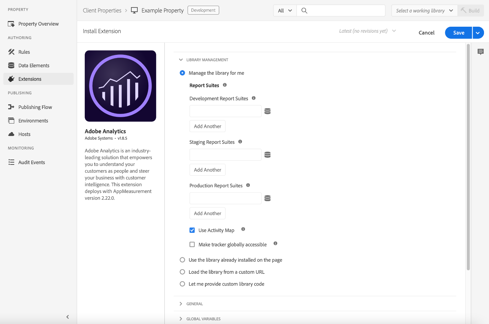

# Adobe Analytics擴充功能概觀

>[!NOTE]
>
>Adobe Experience Platform Launch已重新命名為Experience Platform中的資料收集技術套件。 因此，產品檔案中已推出數個術語變更。 有關術語更改的綜合參考，請參閱以下[document](../../../term-updates.md)。

請使用此參考資料來了解有關設定 Adobe Analytics 擴充功能的資訊，以及使用此擴充功能建立規則時可用的選項。

## 設定 Adobe Analytics 擴充功能

本節提供設定 Adobe Analytics 擴充功能時可用選項的參考資料。

如果尚未安裝Adobe Analytics擴充功能，請開啟屬性，然後選取&#x200B;**[!UICONTROL 擴充功能>目錄]**，將游標暫留在Adobe Analytics擴充功能上，然後選取&#x200B;**[!UICONTROL 安裝]**。

若要設定擴充功能，請開啟「擴充功能」標籤，將游標暫留在擴充功能上，然後選取「**[!UICONTROL 設定]**」。



## 程式庫管理

從設定頁面的「程式庫管理」區段中選取選項。下列組態選項可供使用：

### 為我管理程式庫

#### 報表套裝

針對下列各個環境指定一或多個報表套裝：

* 開發
* 預備
* 生產

### 使用已安裝在頁面上的程式庫

#### 在追蹤器上設定下列報表套裝

如果選取此選項，請針對下列各個環境指定一或多個報表套裝：

* 開發
* 預備
* 生產

#### 使用 Activity Map 模組

Activity Map 會以個別模組的形式 (類似 AAM 模組) 載入。Activity Map 預設為開啟，但您可以取消勾選設定中相對應的方塊將其關閉。

#### 追蹤器可在指定的全域變數存取

勾選此方塊可讓追蹤器物件在全域使用。例如，您可以在網站上任意位置定義變數 `window.s.pageName`。

### 從自訂 URL 載入程式庫

#### HTTP URL

指定程式庫所在的 URL。

#### HTTPS URL

指定程式庫所在的 URL。

#### 在追蹤器上設定下列報表套裝

如果選取此選項，請針對下列各個環境指定一或多個報表套裝：

* 開發
* 預備
* 生產

#### 追蹤器可在指定的全域變數存取

指定要在全域使用的追蹤器物件。

### 讓我提供自訂程式庫程式碼

#### 開啟編輯器

可讓您插入核心[AppMeasurement.js](https://experienceleague.adobe.com/docs/analytics/implementation/js/overview.html?lang=zh-Hant)程式碼。 使用自動設定方式時，系統會自動填入此程式碼。

>[!NOTE]
>
>標籤程式碼編輯器中使用的驗證器，專門用於識別開發人員所編寫程式碼的問題。 經過縮製程式的程式碼（例如從程式碼管理員下載的AppMeasurement.js程式碼）可能會遭標籤驗證器誤判而標示為有問題，這通常可以忽略。

#### 在追蹤器上設定下列報表套裝

如果選取此選項，請針對下列各個環境指定一或多個報表套裝：

* 開發
* 預備
* 生產

#### 追蹤器可在指定的全域變數存取

指定要在全域使用的追蹤器物件。

## 一般

從設定頁面的「一般」區段中選取選項。下列組態選項可供使用：

### 對 Adobe Analytics 啟用 EU 規範

根據 EU 隱私權 Cookie 來啟用或停用追蹤。

勾選「EU法規遵循」核取方塊時，會出現「追蹤Cookie名稱]」欄位。 [!UICONTROL 追蹤 Cookie 會覆寫預設的追蹤 Cookie 名稱。您可以自訂標籤用來追蹤您對於接收其他Cookie的選擇退出狀態的名稱。

載入頁面時，系統會檢查名為 sat\_track 的 Cookie 是否已經設定 (或「編輯屬性」頁面上所指定的自訂 Cookie 名稱)。請考量下列資訊：

* 如果此 Cookie 不存在，或 Cookie 存在但設定為 true 以外的任何值，則會在啟用此設定時跳過工具的載入。其效果是，如果某規則使用工具，則不會套用該規則的任何部分。如果規則具有啟用了 EU 法規遵循的分析以及協力廠商程式碼，且 Cookie 設定為 false，協力廠商程式碼仍會執行。不過，不會設定分析變數。
* 如果此 Cookie 存在，但設定為 true，則工具會正常載入。

如果訪客選擇退出，您要負責將 sat\_ track (或自訂名稱) Cookie 設為 false。您可以使用自訂程式碼來達到此目標：

```javascript
_satellite.cookie.set("sat_track", "false");
```

您也必須具備機制可將該 Cookie 設定為true，如果要讓訪客能夠稍後選擇加入：

```javascript
_satellite.cookie.set("sat_track", "true");
```

### 字元集

判斷影像要求的編碼方式。如果您的實作或網站使用非 ASCII 字元，請務必在這裡定義字元集。您可以選取預設的字元集或指定自訂的字元集。Adobe 建議您使用與您網站相同的字元編碼。通常此值為 UTF-8。

字元集可在 Analytics 自訂程式碼中使用 `s.charSet` 變數設定。如需字元集的詳細資訊，請參閱 [charSet 文件](https://experienceleague.adobe.com/docs/analytics/implementation/vars/config-vars/charset.html)。

### 貨幣代碼

判斷要套用至收入和貨幣事件的轉換率。如果您的網站允許訪客以多種貨幣購買，設定貨幣代碼可確保正確轉換和儲存貨幣金額。

如需支援的貨幣代碼詳細資訊，請參閱 [currencyCode](https://experienceleague.adobe.com/docs/analytics/implementation/vars/config-vars/currencycode.html)。

### 追蹤伺服器

用於第一方 Cookie 實作，以指定第一方 Cookie 的儲存位置。如果您使用 Experience Cloud ID 服務，Adobe 建議不要填入此欄位。

追蹤伺服器可在 Analytics 自訂程式碼中使用 `s.trackingServer` 變數設定。

請參閱 Adobe Analytics 實作指南中的 [trackingServer](https://experienceleague.adobe.com/docs/analytics/implementation/vars/config-vars/trackingserver.html)。

### SSL 追蹤伺服器

用於 SSL 第一方 Cookie 實作，以指定第一方 Cookie 的儲存位置。如果您使用 Experience Cloud ID 服務，Adobe 建議不要填入此欄位。如未定義，則 SSL 資料會使用追蹤伺服器。

SSL 追蹤伺服器可在 Analytics 自訂程式碼中使用 `s.trackingServerSecure` 變數設定。

請參閱 [trackingServerSecure](https://experienceleague.adobe.com/docs/analytics/implementation/vars/config-vars/trackingserversecure.html)。

## 全域變數

使用此區段來設定 [eVar 和 Prop](https://experienceleague.adobe.com/docs/analytics/implementation/vars/page-vars/evar.html)，以及建立階層。

全域變數是在頁面上初始化該物件時，在 Analytics 追蹤物件上設定的變數。在每個頁面上建立追蹤物件時，您在此處設定的任何變數都會設定。在設定這些變數後，就會與使用其他方式設定的任何變數一樣。具體來說，這表示規則可以修改、變更或清除這些變數。

如果您的網頁應用程式通常會在每頁傳送一個信標，此區段可讓您輕鬆在同一個位置設定變數。如果您的應用程式會在每頁傳送多個信標 (例如單頁應用程式)，而您需要清除變數並使用相同的追蹤物件重設變數，則使用規則來設定和清除變數比較簡單。

## 連結追蹤

從設定頁面的「Link Tracking」區段中選取選項。下列組態選項可供使用：

### 啟用 ClickMap

[ClickMap](https://experienceleague.adobe.com/docs/analytics/analyze/activity-map/activity-map.html?lang=zh-Hant) 是 Internet Explorer 和 Firefox 的外掛程式，也是 Reports &amp; Analytics 的模組。

### 追蹤下載連結

追蹤網站上的檔案下載連結。

請參閱 [s.trackDownLoadLinks](https://experienceleague.adobe.com/docs/analytics/implementation/vars/config-vars/trackdownloadlinks.html)。

### 下載副檔名

如果啟用「追蹤下載連結」選項，您可以選取「下載報告」中包含之檔案連結的副檔名 (如果您網站包含的連結會連結至具有下列任一副檔名的檔案)，這些連結的 URL 會出現在報告中。

請參閱 [s.linkDownloadFileTypes](https://experienceleague.adobe.com/docs/analytics/implementation/vars/config-vars/linkdownloadfiletypes.html)。

### 追蹤對外連結

判斷選取的連結是否為退出連結。

請參閱 [s.trackExternalLinks](https://experienceleague.adobe.com/docs/analytics/implementation/vars/config-vars/trackexternallinks.html)。

**單一頁面應用程式考量事項：**&#x200B;由於部分 SPA 網站的編碼方式，對 SPA 網站上頁面的內部連結，看起來可能像是對外連結。

您可以使用下列其中一個方法，來追蹤來自 SPA 網站的對外連結：

* 如果您不想要從 SPA 追蹤任何對外連結，請插入項目至永不追蹤區段。例如，`http://testsite.com/spa/\#`。所有連線至此主機的 \# 連結會遭忽略。會追蹤連線至其他主機的所有輸出連結，例如 [https://www.google.com](https://www.google.com)。
* 如果在 SPA 上有您想要追蹤的一些連結，請使用永遠追蹤區段。

例如，如果您有 spa/\#/about 頁面，即可以在「永遠追蹤」區段放入「關於」。

「關於」頁面是所追蹤的唯一對外連結。不會追蹤頁面上的其他任何連結 (例如：[https://www.google.com](https://www.google.com))。

>[!NOTE]
>
>這兩個選項會互斥。

### 保留 URL 參數

保留查詢字串。

請參閱 [s.linkLeaveQueryString](https://experienceleague.adobe.com/docs/analytics/implementation/vars/config-vars/linkleavequerystring.html)。

## Cookie

設定用於部署 Adobe Analytics 擴充功能之 Cookie 全域設定的欄位說明。下列組態選項可供使用：

### 訪客 ID

不重複值，代表離線和線上系統的客戶。

請參閱 [visitorID](https://experienceleague.adobe.com/docs/analytics/import/data-sources/data-types-and-categories/datasrc-visitorid.html)。

### 訪客命名空間

識別 Cookie 設定所在網域的變數。

請參閱 [visitorNamespace](https://experienceleague.adobe.com/docs/analytics/implementation/vars/config-vars/visitornamespace.html)。

### 網域句號

決定頁面 URL 網域中的句號數後，要在其中設定 Analytics Cookie `s_cc` 和 `s_sq` 的網域。有些外掛程式也會使用此變數來決定用以設定外掛程式 Cookie 的正確網域。

請參閱 [s.cookieDomainPeriods](https://experienceleague.adobe.com/docs/analytics/implementation/vars/config-vars/cookiedomainperiods.html)。

### 第一方網域句號

`fpCookieDomainPeriods` 變數會用於由 JavaScript (`s_sq`、`s_cc` 外掛程式) 設定、原本即為第一方 Cookie 的 Cookie，即使您的實作使用協力廠商的 2o7.net 或 omtrdc.net 網域亦然。

請參閱 [s.fpCookieDomainPeriods](https://experienceleague.adobe.com/docs/analytics/implementation/vars/config-vars/fpcookiedomainperiods.html)。

### Cookie 期限

決定 Cookie 的存留時間。

請參閱 [s.cookieLifetime](https://experienceleague.adobe.com/docs/analytics/implementation/vars/config-vars/cookielifetime.html)。

### 安全 Cookie

此變數可讓 AppMeasurement 編寫安全 Cookie。

請參閱 [writeSecureCookies](https://experienceleague.adobe.com/docs/analytics/implementation/vars/config-vars/writesecurecookies.html)


## 自訂頁面代碼

使用編輯器來自訂頁面代碼。

## Adobe Audience Manager

使用擴充功能設定的此區段來指定 Audience Manager 與 Analytics 搭配使用的方式。

啟用&#x200B;**「自動與 Audience Manager 共用 Analytics 資料」**。

下列選項隨即顯示：


Audience Manager 子網域由 Adobe Audience Manager 指派。有時稱為「合作夥伴名稱」或「合作夥伴子網域」。如果您不知道您的合作夥伴名稱，請連絡您的 Adobe 顧問或客戶服務。

您可以選取&#x200B;**顯示進階設定**&#x200B;並輸入您的偏好設定，以設定進階設定。


如需各設定的詳細資訊，請選取資訊圖示，或參閱 [Adobe Audience Manager 文件](https://experienceleague.adobe.com/docs/audience-manager/user-guide/aam-home.html)。

## Analytics 擴充功能動作類型

本節說明 Analytics 擴充功能中可用的動作類型。

Analytics 擴充功能提供下列動作：

* [設定變數](#set-variables)
* [傳送信標](#send-beacon)
* [清除變數](#clear-variables)

### 設定變數 {#set-variables}

重要：使用「設定變數」動作不會傳送信標。您必須使用「傳送信標」動作。

#### eVar

設定一或多個 [eVar](https://experienceleague.adobe.com/docs/analytics/implementation/vars/page-vars/evar.html)。

1. 從下拉式清單中選取 eVar。
1. 指定您要將 eVar 設定為值 (「Set As」) 或複製 (「Duplicate From」) 另一個 eVar。
1. 提供「Set As」的值，或選擇您要複製的 eVar。
1. (選用) 選取「新增 eVar」以設定更多 eVar。
1. 選擇&#x200B;**[!UICONTROL 保留更改]**。

#### Prop

設定一或多個 [Prop](https://experienceleague.adobe.com/docs/analytics/implementation/vars/page-vars/prop.html)。

1. 從下拉式清單中選取 Prop。
1. 指定您要將 Prop 設定為值 (「Set As」) 或複製 (「Duplicate From」) 另一個 eVar。
1. 提供「Set As」的值，或選擇您要複製 Prop 的來源 eVar。
1. （選用）選取&#x200B;**[!UICONTROL 新增prop]**&#x200B;以設定更多prop。
1. 選擇&#x200B;**[!UICONTROL 保留更改]**。

#### 事件

設定一或多個[事件](https://experienceleague.adobe.com/docs/analytics/implementation/vars/page-vars/events/events-overview.html)。

1. 從下拉式清單中選取事件。
1. (選用) 選擇或指定用於[事件序列化](https://experienceleague.adobe.com/docs/analytics/implementation/vars/page-vars/events/event-serialization.html)的資料元素。
1. （選用）選取&#x200B;**[!UICONTROL 新增事件]**&#x200B;以設定更多事件。
1. 選擇&#x200B;**[!UICONTROL 保留更改]**。

#### 階層

設定 Analytics [階層](https://experienceleague.adobe.com/docs/analytics/implementation/vars/page-vars/hier.html)變數。

指定階層中的各個層級。

如有需要，可設定其他階層。

#### 其他資訊

指定頁面使用的其他資訊。

這些設定包括：

* 頁面名稱
* 頁面 URL
* 伺服器
* 管道
* 反向連結
* 促銷活動
* 購買 ID

   指定值或查詢參數

* 狀態
* 郵遞區號
* 交易 ID

選取「其他設定」核取方塊，即可在「全域變數」選單中找到這些設定。

#### 自訂頁面代碼

**說明**

使用編輯器來指定自訂頁面代碼。

**設定**

1. 選擇&#x200B;**[!UICONTROL 開啟編輯器]**。
1. 輸入自訂程式碼。
1. 選取&#x200B;**[!UICONTROL 「儲存」]**。

### 傳送信標 {#send-beacon}

#### 遞增頁面檢視 - s.t()

選取是否要遞增頁面檢視。

#### 不要遞增頁面檢視 - s.t()

選取是否不要增加頁面檢視。

**設定**

1. 選取連結類型。

   您可以選取下列其中一項：

   * 自訂連結
   * 下載連結
   * 退出連結

1. 設定所選連結的參數。
   * 自訂連結：指定連結名稱。
   * 下載連結：指定檔案名稱。
   * 退出連結：指定目的地 URL。
1. 選擇&#x200B;**[!UICONTROL 保留更改]**。

### 清除變數 {#clear-variables}

如果選取「清除變數」動作類型，則沒有設定選項。
