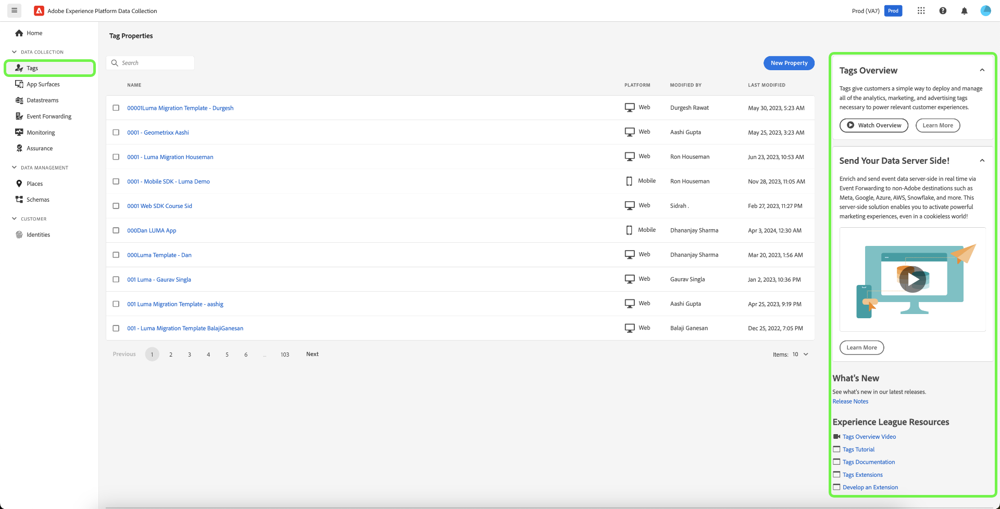

# 標籤總覽

>[!NOTE]
>
>Adobe Experience Platform Launch已經過品牌重塑，現在是Adobe Experience Platform中的一套資料收集技術。 因此，所有產品檔案中出現了幾項術語變更。 請參閱下列[檔案](./term-updates.md)，以取得術語變更的彙總參考資料。

Adobe Experience Platform中的標籤是新一代Adobe標籤管理功能。 標籤可讓客戶透過簡單的方式部署及管理所有必要的分析、行銷及廣告標籤功能，以便支援相關客戶體驗。

標籤可讓任何人建置和維護自己的整合，稱為&#x200B;*擴充功能*。 這些擴充功能可為 [!DNL Adobe Experience Cloud] 客戶提供應用程式商店的使用體驗，讓客戶快速安裝、設定和部署自己的標籤。

標籤是以隨附的加值功能提供給[!DNL Adobe Experience Cloud]個客戶。

## 主要優點 {#key-benefits}

* 加速創造價值。
* 使用資料元素集中收集、整理和傳送資料，確保資料值得信賴。
* 使用規則產生器，透過整合資料和行銷技術提供引人入勝的體驗。

## 主要功能 {#key-features}

使用右側面板中產品說明內的，深入瞭解標籤並檢視其他可用資源。

資料收集UI中的

### 擴充功能 {#extensions}

擴充功能是指能擴充標籤功能的程式碼(JavaScript、HTML及CSS)套件。 使用幾乎為自助服務的介面來建置、管理和更新您的整合。您可以將擴充功能視為用來完成工作的應用程式。

### 擴充功能目錄 {#extension-catalog}

瀏覽、設定及部署由獨立軟體廠商建置和維護的行銷/廣告工具。

### 規則產生器 {#rule-builder}

建立結合多個事件的完善規則，並以您使用若/則 (if/then) 邏輯搭配條件和例外決定的順序加以排序。規則為以下項目提供選項：

* 事件
* 條件
* 例外
* 動作

規則產生器包含對自訂程式碼的即時錯誤檢查和語法螢光標示。

只要符合規則中所列的準則及其他條件，您所定義的動作就會依序執行。

### 資料元素 {#data-elements}

透過網頁式行銷和廣告技術收集、整理及傳送資料。

### 企業發佈 {#enterprise-publishing}

發佈程序可讓團隊將程式碼發佈至頁面。不同的人員可以建立、核准實作，並將其發佈到您的頁面上。

* 程式碼變更會封裝到您定義的程式庫中。
* 您可以指定部署程式碼的位置和時機。
* 不同團隊可同時建置多個程式庫。
* 開發環境不受任何限制。
* 合併程式庫時，採用審慎的許可權型程式。

### 開放 API {#open-apis}

將個別技術或技術群組的實作自動化。

* 標籤會與Reactor API互動。
* 可透過 API 自動部署。
* 將API與您自己的內部系統進行整合。
* 如有需要，您可以建置您專屬的使用者介面。

### 輕量型模組化容器標籤 {#modular-tag}

容器的內容皆經過適當極簡化，包括自訂程式碼。一切模組化。如果您不需要某個項目，就不必將該項目納入程式庫。如此可使實作流程更加快速和精簡。請參閱[縮製](./ui/publishing/builds.md)。

## 其他重點項目 {#other-highlights}

標籤在類似系統上提供數項改善功能，包括：

* Chrome 未允許的情況下，不得使用 `document.write ()`。
* 將 Page Top 和 Page Bottom 規則內建到主要程式庫，將不必要的 HTTP 呼叫減至最少。
* 規則內的自訂動作指令碼可同時載入，但會依序執行。
* 如果您撤銷 Page Top 和 Page Bottom 規則，程式碼通常會不同步，而且會附上一個完全非同步的路徑。
