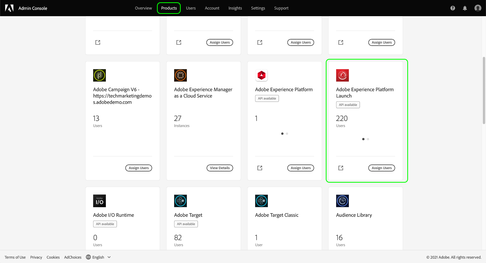
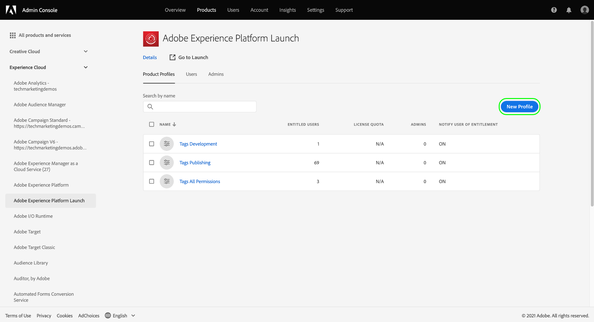
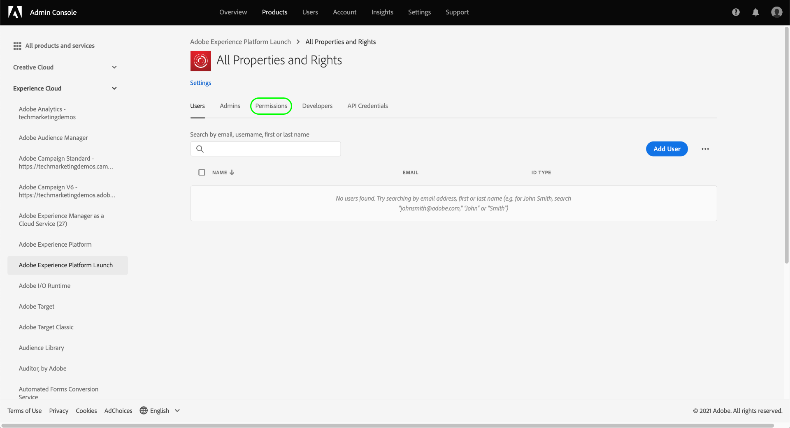

# 管理標籤的權限

>[!NOTE]
>
>Adobe Experience Platform Launch在Adobe Experience Platform中已重新命名為一套資料收集技術。 因此，產品檔案中已推出數個術語變更。 有關術語更改的綜合參考，請參閱以下[document](../../term-updates.md)。

若要在Adobe Experience Platform中使用標籤，您必須透過Adobe Admin Console，獲得至少一項Adobe Experience Cloud產品的存取權。 此外，您也必須獲得產品設定檔層級標籤的權限，才能在登入資料收集UI時執行特定動作。

本指南涵蓋如何使用Admin Console將這些權限授予使用者。

>[!NOTE]
>
>有關本指南中提及的不同可用標籤權限類型的詳細資訊，請參閱[使用者權限概述](./user-permissions.md)。

## 取得標籤產品設定檔的管理權限

若要管理標籤的使用者權限，您至少必須是Adobe Admin Console中標籤的產品設定檔管理員。 系統管理員和產品管理員也可以管理標籤產品設定檔的權限。

請參閱[管理角色](https://helpx.adobe.com/enterprise/admin-guide.html/enterprise/using/admin-roles.ug.html)上的Admin Console檔案，了解不同管理層級以及如何在組織內管理這些角色的詳細資訊。

## 選取要管理的權限的產品設定檔

擁有管理員權限後，登入Admin Console並從頂端導覽中選取&#x200B;**[!UICONTROL Products]**。 從顯示的產品清單中，選擇&#x200B;**[!UICONTROL Adobe Experience Platform Launch]**。

產品設定檔清單隨即顯示。 產品設定檔是將一組權限連結至一組使用者的結構。 從此處，您可以建立要設定的新設定檔，或從清單中選取要編輯的現有產品設定檔（假設您擁有該設定檔的管理員權限）。

### 建立產品設定檔

>[!NOTE]
>
>如果您選取了要編輯的現有設定檔，請跳到[下一節](#permissions)。

要建立新產品配置檔案，請選擇&#x200B;**[!UICONTROL 新配置檔案]**。

此時會出現一個對話方塊，讓您提供設定檔的名稱和選用說明。 您也可以切換將使用者新增至此設定檔或從中移除時，是否應讓使用者收到電子郵件。 完成後，選擇&#x200B;**[!UICONTROL Save]**。

## 設定產品設定檔的權限 {#permissions}

產品設定檔的詳細資訊頁面隨即顯示。 使用提供的索引標籤，您可以管理指派給設定檔的使用者，並設定設定檔將授予這些使用者的特定屬性和權限。

本指南](#users)後面提供了有關如何添加用戶的步驟。 [目前，請選擇&#x200B;**[!UICONTROL 權限]**。

下一個畫面會顯示目前指派給設定檔的平台、屬性和權限數目的概觀。 選取其中一列旁的&#x200B;**[!UICONTROL Edit]**&#x200B;以開始設定設定檔的權限。

此時會出現[!UICONTROL 編輯權限]畫面，讓您從產品設定檔新增和移除權限。 從&#x200B;**[!UICONTROL 平台]**&#x200B;區段中，您可以看到所有平台皆已預設新增至設定檔。

### 指派屬性

要為此配置檔案分配屬性，請在左側導航中選擇&#x200B;**[!UICONTROL 屬性]**。

依預設，系統會自動為新產品設定檔授予對您組織可用屬性的存取權。 這包括目前可用的屬性以及未來提供的任何屬性。

如果要限制可用屬性，請選擇&#x200B;**[!UICONTROL 自動包含]**&#x200B;切換。 這可讓您視需要手動新增和移除屬性的屬性。

如果「自動包含」已停用，所有目前可用的屬性都會列在左側。 您可以在左欄中選取相關屬性旁的加號(**+**)圖示，將屬性新增至設定檔。 若要移除屬性，請在右側欄中選取相關屬性旁的&#x200B;**X**&#x200B;圖示。

>[!IMPORTANT]
>
>停用「自動包含」功能表示未來建立的任何屬性都必須手動新增至產品設定檔，才能獲得這些屬性的存取權。

### 指派權利

依預設，產品設定檔的所有權限都會停用，且必須手動新增才能啟用。 如果您屬於自動包含屬性但沒有權限的產品設定檔，則您擁有所有屬性的唯讀存取權。

>[!NOTE]
>
>使用者可以屬於Admin Console中的多個產品設定檔，但來自這些設定檔的權限不會結合到主權限集中。 該使用者仍然只會有各個群組明確授予的權利。
>
>例如，如果群組1可存取具有開發權利的屬性A，而群組2可存取具有發佈權利的屬性B，則不會為屬性A和屬性B結合開發和發佈權利。您只能在屬性A上開發，並在屬性B上發佈。

在左側導航中選擇&#x200B;**[!UICONTROL 屬性權限]**。 與屬性一樣，您可以選取屬性旁的加號(**+**)圖示，將其新增至設定檔。 如果要向配置檔案添加所有屬性權利，也可以選擇&#x200B;**[!UICONTROL Add all]**。

接下來，在左側導覽中選取&#x200B;**[!UICONTROL 公司權限]**。 添加或刪除所需的權限，完成後，選擇&#x200B;**[!UICONTROL Save]**。

## 將使用者指派至設定檔 {#users}

若要將使用者指派給產品設定檔，請選取[!UICONTROL 使用者]標籤，然後選取[!UICONTROL 新增使用者]。

在顯示的對話方塊中，輸入您要新增至設定檔之使用者的名稱、使用者群組或電子郵件地址。 如果使用者是您組織的一員，其資訊會顯示在自動完成下拉式清單中，您可以選取該下拉式清單以填入詳細資訊。 如果他們不屬於您的組織，您可以手動輸入他們的資訊。

完成後，選擇&#x200B;**[!UICONTROL Save]**&#x200B;將指定的用戶添加到產品配置檔案中。

將使用者新增至設定檔後，使用者會收到電子郵件，通知他們現在擁有資料收集UI的權限。

## 後續步驟

本檔案說明如何使用Adobe Admin Console管理資料收集UI的屬性和權限。 如需可用權限及其授予存取權的功能的詳細資訊，請參閱[使用者權限](./user-permissions.md)的概觀。
