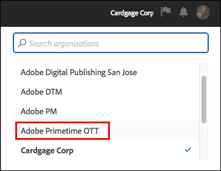
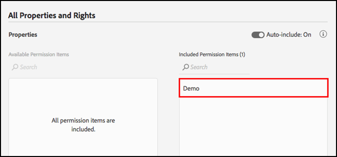

# 使用者權限

>[!NOTE]
>
>Adobe Experience Platform Launch已重新命名為Experience Platform中的資料收集技術套件。 因此，產品檔案中已推出數個術語變更。 有關術語更改的綜合參考，請參閱以下[document](../../term-updates.md)。

## 權限類型

若要與Adobe Experience Platform中的標籤搭配使用，請了解以下兩個使用者權限：

* **Experience Cloud 權限：**&#x200B;可使用公司層級在 Admin Console 找到，[!DNL Experience Cloud] 權限控管誰可以控制所有 [!DNL Experience Cloud] 產品的群組權限和群組會籍。
* **標籤的權限：** 標籤的權限位於產品設定檔層級的Admin Console中。這些權限控管哪些使用者可在登入資料收集UI時實際執行特定動作。

本文將深入探討這些權限類型。

### Experience Cloud 權限

本節探討使用Platform時需了解的重要因素。 如需 [!DNL Experience Cloud] 權限的完整檢視，請參閱[企業使用指南中的管理角色](https://helpx.adobe.com/tw/enterprise/using/admin-roles.html)。

#### 組織管理員

組織管理員通常稱為 Org Admin。組織管理員的主要功能是指派權限給其他使用者。作法是建立包含特定產品內的一組特定權利的產品設定檔 (或群組)，然後指派現有或新的使用者給該產品設定檔。

Enterprise組織管理員不會繼承Platform中標籤的任何權利。 如果他們想在資料收集UI中執行任何操作，則必須將自己新增至具有適當權限的產品設定檔。

#### 產品管理員

產品管理員 (又稱為 Product Admin) 類似於組織管理員，但其範圍較小。產品管理員 只有修改特定 [!DNL Adobe] 產品的產品設定檔的權限，而沒有公司可存取之所有 [!DNL Adobe] 產品的權限。

### 標籤的權限

在 [!DNL Experience Cloud] 中，不會將任何權利或權限指派給個別使用者。它們會指派給產品設定檔 (請參閱上述「Experience Cloud 權限」)。接著，個別使用者會獲派一或多個產品設定檔。

在產品設定檔中，標籤的權限會分為四個維度。

1. 平台
1. 屬性
1. 屬性權利
1. 公司權利

#### 平台

每個屬性都有一個平台。目前有兩個平台可供標籤使用：*Web*&#x200B;和&#x200B;*Mobile*。 您可以善用此權限類型，限制或授予特定屬性類型的存取權。若您的行動應用程式和網站是由不同的團隊管理，此方法即可派上用場。

#### 屬性

這是您公司內現存屬性的完整清單。您可以善用此權限類型，限制或授予特定現有屬性 (依名稱) 的存取權。

#### 屬性權利

您在資料收集UI中建立的任何屬性，都可在Admin Console中供您指派權限。 如果指定的產品設定檔沒有屬性 A1 的存取權，屬於該設定檔的使用者就無法看到或修改屬性 A1 內的任何設定。

假設使用者屬於某個具有屬性 A1 存取權的設定檔，使用者可在屬性 A1 內執行的操作，便取決於此權限群組所授予的權限。如果使用者擁有屬性 A1 的權限，但未獲派權利，則只能以唯讀方式存取。

此群組提供的權限包括：

* **開發：** 這可讓您建立規則和資料元素。您也可以建立程式庫，並在現有開發環境中進行建置。準備好之後，您可以提交程式庫進行核准。資料收集UI中的大部分日常工作都需要此權限。
* **核准：** 這可讓您取得已提交的程式庫，並建置至測試環境。完成測試之後，您也可以核准程式庫以進行發佈。
* **發佈：** 這可讓您將已核准的程式庫發佈至生產環境。
* **管理擴充功能：** 這可授予將新擴充功能安裝至屬性、修改已安裝擴充功能的擴充功能組態，以及刪除擴充功能的能力。請參閱[的擴充功能概觀檔案，以了解擴充功能](../managing-resources/extensions/overview.md)的詳細資訊。 視您的組織而定，此角色通常屬於 IT 或行銷部門。
* **管理環境：** 這可讓您建立和修改環境。如需詳細資訊，請參閱[環境檔案](../publishing/environments.md)。 此角色通常屬於 IT 群組。

#### 公司權利

公司權利適用於橫跨多個屬性的權限。目前有三個：

* **管理屬性：** 這可讓您在資料收集UI中建立新屬性，以及在屬性層級修改中繼資料和設定。您也可以刪除屬性。如需詳細資訊，請參閱[屬性檔案](companies-and-properties.md)。 管理員通常會執行此角色。
* 
* 授予在[!DNL Platform Launch]中建立新屬性以及在屬性級別修改元資料和設定的能力。 您也可以刪除屬性。您可以前往[這裡](companies-and-properties.md)，深入閱讀有關屬性的資訊。管理員通常會執行此角色。
* **開發擴充功能：**&#x200B;授予建立及修改公司擁有的擴充功能套件的能力，包括私人發行和公開發行要求。
* **管理應用程式設定：** 這僅適用於已授權Adobe Journey Optimizer的客戶，或其他可讓他們存取行動應用程式內及推送訊息的解決方案。這可讓您管理Experience Cloud所知的應用程式，以及與Firebase雲端訊息服務和Apple推播通知服務通訊所需的必要推播憑證。

### 總計使用者權限

個別使用者的總計權限取決於其不同產品設定檔中的總計會籍。如果使用者屬於多個產品設定檔，來自各個設定檔的權限會相加在一起，而不是相乘。

例如：產品設定檔 A 授予 Henry 屬性 1 的開發權利。產品設定檔 B 授予 Henry 屬性 2 的發佈權利。Henry 可以在屬性 1 中開發並在屬性 2 中發佈，但無法在屬性 1 中發佈或在屬性 2 中開發，因為他尚未被授予可這麼做的明確權利。

## 權利案例

建立新產品設定檔時，不同的公司會有不同的需求。這些需求會根據公司規模、組織結構、網站數量、參與管理標籤的人員數量等因素而有所差異。

當您考慮建立產品設定檔並將使用者新增到其中時，以下是可供您參考的一些常見案例和建議起點。

### 單人負責

如果您經營一個人需要負責所有事情的小型公司，請將此使用者權限授予所有屬性，並將所有上述權利指派給他們。

### 責任分散

有許多人參與標籤管理。您有建立規則和資料元素的一組人員 (可能是外部顧問)，但您不想要讓他們存取生產環境。您想要確定除了 IT 團隊以外，沒有任何人能夠部署至生產環境。

1. 為顧問建立帳戶，並只授予顧問開發權利。
1. 顧問可在您設定的限制內進行建置及測試。
1. 如果顧問想要新的擴充功能或已準備好正式上線，來自貴組織的代表人員 (具有相關權利) 會執行這些動作。

### 企業

企業公司可能有分散在不同地理位置的多個網站，以及負責各個地理位置的不同團隊。在這些團隊內，由不同的個人負責開發及發佈。

這類似於上述的「責任分散」，不過是依地理位置區域而加以編排。

* 北美
   * 開發群組
   * 發佈群組
* 歐洲
   * 開發群組
   * 發佈群組
* ...
   * 開發群組
   * 發佈群組

## 範例

貴組織中可能會有的一些角色類型範例，以及您應為其指派哪些權限，可協助您釐清此概念。

以下是可在貴組織中套用的一些不同角色的說明，以及顯示執行其工作所需之權限的矩陣圖。

* 主管：想要查看目前的情況，但應該無法進行任何變更。
* 行銷人員：可以安裝擴充功能並為現有屬性設定新標籤，但無法發佈至預備或生產環境。
* 行動應用程式開發人員：負責在原生行動應用程式內實作 Adobe 和協力廠商解決方案。
* IT 團隊：無法實際修改任何標籤，但可完全控制預備環境和生產環境，以及其中的內容。
* 全能：可執行一切。

| 角色 | 屬性 | 公司權利 | 屬性權利 |
|--- |--- |--- |--- |
| 主管 | 自動納入 |  |  |
| 行銷人員 | 自動納入 | 管理屬性 | 開發 管理擴充功能 |
| 行動應用程式開發人員 | 自動納入 | 管理屬性 管理應用程式設定 | 開發 管理擴充功能 |
| IT 團隊 | 自動納入 | 核准 發佈 管理環境 |
| 全能 | 自動納入 | 管理屬性 | 開發 核准 發佈 管理擴充功能 管理環境 |
| 擴充功能開發人員 | 自動納入 | 管理屬性開發 擴充功能 | 開發 |

## 指派使用者權限

下列步驟逐步引導您完成指派權限的程序。您也可以觀看此程序的[影片](https://www.youtube.com/watch?v=ba28BHX8cwU)。

您可以直接導覽至 [Adobe Admin Console](https://adminconsole.adobe.com/enterprise/products)，以略過下列步驟 1 到 3。如果您隸屬於多個組織，請從右側的頂端導覽列中選取正確的組織。

### 1. 登入 Experience Cloud

使用您的Adobe ID登入[https://experiencecloud.adobe.com/](https://experiencecloud.adobe.com/)，然後從[!UICONTROL Navigation]功能表中選擇要在資料收集UI內使用的組織。

從[!UICONTROL Navigation]功能表中選取9個點的圖示，然後選取&#x200B;**[!UICONTROL Administration]**，以開啟解決方案選擇器。

如果您未看到此連結，表示情況符合下列兩項條件：

* 您不是組織管理員。
* 您不是任何 [!DNL Experience Cloud] 產品的產品管理員。

無論是哪種情況，請要求組織管理員為您執行這些步驟，或讓您成為標籤的產品管理員，這樣您才能自行操作。

>[!NOTE]
>
>如果您不確定組織管理員是誰，請連絡客戶服務。

### 2. 開啟 Admin Console

選擇&#x200B;**Admin Console**。

選取「**[!DNL Experience Platform Launch]-`Company Name`**」卡片。

<!-- Scott, update above image. Rebranding. -->

您也可以選取頂端導覽列中的&#x200B;**[!UICONTROL Products]**，然後從左側導覽中選取&#x200B;**[!DNL Experience Platform Launch]-`Company Name`**。

如果您沒有看到 [!DNL Experience Platform Launch] 卡片，以及/或者如果 [!DNL Experience Platform Launch] 沒有出現在清單中，則表示您不是組織管理員，但您是其他r Experience Cloud 產品的產品管理員。因為您不是 Experience Platform Launch 的管理員，因此您必須尋找可為您執行這些步驟，或可讓您成為 [!DNL Platform Launch] 產品管理員的組織管理員。

選取 Platform Launch 之後，產品設定檔清單隨即顯示。請將這些設定檔視為權限群組。系統已為您建立一個設定檔，並命名為「[!DNL Platform Launch] - `Company Name`」。

### 3. 建立您的產品設定檔

如果您正在編輯現有產品設定檔，請略過此步驟。

選擇編輯此產品設定檔，或建立新的設定檔。

要建立新產品配置檔案，請選擇&#x200B;**[!UICONTROL 新配置檔案]**。

為您的新設定檔命名並輸入說明、設定將使用者新增到此設定檔或從中移除時是否應讓使用者收到電子郵件通知，然後選取&#x200B;**[!UICONTROL Done]**。

### 4. 編輯您的產品設定檔

從清單中選取產品設定檔，然後開啟&#x200B;**[!UICONTROL Permissions]**&#x200B;標籤。 您可以跨以下兩個維度指派權限：屬性和權利。

要為此組定義分配屬性，請開啟&#x200B;**[!UICONTROL Properties]**&#x200B;部分。

清單會顯示您的標籤屬性。

根據預設，新產品設定會自動包含屬性。也就是說，所有屬性 (目前及未來) 都會包含在群組定義中。

如果「自動包含」已停用，所有目前可用的屬性都會列在左側。您可以選取&#x200B;**[!UICONTROL Add]**，將屬性移動到此群組定義中。

完成後，選擇&#x200B;**[!UICONTROL Save]**。

### 5. 指派權利

指派您要讓哪些權利屬於群組定義的一部分。開啟&#x200B;**[!UICONTROL Rights]**&#x200B;區段。

系統不會自動包含權利。您必須指派各個權利給您的設定檔。您可以使用[!UICONTROL +新增全部]按鈕，快速將所有權利新增至此設定檔，或使用個別+（新增）按鈕，指派個別權利。 如需各個權利的關聯權限的詳細資訊，請參閱[權利案例](#rights-scenarios)。完成後，選擇&#x200B;**[!UICONTROL Save]**。 如果[!UICONTROL Save]不可用，則未進行任何更改，並且您將不會獲派任何新權限。

首先，指派屬性權利：

然後，指派公司權利。

在權利分配方面應謹記的一些重要事項：

* 缺乏權利表示只有唯讀存取權。如果您屬於某個具有「自動包含」屬性且沒有權限的產品設定，則您擁有所有標籤屬性的唯讀存取權。
* 如果您未正確指派「管理屬性」，則無法在登入時新增任何屬性。
* 一個使用者可以屬於多個群組，但來自這些群組的權利無法結合為一個主要權限集。該使用者仍然只會有各個群組明確授予的權利。

   例如，如果群組 1 可使用開發權利存取屬性 A，而群組 2 可使用發佈權利存取屬性 B，並不會為屬性 A 和屬性 B 將開發和發佈權利結合在一起。您只能在屬性 A 進行開發，以及在屬性 B 進行發佈。

### 6. 將使用者指派給群組

若要指派要成為您群組成員的使用者，請開啟[!UICONTROL 使用者]標籤，然後選取[!UICONTROL 新增使用者]。

選擇省略號(...)以獲取其他選項，如批量用戶操作。

>[!NOTE]
>
>擔任組織管理員或產品管理員不會授予您在標籤產品內的任何權利。 您必須隸屬於至少一個產品設定檔，才能擁有相關權限。

搜尋您要新增到群組的使用者。您可以依名稱或電子郵件地址來搜尋。系統會以貴組織中的現有使用者自動填入。在您找到需要的使用者之後，請選取其名稱。

新增使用者後，使用者會收到電子郵件，通知他們現在擁有權限。 若要登入，請依照[資料收集UI](https://launch.adobe.com)的連結進行。

>[!NOTE]
>
>如果使用者不存在，您可以直接輸入使用者的完整電子郵件地址，並提供名字和姓氏。新使用者會收到電子郵件，而當使用者從該電子郵件邀請建立 [!DNL Adobe] ID 時，就會與您為其建立的使用者帳戶連結在一起。如果您指派權限給自己，則不會有此問題。

## 常見問題

### 載入帳戶時發生錯誤

當您登入Data Cloction UI時，您會收到顯示「Error Loading Account」訊息的訊息。

解決方法：您的使用者不屬於任何標籤產品設定檔。 請參閱上述步驟，建立設定檔並為其指派權利，然後將使用者指派給設定檔。

### 顯示為灰色的 Property 按鈕

登入之後，您就無法新增任何屬性。

解決方法：您的使用者帳戶不屬於擁有管理屬性權利的產品設定。請回到上述步驟 5。
