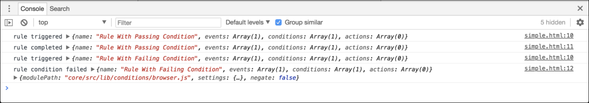

# Satellite物件參考

>[!NOTE]
>
>Adobe Experience Platform Launch已經過品牌重塑，現在是Adobe Experience Platform中的一套資料收集技術。 因此，所有產品檔案中出現了幾項術語變更。 請參閱下列[檔案](../../term-updates.md)，以取得術語變更的彙總參考資料。

此檔案可作為使用者端`_satellite`物件的參考，以及您可以使用該物件執行的各種功能。

## `track`

**代碼**

```javascript
_satellite.track(identifier: string [, detail: *] )
```

**範例**

```javascript
_satellite.track('contact_submit', { name: 'John Doe' });
```

`track`會使用已設定核心標籤延伸之指定識別碼的「直接呼叫」事件型別，引發所有規則。 上述範例會使用「直接呼叫」事件類型觸發所有規則，其中設定的識別碼為 `contact_submit`。也會傳遞包含相關資訊的選用物件。您可以在條件或動作的文字欄位內輸入 `%event.detail%`，或是在 Custom Code 條件或動作的程式碼編輯器內輸入 `event.detail`，以存取詳細資料物件。

## `getVar`

**代碼**

```javascript
_satellite.getVar(name: string) => *
```

**範例**

```javascript
var product = _satellite.getVar('product');
```

在提供的範例中，如果資料元素存在且具有相符名稱，則會傳回資料元素的值。 如果沒有任何相符的資料元素存在，則會檢查看看是否有先前已使用 `_satellite.setVar()` 設定之相符名稱的自訂變數。如果找到相符自訂變數，則會傳回其值。

>[!NOTE]
>
>您可以使用百分比(`%`)語法來參考標籤實作中許多表單欄位的變數，減少呼叫`_satellite.getVar()`的需求。 例如，使用`%product%`將會存取產品資料元素或自訂變數的值。

當事件觸發規則時，您可以將規則的對應`event`物件傳遞至`_satellite.getVar()`，如下所示：

```javascript
// event refers to the calling rule's event
var rule = _satellite.getVar('return event rule', event);
```

## `setVar`

>[!NOTE]
>
>`setVar`程式碼與Tags中指定的資料元素完全不同。

**代碼**

```javascript
_satellite.setVar(name: string, value: *)
```

**範例**

```javascript
_satellite.setVar('product', 'Circuit Pro');
```

`setVar()`設定具有指定名稱和值的自訂變數。 變數的值之後可以透過 `_satellite.getVar()` 存取。

您可以傳遞鍵值為變數名稱且值為個別變數值的物件，選擇是否要一次設定多個變數。

```javascript
_satellite.setVar({ 'product': 'Circuit Pro', 'category': 'hobby' });
```

## `getVisitorId`

**代碼**

```javascript
_satellite.getVisitorId() => Object
```

**範例**

```javascript
var visitorIdInstance = _satellite.getVisitorId();
```

[!DNL Adobe Experience Cloud ID] 如果此擴充功能已安裝在屬性上，則此方法會傳回 Visitor ID 例項。如需詳細資訊，請參閱 [Experience Cloud ID 服務文件](https://experienceleague.adobe.com/docs/id-service/using/home.html?lang=zh-Hant)。

## `logger`

**代碼**

```javascript
_satellite.logger.log(message: string)
```

```javascript
_satellite.logger.info(message: string)
```

```javascript
_satellite.logger.warn(message: string)
```

```javascript
_satellite.logger.error(message: string)
```

**範例**

```javascript
_satellite.logger.error('No product ID found.');
```

`logger`物件允許將訊息記錄到瀏覽器主控台。 只有在使用者已啟用標籤偵錯（透過呼叫`_satellite.setDebug(true)`或使用適當的瀏覽器延伸模組）時，才會顯示訊息。

### 記錄取代警告

```javascript
_satellite.logger.deprecation(message: string)
```

**範例**

```javascript
_satellite.logger.deprecation('This method is no longer supported, please use [new example] instead.');
```

這會將警告記錄到瀏覽器主控台。 顯示使用者是否啟用標籤偵錯的訊息。

## `cookie` {#cookie}

`_satellite.cookie`包含讀取和寫入Cookie的函式。 這是一份公開的協力廠商程式庫js-cookie。 如需此程式庫更進階使用方式的詳細資訊，請檢閱[js-cookie檔案](https://www.npmjs.com/package/js-cookie#basic-usage)。

### 設定Cookie {#cookie-set}

若要設定Cookie，請使用`_satellite.cookie.set()`。

**代碼**

```javascript
_satellite.cookie.set(name: string, value: string[, attributes: Object])
```

>[!NOTE]
>
>在設定Cookie的舊[`setCookie`](#setCookie)方法中，此函式呼叫的第三個（選用）引數是表示Cookie過期時間（以天為單位）的整數。 在這個新方法中，「attributes」物件會被視為第三個引數。 若要使用新方法設定Cookie的有效期，您必須在屬性物件中提供`expires`屬性，並將其設定為所要的值。 這會在以下範例中示範。

**範例**

以下函式呼叫會寫入一週後過期的Cookie。

```javascript
_satellite.cookie.set('product', 'Circuit Pro', { expires: 7 });
```

### 擷取Cookie {#cookie-get}

若要擷取Cookie，請使用`_satellite.cookie.get()`。

**代碼**

```javascript
_satellite.cookie.get(name: string) => string
```

**範例**

以下函式呼叫會讀取先前設定的Cookie。

```javascript
var product = _satellite.cookie.get('product');
```

### 移除Cookie {#cookie-remove}

若要移除Cookie，請使用`_satellite.cookie.remove()`。

**代碼**

```javascript
_satellite.cookie.remove(name: string)
```

**範例**

以下函式呼叫會移除先前設定的Cookie。

```javascript
_satellite.cookie.remove('product');
```

## `buildInfo`

**代碼**

```javascript
_satellite.buildInfo
```

此物件包含有關建立目前標籤執行階段程式庫的資訊。 此物件包含下列屬性：

### `turbineVersion`

這會提供目前程式庫內使用的[Turbine](https://www.npmjs.com/package/@adobe/reactor-turbine)版本。

### `turbineBuildDate`

建置容器內使用的 [Turbine](https://www.npmjs.com/package/@adobe/reactor-turbine) 版本時的 ISO 8601 日期。

### `buildDate`

建置目前程式庫時的 ISO 8601 日期。

此範例示範物件值：

```javascript
{
  turbineVersion: "14.0.0",
  turbineBuildDate: "2016-07-01T18:10:34Z",
  buildDate: "2016-03-30T16:27:10Z"
}
```

## `environment`

此物件包含目前標籤執行階段程式庫部署所在環境的相關資訊。

**代碼**

```javascript
_satellite.environment
```

此物件包含下列屬性：

```javascript
{
  id: "ENbe322acb4fc64dfdb603254ffe98b5d3",
  stage: "development"
}
```

| 屬性 | 說明 |
| --- | --- |
| `id` | 環境的ID。 |
| `stage` | 建置此程式庫的環境。可能的值為`development`、`staging`和`production`。 |

## `notify`

>[!NOTE]
>
>此方法已淘汰。請改用 `_satellite.logger.log()`。

**代碼**

```javascript
_satellite.notify(message: string[, level: number])
```

**範例**

```javascript
_satellite.notify('Hello world!');
```

`notify`將訊息記錄到瀏覽器主控台。 只有在使用者已啟用標籤偵錯（透過呼叫`_satellite.setDebug(true)`或使用適當的瀏覽器延伸模組）時，才會顯示訊息。

可傳遞選用記錄層級，這會影響所記錄訊息的樣式和篩選。 支援層級如下：

3 - 資訊訊息。

4 - 警告訊息。

5 - 錯誤訊息。

如果您未提供記錄層級或傳遞任何其他層級值，訊息會記錄為一般訊息。

## `setCookie` {#setCookie}

>[!IMPORTANT]
>
>此方法已淘汰。請改用 [`_satellite.cookie.set()`](#cookie-set)。

**代碼**

```javascript
_satellite.setCookie(name: string, value: string, days: number)
```

**範例**

```javascript
_satellite.setCookie('product', 'Circuit Pro', 3);
```

這會在使用者的瀏覽器中設定Cookie。 Cookie 會持續保留到指定的天數。

## `readCookie`

>[!IMPORTANT]
>
>此方法已淘汰。請改用 [`_satellite.cookie.get()`](#cookie-get)。

**代碼**

```javascript
_satellite.readCookie(name: string) => string
```

**範例**

```javascript
var product = _satellite.readCookie('product');
```

這會從使用者的瀏覽器中讀取Cookie。

## `removeCookie`

>[!NOTE]
>
>此方法已淘汰。請改用 [`_satellite.cookie.remove()`](#cookie-remove)。

**代碼**

```javascript
_satellite.removeCookie(name: string)
```

**範例**

```javascript
_satellite.removeCookie('product');
```

這會從使用者的瀏覽器中移除Cookie。

## 除錯函數

下列函式不應從生產程式碼中存取。 這些函數適用於除錯用途，且會視需要隨時變更。

### `container`

**代碼**

```javascript
_satellite._container
```

**範例**

>[!IMPORTANT]
>
>不應從生產程式碼存取此函式。 此函數僅適用於除錯用途，且會視需求隨時變動。

### `monitor`

**代碼**

```javascript
_satellite._monitors
```

**範例**

>[!IMPORTANT]
>
>不應從生產程式碼存取此函式。 此函數僅適用於除錯用途，且會視需求隨時變動。

**樣本**

在執行標籤庫的網頁上，將程式碼片段新增至您的HTML。 通常，程式碼會插入到載入標籤程式庫的`<script>`元素之前的`<head>`元素中。 這可讓監視器取得標籤程式庫中發生的最早系統事件。 例如：

```html
<!DOCTYPE html>
<html lang="en">
<head>
  <meta charset="UTF-8">
  <title>Title</title>
  <script>
    window._satellite = window._satellite || {};
    window._satellite._monitors = window._satellite._monitors || [];
    window._satellite._monitors.push({
      ruleTriggered: function (event) {
        console.log(
          'rule triggered',
          event.rule
        );
      },
      ruleCompleted: function (event) {
        console.log(
          'rule completed',
          event.rule
        );
      },
      ruleConditionFailed: function (event) {
        console.log(
          'rule condition failed',
          event.rule,
          event.condition
        );
      }
    });
  </script>
  <script src="//assets.adobedtm.com/launch-EN5bfa516febde4b22b3e7c6f96f6b439f.min.js"
          async></script>
</head>
<body>
  <h1>Click me!</h1>
</body>
</html>
```

在第一個指令碼元素中，因為尚未載入標籤程式庫，所以已建立初始`_satellite`物件，並初始化`_satellite._monitors`上的陣列。 接著，指令碼將監視器物件新增到該陣列。監視器物件可以指定下列方法，標籤程式庫稍後會呼叫這些方法：

### `ruleTriggered`

此函式會在事件觸發規則之後，但在處理規則的條件和動作之前呼叫。 傳遞到 `ruleTriggered` 的事件物件包含有關已觸發規則的資訊。

### `ruleCompleted`

此函式會在規則完全處理後呼叫。 換句話說，事件已發生、所有條件皆已傳遞，且所有動作皆已執行。 傳遞至`ruleCompleted`的事件物件包含有關已完成規則的資訊。

### `ruleConditionFailed`

此函式會在規則觸發且其中一個條件失敗後呼叫。 已傳遞到 `ruleConditionFailed` 的事件物件包含有關已觸發規則和已失敗條件的資訊。

若已呼叫 `ruleTriggered`，之後即將會呼叫 `ruleCompleted` 或 `ruleConditionFailed`。

>[!NOTE]
>
> 監視器不必指定所有三種方法 (`ruleTriggered`、`ruleCompleted` 和 `ruleConditionFailed`)。Adobe Experience Platform中的標籤可與監視器已提供的任何支援方法搭配使用。

### 測試監視器

以上範例在監視器中指定所有這三個方法。呼叫這些方法時，監視器會記錄相關資訊。若要對此進行測試，請在標籤程式庫中設定兩個規則：

1. 具有點擊事件和瀏覽器條件的規則，只有在瀏覽器是 [!DNL Chrome] 時才會傳遞。
1. 具有點擊事件和瀏覽器條件的規則，只有在瀏覽器是 [!DNL Firefox] 時才會傳遞。

如果您在 [!DNL Chrome] 中開啟頁面，請開啟瀏覽器主控台，然後選取頁面，下列內容就會顯示在主控台中：



可視需要將其他Hook或其他資訊新增到這些處理常式。
