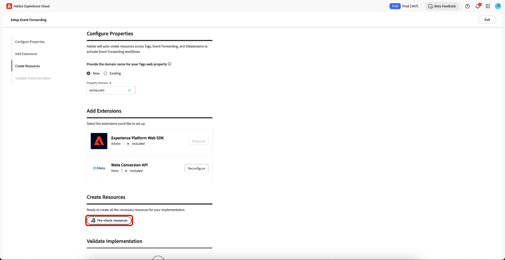
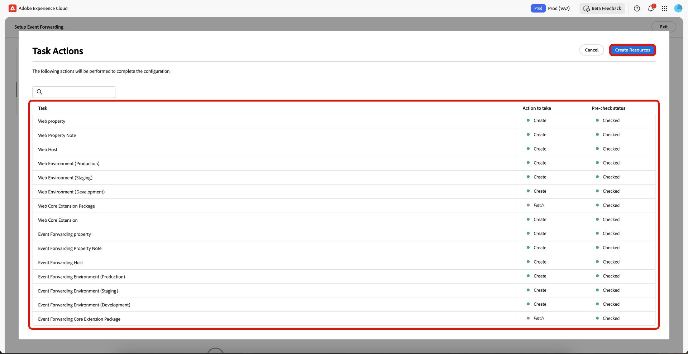
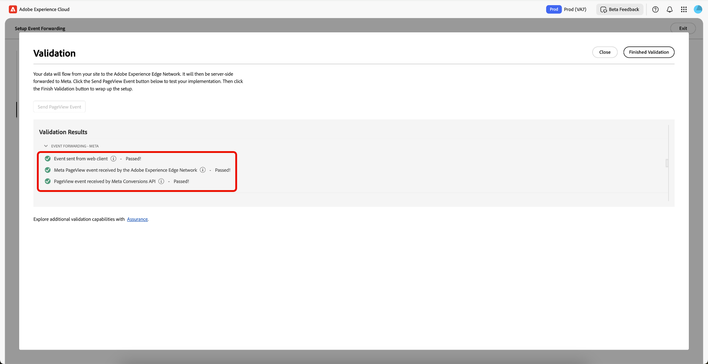
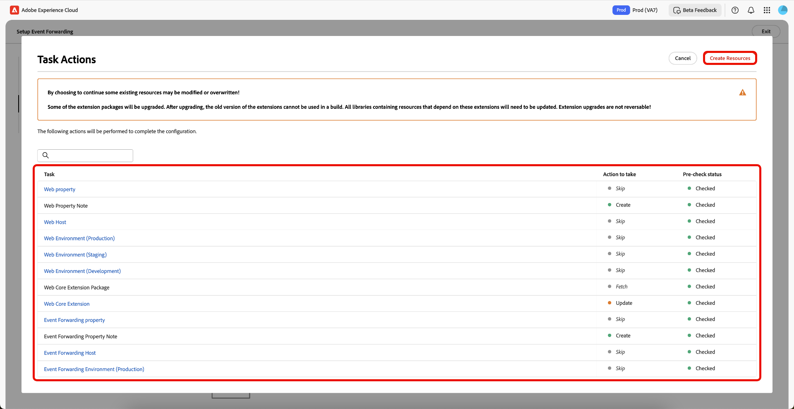

# 事件轉送引導式設定概述

>[!IMPORTANT]
>
>已購買Real-Time CDP Prime和Ultimate套件的客戶可以使用引導式設定功能。 如需詳細資訊，請聯絡 Adobe 代表。

>[!NOTE]
>
>任何現有使用者端都可使用引導式設定工作流程建立可供下列專案使用的參考實作：
>
>* 作為全新實作的開始。
>* 將其當作參考實作，您可以檢查以瞭解其設定方式，然後在目前的生產實作中複製。

引導式設定功能可協助您輕鬆且高效地完成設定。 此工具可自動執行在Adobe標籤和事件轉送中執行的多個步驟，大幅縮短設定時間。

此安裝程式可自動安裝擴充功能。 [!DNL Meta]建議使用此混合式實作來收集和轉寄伺服器端的事件轉換。 引導式設定功能旨在協助您開始實施事件轉送，並非旨在提供因應所有使用案例的端對端完整功能實施。

## 開始使用引導式設定 {#guided-setup}

若要開始使用此功能，請在&#x200B;**[!UICONTROL Get Started]**&#x200B;資料集合UI中選取&#x200B;**[!UICONTROL Event Forwarding]**。

![事件轉送首頁在資料收集UI中顯示[開始使用]卡片](../../images/ui/guided-setup/get-started.png)

>[!INFO]
>
>您也可以直接從資料收集首頁存取引導式設定。

### 建立新的標籤屬性 {#new-property}

在[設定屬性]區段中，選取&#x200B;**[!UICONTROL New]**&#x200B;並輸入新的&#x200B;**[!UICONTROL Property Domain]**&#x200B;詳細資料。

在[新增擴充功能]區段中，為&#x200B;**[!UICONTROL Add]**&#x200B;選取[!DNL Meta Conversion API]。 在[設定[!DNL Meta]資訊]頁面中，您可以選擇手動輸入您的&#x200B;**[!UICONTROL Meta Pixel ID]**、**[!UICONTROL Meta System User Access Token]**&#x200B;和&#x200B;**[!UICONTROL Data Layer Path]**，或者您可以使用&#x200B;**[!UICONTROL Connect to Meta]**&#x200B;選項。

![設定Meta資訊頁面，其中顯示[連線至Meta]選項](../../images/ui/guided-setup/connect-to-meta.png)

#### 使用您的認證連線到[!DNL Meta] {#meta-credentials}

選取&#x200B;**[!UICONTROL Connect to Meta]**，然後輸入您的[!DNL Meta]認證並選取&#x200B;**[!UICONTROL Log in]**，然後選取&#x200B;**[!UICONTROL Next]**。

現在將會要求您&#x200B;**建立企業投資組合**。 輸入&#x200B;**[!UICONTROL Business portfolio name]**&#x200B;並選取&#x200B;**[!UICONTROL Next]**。

從清單中選取您的企業投資組合，然後選取&#x200B;**[!UICONTROL Next]**。 您可以檢視商務Portfolio、廣告帳戶和[!DNL Meta Pixel]的設定。 選取&#x200B;**[!UICONTROL Continue]**&#x200B;以確認設定，然後選取&#x200B;**[!UICONTROL Next]**。

請稍等幾分鐘讓安裝程式完成，然後選取&#x200B;**[!UICONTROL Done]**。

系統會自動填入您的&#x200B;**[!UICONTROL Meta Pixel ID]**、**[!UICONTROL Meta System User Access Token]**&#x200B;和&#x200B;**[!UICONTROL Data Layer Path]**。 選擇「**[!UICONTROL Save]**」。

#### 為您的新標籤屬性建立資源 {#create-resources}

在[建立資源]區段中，選取&#x200B;**[!UICONTROL Pre-check resources]**&#x200B;以檢查您的組織和屬性，找出衝突或您實作的現有必要資源。

「工作動作」頁面會顯示工作與動作的清單。 選取&#x200B;**[!UICONTROL Create Resources]**&#x200B;以建立這些工作。

請稍候幾分鐘讓必要的規則、資料元素、擴充功能、程式庫、SDK等完成安裝。 「建立資源」段落提供已建立之屬性和資源的連結。

#### 驗證實施 {#validate-implementation}

驗證實作區段提供您可在網站上使用的內嵌連結。 **[!UICONTROL Start Validation]**&#x200B;會在此引導式設定頁面上，在您目前的瀏覽器工作階段中執行測試。 如果在此驗證成功，您在網站上部署內嵌連結時，相同的實作應可正常運作。

選取&#x200B;**[!UICONTROL Send PageView Event]**&#x200B;以透過Adobe Experience Platform Edge Network傳送測試事件。 然後，伺服器端轉送至[!DNL Meta]。 選取&#x200B;**[!UICONTROL Finished Validation]**&#x200B;以完成設定。

>[!NOTE]
>
>如果在驗證程式期間發生任何失敗，請選取&#x200B;**[!UICONTROL Assurance]**&#x200B;連結以檢閱可能已失敗的事件。

### 使用現有的標籤屬性 {#existing-property}

在「設定屬性」區段中，選取&#x200B;**[!UICONTROL Existing]**，然後從下拉式功能表中選取您的標籤屬性。 系統會嘗試透過資料串流尋找已附加至此屬性的事件轉送屬性。 您現在可以繼續重新設定[!DNL Meta Conversion API]，然後預先檢查並建立資源。

如果選取的tags屬性未連線至事件轉送屬性，或資料串流遺失，則會自動建立資料串流。

若要設定您的[!DNL Meta Conversion API]，請使用您的認證[，按照上述 [!DNL Meta] 連線至](#meta-credentials)中強調的處理程式進行。

現在您已產生&#x200B;**[!UICONTROL Meta Pixel ID]**、**[!UICONTROL Meta System User Access Token]**&#x200B;和&#x200B;**[!UICONTROL Data Layer Path]**，請選取&#x200B;**[!UICONTROL Pre-Check resources]**&#x200B;以建立事件轉送工作流程。

由於您使用現有的標籤屬性，因此設定程式與新的屬性工作流程稍有不同。 您可以看到系統將跳過建立Web屬性、主機和環境，因為這些已存在。 最後，選取&#x200B;**[!UICONTROL Create Resources]**&#x200B;以建立尚未可用的工作。

>[!INFO]
>
>引導式設定會自動將附註新增至流程期間更新的屬性。 在編輯模式中，您可以在tags屬性的右側面板的「附註」區段中檢視這些專案。 您可以使用引導式設定工具檢視屬性的更新或建立時間。 此稽核軌跡可協助您追蹤引導式設定功能所做的修改。

請稍候幾分鐘讓必要的規則、資料元素、擴充功能、程式庫、SDK等完成安裝。 「建立資源」段落提供已建立之屬性和資源的連結。

驗證實作區段提供您可在網站上使用的內嵌連結。 **[!UICONTROL Start Validation]**&#x200B;會在此引導式設定頁面上，在您目前的瀏覽器工作階段中執行測試。 如果在此驗證成功，您在網站上部署內嵌連結時，相同的實作應可正常運作。

選取&#x200B;**[!UICONTROL Send PageView Event]**&#x200B;以透過Adobe Experience Platform Edge Network傳送測試事件。 然後，伺服器端轉送至[!DNL Meta]。 選取&#x200B;**[!UICONTROL Finished Validation]**&#x200B;以完成設定。

>[!NOTE]
>
>如果在驗證程式期間發生任何失敗，請選取&#x200B;**[!UICONTROL Assurance]**&#x200B;連結以檢閱可能已失敗的事件。

## 後續步驟 {#next-steps}

本指南說明如何使用引導式設定工具來建立和設定[!DNL Meta Conversions API]的屬性。

如需有關如何有效實作整合的更多指引，請參閱[!DNL Meta][之 [!DNL Conversions API]最佳實務的](https://www.facebook.com/business/help/308855623839366?id=818859032317965)檔案。 如需Adobe Experience Cloud中標籤與事件轉送的一般詳細資訊，請參閱[標籤總覽](../../home.md)。
