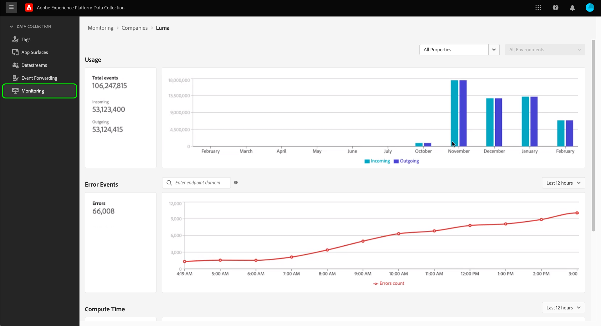

# 監控事件轉送中的活動（測試版）

>[!IMPORTANT]
>
>此功能目前仍在測試中，您的組織可能尚未取得存取權。 功能和檔案可能會有所變更。

此 **[!UICONTROL 監控]** 標籤，即可讓您監控事件轉送屬性的使用模式、錯誤，以及計算時間。 本指南提供如何檢視和了解標籤中所顯示報表的概觀。

## 先決條件

本指南假設您已購買事件轉送，且您已妥善了解事件轉送的運作方式。 請參閱 [事件轉送概觀](./overview.md) 以取得更多資訊。

## 影片概述

觀看下列影片，以概略了解監控功能：

>[!VIDEO](https://video.tv.adobe.com/v/343999?quality=12&learn=on)

## 選取屬性和環境

您可以在個別環境和屬性中，或在貴組織擁有的所有屬性和環境中檢視量度。

若要顯示單一屬性的量度，請選取屬性下拉式選單，然後從清單中選擇所要的屬性。 選取屬性後，您也可以使用環境下拉式清單來選取感興趣的環境。

## [!UICONTROL 使用狀況]

此 **[!UICONTROL 使用狀況]** 報表顯示指定時段內的來電和來電。 傳入的呼叫代表傳送至事件轉送的資料。 傳出呼叫代表從事件轉送傳送的資料。 此 **[!UICONTROL 事件總數]** 左窗格中的數字是指定時段的來話和去話呼叫的總和。

## [!UICONTROL 錯誤事件]

此 **[!UICONTROL 錯誤事件]** 報表會在將游標暫留在折線圖上時，顯示匯總中的錯誤，並依HTTP回應代碼劃分。 顯示的錯誤來自傳出呼叫，回應代碼來自事件轉送正與之互動的端點。

系統會針對指定的時段顯示錯誤，您可從提供的下拉式功能表加以調整。

錯誤事件的搜尋方塊可讓您查詢事件轉送，以了解指定端點網域的錯誤。 必須輸入精確域，因為搜索特徵不接受近似或「模糊」匹配。 一旦您提供確實有傳出錯誤資料的網域，請點擊Enter，報表就會重新整理，以顯示該網域的傳出錯誤。 例如，若要查看Facebook轉換API端點中的錯誤，應將網域寫入為 `https://graph.facebook.com`.

## [!UICONTROL 計算時間]

此 **[!UICONTROL 計算時間]** 報表會顯示事件轉送伺服器上所有規則的計算時間。

>[!NOTE]
>
>顯示的時間不代表端對端延遲。 事件轉送的計算時間限制為50毫秒。 如果超過此限制，則會捨棄相關資料。

下列因素會影響計算時間：

1. 規則數
2. 規則的複雜性，通常由執行的自訂JavaScript數量所驅動

例如，如果事件轉送中的動作點擊了端點，而該端點需要兩秒的時間來回應，則此兩秒的延遲不會計入計算時間，因為事件轉送只是等待，並未主動計算任何內容。 回應時間不能超過30秒，否則會捨棄資料。
