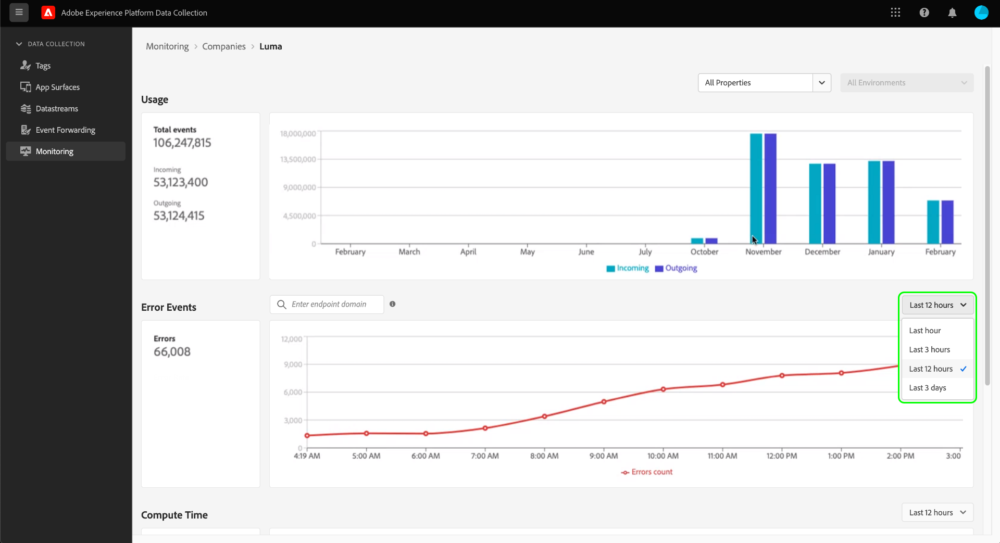

# 監視事件轉送中的活動(Beta)

>[!IMPORTANT]
>
>此功能目前為測試版，貴組織可能尚未提供存取權。 功能和檔案可能會有所變更。

此 **[!UICONTROL 監視]** 資料收集UI中的索引標籤可讓您監控使用模式、錯誤，以及事件轉送屬性的計算時間。 本指南提供如何檢視和瞭解標籤中報表的整體概觀。

## 先決條件

本指南假設您已購買事件轉送，且已實際瞭解事件轉送的運作方式。 請參閱 [事件轉送概觀](./overview.md) 以取得詳細資訊。

## 影片概述

觀看以下影片，概略瞭解監控功能：

>[!VIDEO](https://video.tv.adobe.com/v/343999?quality=12&learn=on)

## 選取屬性和環境

您可以在個別環境和屬性內，或您的組織擁有的所有屬性和環境中檢視量度。

若要顯示單一屬性的量度，請選取屬性下拉式選單，然後從清單中選擇感興趣的屬性。 選擇屬性後，您也可以使用環境下拉式清單來選取感興趣的環境。

## [!UICONTROL 使用狀況]

此 **[!UICONTROL 使用狀況]** 報告顯示特定時段內來電與來電。 來電代表傳送至事件轉送的資料。 傳出呼叫代表從事件轉送所傳送的資料。 此 **[!UICONTROL 事件總數]** [number in the left pane]是指定時段內來電與來電的總和。

## [!UICONTROL 錯誤事件]

此 **[!UICONTROL 錯誤事件]** 報表會以彙總方式顯示錯誤，且當您將游標停留在折線圖上時，報表會以HTTP回應代碼來劃分。 顯示的錯誤來自傳出呼叫，而回應代碼來自事件轉送正在互動的端點。

系統會針對指定的時段顯示錯誤，您可從提供的下拉式功能表調整錯誤。

錯誤事件的搜尋方塊可讓您查詢事件轉送，以瞭解指定端點網域的錯誤。 您必須輸入確切的網域，因為搜尋功能不接受近似值或「模糊」相符項。 提供有傳出錯誤資料的正確網域後，請按Enter，報表會重新整理以顯示該網域的傳出錯誤。 例如，若要檢視Facebook Conversions API端點中的錯誤，網域應編寫為 `https://graph.facebook.com`.

## [!UICONTROL 運算時間]

此 **[!UICONTROL 運算時間]** 報表會顯示事件轉送伺服器上所有規則的計算時間。

>[!NOTE]
>
>顯示的時間不代表端對端延遲。 事件轉送的計算時間限製為50毫秒。 如果超過此限制，將會捨棄相關資料。

下列因素會影響計算時間：

1. 規則數量
2. 規則的複雜性，通常是由執行的自訂JavaScript數量所驅動

例如，如果事件轉送中的動作點選了端點，而該端點需要兩秒的時間回應，則此兩秒延遲不會計算計算時間，因為事件轉送只是等待，並沒有主動計算任何內容。 回應時間不能超過30秒，否則將會捨棄資料。
