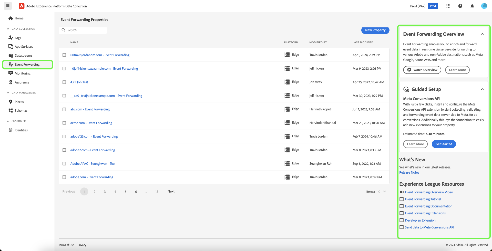
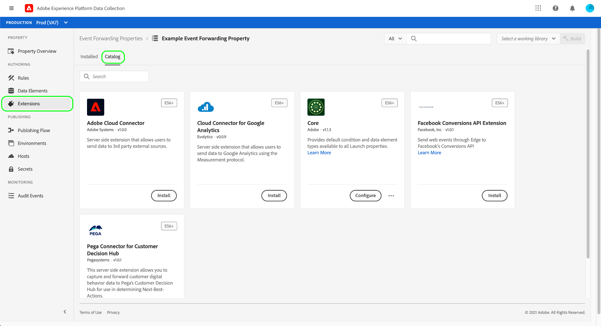

# 事件轉送概觀

>[!NOTE]
>
>事件轉送是一項付費功能，屬於Adobe Real-time Customer Data Platform Connections、Prime或Ultimate方案的一部分。

>[!NOTE]
>
>Adobe Experience Platform Launch已經過品牌重塑，現在是Adobe Experience Platform中的一套資料收集技術。 因此，所有產品文件中出現了幾項術語變更。 如需術語變更的彙整參考資料，請參閱以下[文件](../../term-updates.md)。

Adobe Experience Platform中的事件轉送可讓您將收集的事件資料傳送至目的地以進行伺服器端處理。 事件轉送使用Adobe Experience Platform Edge Network執行通常在使用者端上完成的工作，以降低網頁和應用程式負載。 透過與標籤類似的方式實作，事件轉送規則可以轉換資料並將資料傳送到新目的地，但此資料不會從網頁瀏覽器之類的使用者端應用程式傳送，而是從Adobe的伺服器傳送。

本檔案提供Platform中事件轉送的整體概觀。

>[!NOTE]
>
>如需事件轉送如何在Platform資料收集生態系統中適應的詳細資訊，請參閱 [資料收集概觀](../../../collection/home.md).

事件轉送與Adobe Experience Platform結合 [Web SDK](/help/web-sdk/home.md) 和 [行動SDK](https://experienceleague.adobe.com/docs/platform-learn/data-collection/mobile-sdk/overview.html) 提供下列優點：

**效能**：

* 從包含資料裝載的頁面發出單一呼叫，接著在伺服器端組成聯盟，以減少使用者端網路流量，並為客戶提供更快速的體驗。
* 減少載入網頁所需的時間，以提升網站效能。
* 減少所需的使用者端技術數量，以提供您的體驗並將資料傳送至許多目的地。

**資料控管**：

* 增加透明度和控制跨所有屬性傳送哪些資料。

## 事件轉送與標籤之間的差異 {#differences-from-tags}

在設定方面，事件轉送使用許多與標籤相同的概念，例如 [規則](../managing-resources/rules.md)， [資料元素](../managing-resources/data-elements.md)、和 [擴充功能](../managing-resources/extensions/overview.md). 兩者之間的主要差異可概括如下：

* 標籤 **收集** 來自網站或原生行動應用程式的事件資料，並傳送至Platform Edge Network。
* 事件轉送 **傳送** 從Platform Edge Network傳入事件資料至端點，端點代表最終目的地或端點，提供您要用來擴充原始裝載的資料。

雖然標籤會使用Platform Web和Mobile SDK直接從您的網站或原生行動應用程式收集事件資料，但事件轉送需先透過Platform Edge Network傳送事件資料，才能將其轉送至目的地。 換言之，您必須在數位屬性上實作Platform Web或Mobile SDK （透過標籤或使用原始程式碼），才能使用事件轉送。

### 屬性 {#properties}

事件轉送會維護其自身與標籤分開的屬性儲存，您可以在Experience PlatformUI或資料收集UI中透過選取來檢視 **[!UICONTROL 事件轉送]** ，位於左側導覽器中。

所有事件轉送屬性清單 **[!UICONTROL Edge]** 作為他們的平台。 它們不會區分Web或行動裝置，因為它們只會處理從Platform Edge Network收到的資料，而該網路本身可同時接收來自Web和行動平台的事件資料。

### 擴充功能 {#extensions}

事件轉送有其專屬的相容擴充功能目錄，例如 [核心](../../extensions/server/core/overview.md) 擴充功能和 [Adobe雲端聯結器](../../extensions/server/cloud-connector/overview.md) 副檔名。 您可以在UI中檢視事件轉送屬性的可用擴充功能，方法是選取 **[!UICONTROL 擴充功能]** 在左側導覽中，後面接著 **[!UICONTROL 目錄]**.

### 資料元素 {#data-elements}

事件轉送中可用的資料元素型別僅限於相容的目錄 [擴充功能](#extensions) 會提供這些資訊。

雖然資料元素本身在事件轉送中的建立與設定方式與標籤相同，但在如何參照來自Platform Edge Network的資料方面，有一些重要的語法差異。

#### 引用Platform Edge Network的資料 {#data-element-path}

若要參照來自Platform Edge Network的資料，您必須建立提供該資料的有效路徑的資料元素。 在UI中建立資料元素時，請選取 **[!UICONTROL 核心]** 擴充功能和 **[!UICONTROL 路徑]** 型別對應的。

此 **[!UICONTROL 路徑]** 資料元素的值必須遵循此模式 `arc.event.{ELEMENT}` (例如： `arc.event.xdm.web.webPageDetails.URL`)。 必須正確指定此路徑才能傳送資料。

### 規則 {#rules}

在事件轉送屬性中建立規則的運作方式與標籤類似，主要差異在於您無法選取事件做為規則元件。 事件轉送規則會處理所有從接收的事件。 [資料流](../../../datastreams/overview.md) 並在符合某些條件時將事件轉送至目的地。

此外，有一個30秒的逾時適用於單一事件，因為單一事件會在事件轉送屬性內的所有規則（以及因此產生的所有動作）中處理。 這表示單一事件的所有規則和所有動作都必須在此時間範圍內完成。

#### 資料元素代碼化 {#tokenization}

在標籤規則中，資料元素會使用 `%` 位於資料元素名稱的開頭和結尾處(例如： `%viewportHeight%`)。 在事件轉送規則中，資料元素會改用代碼化 `{{` 在開頭和 `}}` 位於資料元素名稱結尾處(例如： `{{viewportHeight}}`)。

#### 規則動作順序 {#action-sequencing}

此 [!UICONTROL 動作] 事件轉送規則的區段一律依序執行。 例如，如果規則有兩個動作，則第二個動作要等到前一個動作完成時才會開始執行（如果預期端點會回應，則表示該端點已回應）。 儲存規則時，請確認動作順序正確。此執行序列無法像使用標籤規則時一樣以非同步方式執行。

## 秘密 {#secrets}

事件轉送可讓您建立、管理和儲存秘密，這些秘密可用於向您傳送資料的目的地伺服器進行驗證。 請參閱以下指南： [秘密](./secrets.md) 各種可用的秘密型別，以及在UI中實作的方式。

## 後續步驟

本檔案簡要介紹事件轉送。 有關如何為您的組織設定此功能的詳細資訊，請參閱 [快速入門手冊](./getting-started.md).
