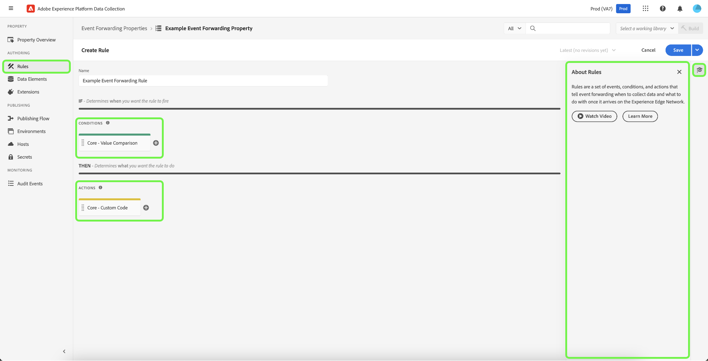

# 事件轉送概觀

>[!NOTE]
>
>Adobe Experience Platform Launch在Adobe Experience Platform中已重新命名為一套資料收集技術。 因此，所有產品文件中出現了幾項術語變更。 如需術語變更的彙整參考資料，請參閱以下[文件](../../term-updates.md)。

Adobe Experience Platform中的事件轉送功能可讓您將收集的事件資料傳送至目的地，以進行伺服器端處理。 事件轉送功能可使用Adobe Experience Platform邊緣網路來執行用戶端上正常執行的工作，借此降低網頁和應用程式的重量。 以類似標籤的方式實作，事件轉送規則可以轉換資料並傳送至新目的地，但與其從用戶端應用程式（如網頁瀏覽器）傳送這些資料，如同從Adobe的伺服器傳送。

本檔案概略介紹Platform中的事件轉送功能。

>[!NOTE]
>
>如需有關事件轉送如何與Platform資料收集生態系統整合的資訊，請參閱 [資料匯集概述](../../../collection/home.md).

事件轉送與Adobe Experience Platform [Web SDK](../../../edge/home.md) 和 [行動SDK](https://aep-sdks.gitbook.io/docs/) 提供下列優點：

**效能**:

* 從包含資料裝載的頁面發出單一呼叫，然後資料裝載會聯合在伺服器端，以減少用戶端網路流量，並為客戶提供更快的體驗。
* 減少網頁載入以改善網站效能所花費的時間。
* 減少必要的用戶端技術數量，以提供您的體驗並將資料傳送至許多目的地。

**資料控管**:

* 提高透明度並控制要在所有屬性間傳送哪些資料。

## 事件轉送與標籤之間的差異 {#differences-from-tags}

就設定而言，事件轉送會使用許多與標籤相同的概念，例如 [規則](../managing-resources/rules.md), [資料元素](../managing-resources/data-elements.md)，和 [擴充功能](../managing-resources/extensions/overview.md). 兩者的主要差異可歸納為：

* 標籤 **收集** 來自網站或原生行動應用程式的事件資料，並將其傳送至Platform Edge Network。
* 事件轉送 **傳送** 將事件資料從Platform Edge Network傳入端點，端點代表最終目的地或端點，提供您想要豐富原始裝載的資料。

雖然標籤會使用Platform Web和Mobile SDK直接從您的網站或原生行動應用程式收集事件資料，但事件轉送需要已透過Platform Edge Network傳送的事件資料，才能轉送至目的地。 換言之，您必須在您的數位屬性上實作Platform Web或Mobile SDK（透過標籤或使用原始代碼），才能使用事件轉送。

### 屬性 {#properties}

Experience Platform轉送會維護自己的屬性存放區，區別於標籤，您可以透過選取 **[!UICONTROL 事件轉送]** 的下一頁。

所有事件轉發屬性清單 **[!UICONTROL Edge]** 作為他們的平台。 他們不會區分Web或行動裝置，因為他們只會處理從Platform Edge Network收到的資料，而Platform Edge Network本身可接收來自Web和行動平台的事件資料。

### 擴充功能 {#extensions}

事件轉送有其自己的相容擴充功能目錄，例如 [核心](../../extensions/server/core/overview.md) 擴充功能與 [Adobe雲端連接器](../../extensions/server/cloud-connector/overview.md) 擴充功能。 您可以在UI中，透過選取 **[!UICONTROL 擴充功能]** 在左側導覽器中，隨後 **[!UICONTROL 目錄]**.

### 資料元素 {#data-elements}

事件轉送中可用的資料元素類型僅限於相容的目錄 [擴充功能](#extensions) 才能提供。

雖然資料元素本身在事件轉送中的建立和設定方式與標籤相同，但在參考來自Platform Edge Network的資料時，有一些重要的語法差異。

#### 從平台邊緣網路參考資料 {#data-element-path}

若要參考來自Platform Edge Network的資料，您必須建立資料元素，以提供該資料的有效路徑。 在UI中建立資料元素時，請選取 **[!UICONTROL 核心]** 擴充功能和 **[!UICONTROL 路徑]** （針對類型）。

此 **[!UICONTROL 路徑]** 資料元素的值必須遵循模式 `arc.event.{ELEMENT}` (例如： `arc.event.xdm.web.webPageDetails.URL`)。 必須正確指定此路徑，才能傳送資料。

### 規則 {#rules}

在事件轉送屬性中建立規則的運作方式與標籤類似，主要差異在於您無法選取事件作為規則元件。 事件轉送規則會處理從 [資料流](../../../edge/datastreams/overview.md) 並在滿足特定條件時，將這些事件轉送至目的地。

#### 資料元素代碼化 {#tokenization}

在標籤規則中，資料元素會以 `%` 在資料元素名稱的開頭和結尾處(例如： `%viewportHeight%`)。 在事件轉送規則中，資料元素會改為使用 `{{` 在開頭和 `}}` 在資料元素名稱的結尾(例如： `{{viewportHeight}}`)。

#### 規則動作順序 {#action-sequencing}

此 [!UICONTROL 動作] 事件轉送規則的區段一律會依序執行。 例如，如果規則有兩個動作，則第二個動作要等到上一個動作完成時才會開始執行（而如果預期會從端點傳回回應，該端點已回應）。 儲存規則時，請確認動作順序正確。此執行序列無法像使用標籤規則一樣非同步執行。

## 秘密 {#secrets}

事件轉送功能可讓您建立、管理和儲存機密，這些機密可用來驗證您要傳送資料的伺服器。 請參閱 [秘密](./secrets.md) 關於不同種類的可用機密類型，以及在UI中實作的方式。

## 後續步驟

本檔案提供事件轉送的概要介紹。 如需如何為貴組織設定此功能的詳細資訊，請參閱 [快速入門手冊](./getting-started.md).
