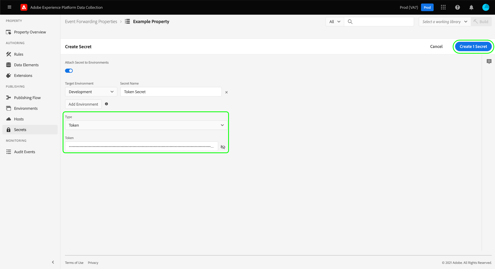
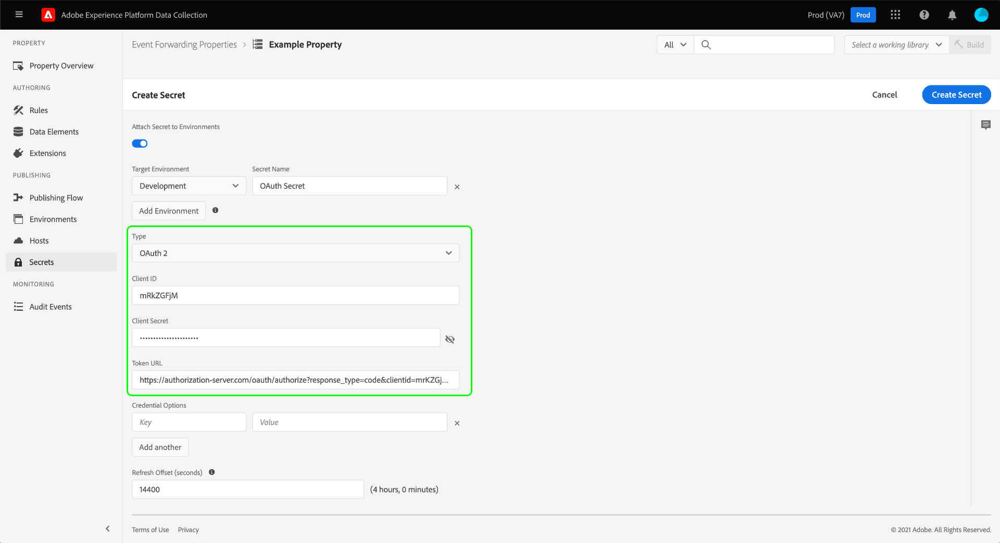

# 在事件轉送中設定秘密

在事件轉送中，密碼是代表其他系統之驗證認證的資源，可允許安全交換資料。 密碼只能在事件轉送屬性中建立。

目前支援的密碼型別如下：

| 密碼型別 | 說明 |
| --- | --- |
| [!UICONTROL Google OAuth 2] | 包含數個屬性以支援 [OAuth 2.0](https://datatracker.ietf.org/doc/html/rfc6749) 驗證規格，用於 [Google Ads API](https://developers.google.com/google-ads/api/docs/oauth/overview) 和 [發佈/訂閱API](https://cloud.google.com/pubsub/docs/reference/service_apis_overview). 系統會要求您提供必要資訊，然後在指定的間隔內處理這些權杖的續約。 |
| [!UICONTROL HTTP] | 包含使用者名稱和密碼的兩個字串屬性。 |
| [!UICONTROL OAuth 2] | 包含數個屬性以支援 [使用者端憑證授權型別](https://datatracker.ietf.org/doc/html/rfc6749#section-1.3.4) 針對 [OAuth 2.0](https://datatracker.ietf.org/doc/html/rfc6749) 驗證規格。 系統會要求您提供必要資訊，然後在指定的間隔內處理這些權杖的續約。 |
| [!UICONTROL OAuth 2 JWT] | 包含數個屬性以支援的JSON Web權杖(JWT)設定檔 [OAuth 2.0授權](https://datatracker.ietf.org/doc/html/rfc7523#section-2.1) 授權。 系統會要求您提供必要資訊，然後在指定的間隔內處理這些權杖的續約。 |
| [!UICONTROL Token] | 代表兩個系統已知且瞭解的驗證Token值的單一字元字串。 |

{style="table-layout:auto"}

本指南提供如何設定事件轉送之密碼的整體概觀([!UICONTROL Edge]Experience Platform )屬性。

>[!NOTE]
>
>如需有關如何在Reactor API中管理機密的詳細指引，包括機密結構的JSON範例，請參閱 [秘密API指南](../../api/guides/secrets.md).

## 先決條件

本指南假設您已熟悉如何管理UI中標籤和事件轉送的資源，包括如何建立資料元素和事件轉送規則。 請參閱以下指南： [管理資源](../managing-resources/overview.md) 如果您需要簡介。

您也應該實際瞭解標籤和事件轉送的發佈流程，包括如何將資源新增至程式庫，以及將組建安裝至您的網站以進行測試。 請參閱 [發佈概觀](../publishing/overview.md) 以取得更多詳細資料。

## 建立密碼 {#create}

>[!CONTEXTUALHELP]
>id="platform_eventforwarding_secrets_environments"
>title="密碼環境"
>abstract="為了讓密碼可供事件轉送使用，必須將其指派給現有環境。如果您沒有為事件轉送屬性建立任何環境，則必須進行設定才能繼續。"
>additional-url="https://experienceleague.adobe.com/docs/experience-platform/tags/publish/environments/environments.html?lang=zh-Hant" text="環境概觀"

若要建立密碼，請選取 **[!UICONTROL 事件轉送]** 在左側導覽中，開啟您要新增密碼的事件轉送屬性。 接下來，選取 **[!UICONTROL 秘密]** 在左側導覽中，後面接著 **[!UICONTROL 建立新密碼]**.

下一個畫面可讓您設定密碼的詳細資訊。 為了讓密碼可供事件轉送使用，必須將其指派給現有環境。如果您尚未針對事件轉送屬性建立任何環境，請參閱上的指南 [環境](../publishing/environments.md) ，取得如何設定這些專案的指引，然後再繼續。

>[!NOTE]
>
>如果您仍要在將密碼新增至環境之前建立並儲存密碼，請停用 **[!UICONTROL 將密碼附加至環境]** 在填入其餘資訊之前切換。 請注意，如果您想要使用密碼，您之後必須將其指派給環境。
>
>

在 **[!UICONTROL 目標環境]**，使用下拉式選單選取您要指派密碼的環境。 在 **[!UICONTROL 密碼名稱]**，提供環境內容中的密碼名稱。 此名稱在事件轉送屬性下的所有密碼中必須是唯一的。

一個密碼一次只能指派給一個環境，但您可以視需要為跨不同環境的多個密碼指派相同的認證。 選取 **[!UICONTROL 新增環境]** 以新增其他列至清單。

對於您新增的每個環境，您必須為關聯的密碼提供另一個唯一名稱。 如果您耗盡所有可用的環境， **[!UICONTROL 新增環境]** 按鈕將不可用。

在此，建立密碼的步驟因您建立的密碼型別而異。 如需詳細資訊，請參閱以下各小節：

* [[!UICONTROL Token]](#token)
* [[!UICONTROL HTTP]](#http)
* [[!UICONTROL OAuth 2]](#oauth2)
* [[!UICONTROL OAuth 2 JWT]](#oauth2jwt)
* [[!UICONTROL Google OAuth 2]](#google-oauth2)

### [!UICONTROL Token] {#token}

若要建立權杖密碼，請選取 **[!UICONTROL Token]** 從 **[!UICONTROL 型別]** 下拉式清單。 在 **[!UICONTROL Token]** 顯示的欄位，提供您驗證的系統可辨識的認證字串。 選取 **[!UICONTROL 建立密碼]** 以儲存密碼。

### [!UICONTROL HTTP] {#http}

若要建立HTTP密碼，請選取 **[!UICONTROL 簡單HTTP]** 從 **[!UICONTROL 型別]** 下拉式清單。 在下面顯示的欄位中，提供認證的使用者名稱和密碼，然後選取 **[!UICONTROL 建立密碼]** 以儲存密碼。

>[!NOTE]
>
>在儲存認證時，會使用 [「基本」HTTP驗證配置](https://www.rfc-editor.org/rfc/rfc7617.html).

### [!UICONTROL OAuth 2] {#oauth2}

若要建立OAuth 2密碼，請選取 **[!UICONTROL OAuth 2]** 從 **[!UICONTROL 型別]** 下拉式清單。 在下面顯示的欄位中，提供您的 [[!UICONTROL 使用者端ID] 和 [!UICONTROL 使用者端密碼]](https://www.oauth.com/oauth2-servers/client-registration/client-id-secret/)，以及您的 [[!UICONTROL 權杖URL]](https://www.oauth.com/oauth2-servers/access-tokens/client-credentials/) 用於您的OAuth整合。 此 [!UICONTROL 權杖URL] UI中的欄位是授權伺服器主機與權杖路徑之間的串連。

在 **[!UICONTROL 認證選項]**，您可以提供其他認證選項，例如 `scope` 和 `audience` 鍵值配對形式。 若要新增更多索引鍵/值組，請選取 **[!UICONTROL 新增另一個]**.

最後，您可以設定 **[!UICONTROL 重新整理位移]** 密碼的值。 這表示系統執行自動重新整理的權杖到期前的秒數。 以小時和分鐘為單位的等效時間會顯示在欄位右側，並會在您輸入時自動更新。

例如，如果將重新整理位移設定為預設值 `14400` （四個小時），而且存取權杖有 `expires_in` 值 `86400` （24小時），系統將在20小時內自動重新整理密碼。

>[!IMPORTANT]
>
>OAuth密碼在重新整理之間至少需要四個小時，並且至少八小時後必須有效。 此限制讓您至少有四個小時可以在產生的Token發生問題時進行干預。
>
>例如，如果位移設定為 `28800` （8小時）且存取權杖有 `expires_in` 之 `36000` （十小時），由於產生的差異不到四小時，交換將會失敗。

完成後，選取 **[!UICONTROL 建立密碼]** 以儲存密碼。

### [!UICONTROL OAuth 2 JWT] {#oauth2jwt}

若要建立OAuth 2 JWT密碼，請選取 **[!UICONTROL OAuth 2 JWT]** 從 **[!UICONTROL 型別]** 下拉式清單。

![此 [!UICONTROL 建立密碼] 索引標籤中，OAuth 2 JWT密碼於 [!UICONTROL 型別] 下拉式清單。](../../images/ui/event-forwarding/secrets/oauth-jwt-secret.png)

>[!NOTE]
>
>唯一 [!UICONTROL 演演算法] 目前支援簽署JWT的是RS256。

在下面顯示的欄位中，提供您的 [!UICONTROL 簽發者]， [!UICONTROL 主旨]， [!UICONTROL 對象]， [!UICONTROL 自訂宣告]， [!UICONTROL TTL]，然後選取 [!UICONTROL 演演算法] 下拉式清單中的。 接下來，輸入 [!UICONTROL 私密金鑰ID]，以及您的 [[!UICONTROL 權杖URL]](https://www.oauth.com/oauth2-servers/access-tokens/client-credentials/) 用於您的OAuth整合。 此 [!UICONTROL 權杖URL] 欄位不是必填欄位。 如果提供值，JWT會與存取權杖交換。 秘密將根據 `expires_in` 回應中的屬性和 [!UICONTROL 重新整理位移] 值。 如果未提供值，則推送至邊緣的秘密為JWT。 JWT將會根據 [!UICONTROL TTL] 和 [!UICONTROL 重新整理位移] 值。

![此 [!UICONTROL 建立密碼] 索引標籤上，將選取的輸入欄位反白顯示。](../../images/ui/event-forwarding/secrets/oauth-jwt-information.png)

在 **[!UICONTROL 認證選項]**，您可以提供其他認證選項，例如 `jwt_param` 鍵值配對形式。 若要新增更多索引鍵/值組，請選取 **[!UICONTROL 新增另一個]**.

![此 [!UICONTROL 建立密碼] 索引標籤以醒目提示 [!UICONTROL 認證選項] 欄位。](../../images/ui/event-forwarding/secrets/oauth-jwt-credential-options.png)

最後，您可以設定 **[!UICONTROL 重新整理位移]** 密碼的值。 這表示系統執行自動重新整理的權杖到期前的秒數。 以小時和分鐘為單位的等效時間會顯示在欄位右側，並會在您輸入時自動更新。

![此 [!UICONTROL 建立密碼] 索引標籤以醒目提示 [!UICONTROL 重新整理位移] 欄位。](../../images/ui/event-forwarding/secrets/oauth-jwt-refresh-offset.png)

例如，如果將重新整理位移設定為預設值 `1800` （30分鐘）且存取權杖具有 `expires_in` 值 `3600` （一小時），系統將於一小時後自動重新整理密碼。

>[!IMPORTANT]
>
>OAuth 2 JWT密碼在重新整理之間需要至少30分鐘，並且至少必須在一小時內有效。 此限製為您提供至少30分鐘的時間，以在產生的權杖發生問題時進行干預。
>
>例如，如果位移設定為 `1800` （30分鐘）且存取權杖具有 `expires_in` 之 `2700` （45分鐘），由於產生的差異少於30分鐘，交換將失敗。

完成後，選取 **[!UICONTROL 建立密碼]** 以儲存密碼。

![此 [!UICONTROL 建立密碼] 標籤反白顯示 [!UICONTROL 建立密碼]](../../images/ui/event-forwarding/secrets/oauth-jwt-create-secret.png)

### [!UICONTROL Google OAuth 2] {#google-oauth2}

若要建立Google OAuth 2密碼，請選取 **[!UICONTROL Google OAuth 2]** 從 **[!UICONTROL 型別]** 下拉式清單。 在 **[!UICONTROL 範圍]**，選取您要使用此密碼來授予存取許可權的Google API。 目前支援下列產品：

* [Google Ads API](https://developers.google.com/google-ads/api/docs/oauth/overview)
* [發佈/訂閱API](https://cloud.google.com/pubsub/docs/reference/service_apis_overview)

完成後，選取 **[!UICONTROL 建立密碼]**.

此時會出現彈出視窗，通知您需要透過Google手動授權密碼。 選取 **[!UICONTROL 建立並授權]** 以繼續。

系統會顯示一個對話方塊，讓您輸入Google帳戶的認證。 依照提示操作，將事件轉送存取權授與選取範圍下的資料。 授權程式完成後，密碼就會建立。

>[!IMPORTANT]
>
>如果您的組織有為Google Cloud應用程式設定的重新驗證原則，則建立的密碼在驗證過期後不會成功重新整理（1到24小時之間，取決於原則設定）。
>
>若要解決此問題，請登入Google Admin Console並導覽至 **[!DNL App access control]** 頁面，以便將事件轉送應用程式(Adobe Real-Time CDP事件轉送)標示為 [!DNL Trusted]. 請參閱Google檔案，網址為 [設定Google Cloud Services的工作階段長度](https://support.google.com/a/answer/9368756) 以取得詳細資訊。

## 編輯密碼

為屬性建立密碼後，您可在以下位置找到所列出的密碼： **[!UICONTROL 秘密]** 工作區。 若要編輯現有密碼的詳細資訊，請從清單中選取其名稱。

下一個畫面可讓您變更密碼的名稱和認證。

>[!NOTE]
>
>如果密碼與現有環境相關聯，則無法將密碼重新指派給其他環境。 如果您想在不同的環境中使用相同的認證，您必須 [建立新密碼](#create) 而非。 從此畫面重新指派環境的唯一方法是，如果您事先未將密碼指派給環境，或如果您刪除了密碼附加到的環境。

### 重試秘密交換

您可以從編輯畫面重試或重新整理秘密交換。 此過程因所編輯的密碼型別而異：

| 密碼型別 | 重試通訊協定 |
| --- | --- |
| [!UICONTROL Token] | 選取 **[!UICONTROL Exchange密碼]** 以重試秘密交換。 此控制項僅在有附加至密碼的環境時可用。 |
| [!UICONTROL HTTP] | 如果密碼沒有附加環境，請選取 **[!UICONTROL Exchange密碼]** 將認證交換給base64。 如果附加了環境，請選取「選取」 **[!UICONTROL Exchange和部署密碼]** 以交換至base64並部署密碼。 |
| [!UICONTROL OAuth 2] | 選取 **[!UICONTROL 產生Token]** 以交換認證，並從驗證提供者傳回存取權杖。 |

## 刪除密碼

若要刪除中現有的密碼  **[!UICONTROL 秘密]** 在選取之前，請選取其名稱旁的核取方塊 **[!UICONTROL 刪除]**.

## 在事件轉送中使用秘密

為了在事件轉送中使用秘密，您必須先建立 [資料元素](../managing-resources/data-elements.md) 會參照密碼本身。 儲存資料元素後，您可以將其納入事件轉送中 [規則](../managing-resources/rules.md) 並將這些規則新增至 [資料庫](../publishing/libraries.md)，這些伺服器即可部署至Adobe的伺服器，作為 [版本編號](../publishing/builds.md).

建立資料元素時，選取 **[!UICONTROL 核心]** 擴充功能，然後選取「 」 **[!UICONTROL 密碼]** （資料元素型別）。 右側面板會更新並提供下拉式控制項，以將最多三個秘密指派給資料元素：一個用於 [!UICONTROL 開發]， [!UICONTROL 分段]、和 [!UICONTROL 生產] （分別）。

>[!NOTE]
>
>只有附加到開發、測試和生產環境的秘密才會顯示在其各自的下拉清單中。

將多個秘密指派給單一資料元素，並納入規則，可讓資料元素的值隨著包含程式庫在 [發佈流程](../publishing/publishing-flow.md).

>[!NOTE]
>
>建立資料元素時，必須指派開發環境。 預備和生產環境的秘密並非必要，但如果組建的秘密型別資料元素未針對相關環境選取秘密，則嘗試轉移至這些環境的組建將會失敗。

## 後續步驟

本指南說明如何在UI中管理秘密。 有關如何使用Reactor API與秘密互動的資訊，請參閱 [秘密端點指南](../../api/endpoints/secrets.md).
