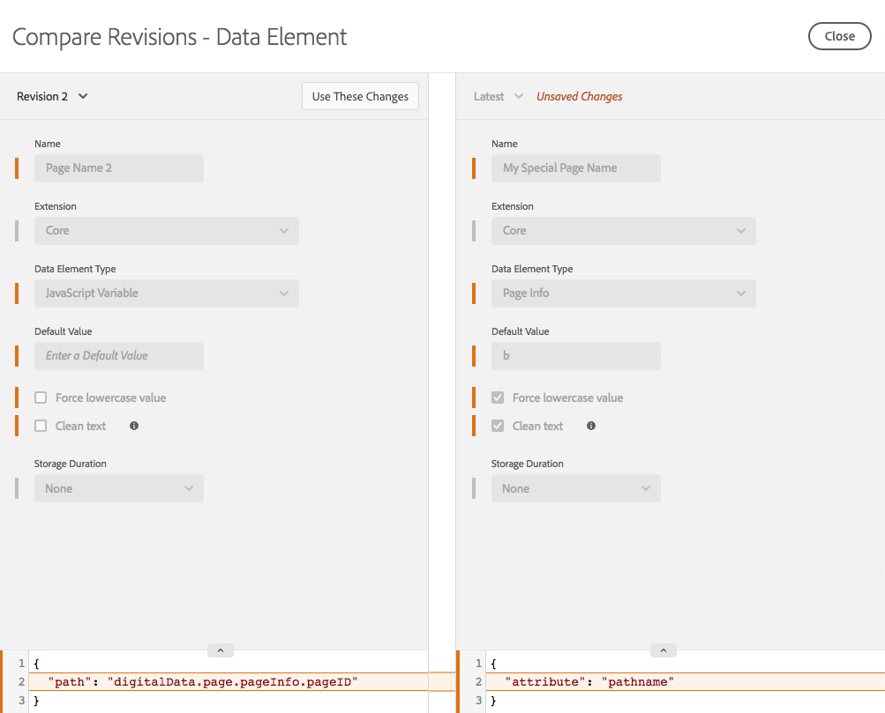

# 比較資源修訂版本

>[!NOTE]
>
>Adobe Experience Platform Launch在Adobe Experience Platform中已重新命名為一套資料收集技術。 因此，所有產品文件中出現了幾項術語變更。 如需術語變更的彙整參考資料，請參閱以下[文件](../../term-updates.md)。

比較資源修訂版本以查看個別資源的歷程記錄。您可以將資源的目前狀態與舊版進行比較，或將目前發佈的資源版本與最新一組已儲存的變更進行比較。

## 啟動比較作業

就所有資源類型而言，啟動比較作業的方式都相同。開啟個別資源的「編輯」檢視，然後尋找旁邊的三個點圖示 **[!UICONTROL 儲存]** 按鈕，查看該資源的可用操作。  選擇 **[!UICONTROL 比較修訂版本]** 從清單中。

對於擴充功能，請選取 **[!UICONTROL 設定]** 按鈕。  針對資料元素和規則，從清單中選取一個項目。

## 使用「比較」檢視

當您啟動比較作業後，預設檢視會在右側顯示最新版本。此版本包含您在「編輯」檢視內對資源所做的所有未儲存變更(請注意下圖右側的「未儲存變更」標籤)。

您可以從左側的任何現有修訂版本中選擇要與「最新」進行比較的項目。

選擇 **[!UICONTROL 使用這些變更]** 將設定從您選取的修訂版本（左）複製到最新版本（右）。  這麼做能將設定從舊修訂版本複製到未儲存的最新變更。若要保留這些變更，請務必 **[!UICONTROL 儲存]** 退出Compare檢視之後。

>[!TIP]
>個別資源可能同時具備屬性和設定。這些設定會儲存為 JSON 區塊，這是一種儲存資料的結構化方式，但優點是夠靈活，擴充功能開發人員可依要達成的目標放入所需內容。
>「比較」檢視的初始版本會以原始格式將設定顯示為 JSON。未來的增強功能可讓您以不同的方式檢視版本，包括詳細的程式碼比較，以及擴充功能開發人員提供的擴充功能檢視。

## 比較擴充功能

擴充功能具有單一畫面，可顯示版本之間的差異。

「比較」檢視會醒目顯示設定版本之間的差異。個別設定的新增和移除會以一條展開的線表示 (其中一個方向)。

如上所示，您會看到下列變更：

* [!DNL Adobe Analytics] 擴充功能會更新為新版本，由頂端的橘色版本號碼所指示。
* `orgID` 和 `currencyCode` 已變更為設定，以展開的設定中橘色區段表示。

## 比較資料元素

資料元素可在單一畫面中顯示差異，但由於資料元素在其設定內有其他屬性，因此會顯示其他資訊。已變更的屬性會以橘色醒目顯示。

如上所示，您會看到下列變更：

* 如橘色列所示，名稱已從「頁面名稱 2」變更為「我的特別頁面名稱」。
* 類型已從 JavaScript 變數變更為頁面資訊。
* 已新增預設值「b」。
* 已選取「強制小寫值」。
* 已選取「清理文字」。
* 已變更設定(JavaScript 變數類型與頁面資訊類型的設定不同)。

在設定區塊很大的情況下，您可以展開設定區段以便查看。

## 比較規則

規則包含許多規則元件。若要了解規則的變更，您必須了解元件的新增和刪除作業，以及個別元件的修改作業。因此，當您比較規則的各個版本時，事實上會有兩個畫面。

第一個畫面顯示高層級檢視，其中會強調顯示規則內規則元件排列的變更。畫面上會強調顯示變更。畫面上會顯示數種不同類型的變更。

如上所示，您會看到下列變更：

* 規則名稱已從「Analytics」變更為「Baseline Analytics」，以根據名稱的橘色列表示。
* 已新增「核心 - 網域」條件，以橘色「+」圖示表示，且右側新增了元件。
* 已移除「[!DNL Adobe Analytics] - 清除變數」動作，以橘色「-」圖示表示，且右側元件已消失。
* 已修改「[!DNL Adobe Analytics] - 設定變數」動作，以介於左右兩側的元件版本之間的橘線表示。如果元件順序已變更，這條線則為直線。
* 「[!DNL Adobe Analytics] - 設定變數」動作和「[!DNL Adobe Analytics] - 傳送信標」動作順序已變更，以曲線表示，連接左右兩側不同版本的元件

若要檢視任一規則元件的特定修改內容，請選取您要檢視的特定元件。您將滑鼠移到上方時，這條線會變成藍色。

個別規則元件比較的運作方式與資料元素的比較相同。

如上所示，您會看到下列變更：

* 規則元件已變更為新增 eVar2 並加上「1」的值。

在設定區塊很大的情況下，您可以展開設定區段以便查看。
