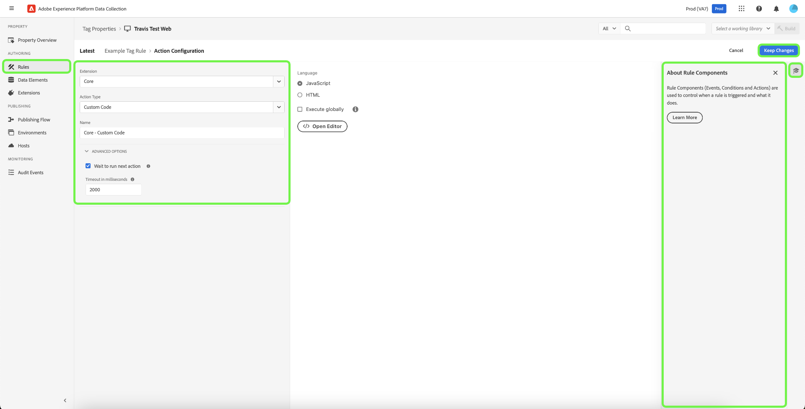

# 規則

>[!NOTE]
>
>Adobe Experience Platform Launch已經過品牌重塑，現在是Adobe Experience Platform中的一套資料收集技術。 因此，所有產品檔案中出現了幾項術語變更。 請參閱下列[檔案](../../term-updates.md)，以取得術語變更的彙總參考資料。

Adobe Experience Platform中的標籤會遵循規則型系統。 他們尋找使用者互動和相關資料。 當符合列於您規則中的準則時，規則會觸發您識別的擴充功能、指令黨指令檔或用戶端代碼。

建置規則來整合行銷和廣告技術的資料和功能，將不同的產品整合為單一解決方案。

## 規則結構

**事件 (If)：**&#x200B;您想要規則尋找的事件。這是透過選擇事件、任何適用條件以及任何例外所定義。

**動作 (Then)：**&#x200B;在規則的事件發生且滿足所有條件之後，就會觸發。標記 規則可以根據需要觸發任意數量的離散操作，並且可以控制這些操作發生的順序。 例如，電子商務「感謝您」頁面的單一規則可以從單一規則觸發您的分析工具和協力廠商標籤。不需要為各個擴充功能或標籤建立不同規則。

您可以新增更多事件類型。您可使用 OR 聯結多個事件，因此如果符合任何一個事件，就會得出規則的條件。

>[!IMPORTANT]
>
>變更項目會等到[發佈](../publishing/overview.md)後才生效。

### 事件和條件 (if)

具有任何條件的事件是規則的 *If* 部分。

如果發生指定事件，就會得出條件，然後視需要發生指定的動作。

* **事件**：指定一或多個必須發生的事件以觸發規則。 您可使用 OR 聯結多個事件。任何指定事件都會觸發規則。

* **條件**：通過配置事件觸發規則必須滿足的任何條件來縮小事件。 例外是定義為NOT條件。 您可使用 AND 聯結多個條件。

可用的事件取決於安裝的擴充功能。如需核心擴充功能中事件的詳細資訊，請參閱[核心擴充功能事件類型](../../extensions/client/core/overview.md#core-extension-event-types)。

### 動作 (then)

動作是指規則的 *Then* 部分。它們定義當規則執行時您想要發生的動作。 觸發事件時，如果條件評估為 true，而例外評估為 false，則會執行動作。您可以視需要拖放動作以進行排序。

## 建立規則

指定在符合條件時會發生什麼動作，以建立規則。

>[!TIP]
>
>您可以從右側面板中選取，檢視其他可用的資源，以進一步瞭解此功能。

1. 開啟[!UICONTROL 規則]標籤，然後選取&#x200B;**[!UICONTROL 建立新規則]**。

   

1. 為規則命名。
1. 選擇“事件 **[!UICONTROL 添加]** ”圖示。
1. 選擇您的擴展和可用於該擴展的事件類型之一，然後配置事件的設置。

   

   可用的事件類型取決於您選擇的擴充功能。 事件設定會因事件類型而異。 有些事件不必設置任何設定。

   >[!IMPORTANT]
   >
   >用戶端規則中的資料元素會在名稱的頭尾分別加上 `%`，加以代碼化，例如 `%viewportHeight%`。在事件轉送規則中，資料元素會在名稱開頭加上`{{`，並在結尾加上`}}`，加以代碼化， 例如 `{{viewportHeight}}`。

   若要參照 Edge Network 的資料，資料元素路徑必須為 `arc.event._<element>_`，

   其中 `arc` 代表 Adobe Response Context。

   例如︰`arc.event.xdm.web.webPageDetails.URL`

   >[!IMPORTANT]
   >
   >如果未正確指定此路徑，系統就不會收集資料。

1. 設定Order引數，然後選取&#x200B;**[!UICONTROL 保留變更]**。

   所有規則元件的預設順序皆為 50。若要加快元件執行的速度，請指定小於 50 的數字。

   * 執行順序是數字的順序。1 在 3 之前。3 在 10 之前。10 在 100 之前，依此類推。
   * 具有相同順序的規則不會以特定順序執行。
   * 規則會依序引發，但不一定會以相同順序完成。如果規則 A 和規則 B 共享一個事件，而您指派順序，讓規則 A 優先，則如果規則 A 非同步執行某個動作，並不保證規則 A 會在規則 B 開始前完成。

     若要使其稍後執行，請指定大於 50 的數字。如需排序的詳細資訊，請參閱[規則排序](rules.md#rule-ordering)。

1. 選取條件&#x200B;**[!UICONTROL 新增]**&#x200B;圖示，然後選取邏輯型別、擴充功能、條件型別並設定條件的相關設定。 接著，選取&#x200B;**[!UICONTROL 保留變更]**。

   

   可用的條件型別取決於您選取的擴充功能。 條件設定會因條件類型而異。

   邏輯類型：

   * 一般邏輯類型會在符合條件時允許執行動作。
   * 例外邏輯類型會在符合條件時禁止執行動作。

   （進階）逾時：在屬性上啟用規則元件排序後，即可使用此選項。 此屬性會定義條件執行的時間長度上限。 如果逾時，條件就會執行失敗，系統會從處理佇列中移除規則的其餘條件和動作。 預設值為 2000 ms。

   您可以無限新增條件。同一規則內的多個條件會由 AND 聯結。

1. 選取動作&#x200B;**[!UICONTROL 新增]**&#x200B;圖示，然後選取您的擴充功能以及該擴充功能可用的其中一個動作型別，設定動作的設定，然後選取&#x200B;**[!UICONTROL 保留變更]**。

   

   可選擇的動作型別取決於您選取的擴充功能。 動作設定會因動作類型而異。

   （進階）等候執行下一個動作：在屬性上啟用規則元件排序後，即可使用此選項。 一旦勾選，此動作完成前，標籤不會呼叫下一個動作。 取消勾選後，下一個動作會立即開始執行。 預設值為&#x200B;**[!UICONTROL 已核取]**。

   （進階）超時：在屬性上啟用元件排序規則此選項可用。 它定義允許操作完成的最長時間量。 如果達到超時，操作將失敗，此規則的任何後續操作都將從處理佇列中刪除。 預設值為 2000 ms。

1. 查看規則，然後選擇 **[!UICONTROL 儲存規則]**“。

   之後，當您[發佈](../publishing/overview.md)時，您會將此規則新增到程式庫並進行部署。

建立或編輯規則時，您可以儲存並建置至[使用中的程式庫](../publishing/libraries.md#active-library)。這樣會立即將變更儲存至您的程式庫並執行組建。組件狀態會隨即顯示。

## 規則順序 {#rule-ordering}

規則排序可讓您控制共用事件的規則的執行順序。 每個規則都包含一個整數，用於確定其順序優先順序（預設值為 50）。 包含較低順序值的規則會先於包含較高值的規則執行。

考慮一組五個規則，這些規則共用一個事件，並且都具有預設優先順序：

* 如果您想要在最後執行某個規則，可以編輯該規則元件，並為它指定大於50 （例如60）的數字。
* 如果您想要先執行某個規則，可以編輯該規則元件，並為它指定小於50 （例如40）的數字。

>[!NOTE]
>
>最終，執行動作的責任在於使用您正在使用之事件型別的擴充功能開發人員。 Adobe擴充功能開發人員可確保擴充功能正常運作。 Adobe為協力廠商擴充功能開發人員提供正確執行此動作的指引，但無法保證如何遵循這些指引。

強烈建議您使用介於1到100 （預設為50）之間的正數來排序規則。 由於規則順序必須以手動方式維護，因此最佳作法是儘可能簡化訂購配置。 如果邊緣案例中此限制太嚴格，則標籤支援介於+/- 2,147,483,648之間的規則順序編號。

### 用戶端規則處理

規則的載入順序取決於規則動作是透過 JavaScript、HTML 或其他用戶端代碼設定，以及規則是否使用頁面底部或頂端事件，或不同類型的事件。

無論為規則設定的事件為何，您皆可在自訂指令碼內使用 `document.write`。

您可以在它們之間排序不同的自訂程式碼類型。例如，您現在可以有 JavaScript 自訂程式碼動作、然後是 HTML 自訂程式碼動作，接著是 JavaScript 自訂程式碼動作。標籤可確保依照該順序執行。

## 規則捆綁

規則事件和條件一律會捆綁在主標記 資料庫里。 操作可以捆綁在主資料庫中，也可以根據需要作為子資源延遲載入。 動作是否整合，取決於規則的事件類型。

### 具「核心 - 程式庫已載入」或「核心 - 頁面頂端」事件的規則

這些事件幾乎都會執行 (除非條件評估為 false)，因此為了提高效率，這些事件會整合至主程式庫，也就是您內嵌程式碼所參考的檔案。

* **Javascript：** JavaScript嵌入主標記 資料庫中。 自訂指令碼會包裝在指令碼標記中，並使用 `document.write` 寫入至文件。如果規則有多個自訂程式碼，則會依序寫入。

* **HTML：** HTML已內嵌於主要標籤程式庫中。 `document.write` 可用來將 HTML 寫入文件。如果規則有多個自訂程式碼，則會依序寫入。

### 具有任何其他事件的規則

Adobe無法保證會實際觸發任何其他規則，且會需要規則的動作程式碼。 因此，上方未列出的所有事件類型動作，都不會封裝至主程式庫，但會儲存為子資源，由主程式庫依需求參考。

* **JavaScript：** JavaScript 會從伺服器載入為一般文字、以指令碼標記包住，並使用 PostScribe 新增至文件中。如果規則有多個 JavaScript 自訂指令碼，則會從伺服器同時載入，不過會依照規則中所設定的相同順序執行。
* **HTML：** HTML 已從伺服器載入，並已使用 Postscribe 新增到文件。如果規則有多個自訂 HTML 指令碼，則會從伺服器同時載入，不過會依照規則中所設定的相同順序執行。

## 規則元件排序 {#sequencing}

執行階段環境的行為取決於您屬性的&#x200B;**[!UICONTROL 執行順序規則元件]**&#x200B;是否開啟。 此設置確定是可以並行（異步）評估規則的元件，還是必須在序列中評估它們。

>[!IMPORTANT]
>
>此設置僅確定如何在每個規則中評估條件和操作，而不會影響在屬性上執行規則本身的序列。 有關如何確定多個規則的執行順序的詳細資訊，請參閱上一節 [規則](#rule-ordering) 排序。
>
>在事件轉發[&#128279;](../event-forwarding/overview.md)屬性中，規則操作始終按順序執行，此設置不可用。建立規則時，請確認順序正確無誤。

### 啟用

如果在運行時觸發事件時啟用該設置，則規則的條件和操作將添加到處理佇列（基於您定義的順序），並在“先進先出”（FIFO） 的基礎上一次處理一個。 規則會等待元件處理完成，再移至下一個元件。

如果條件評估為 false 或達到所定義的逾時時間，系統會從佇列中移除該規則的後續條件和動作。

如果動作失敗或達到所定義的逾時時間，系統會從佇列中移除該規則的後續動作。

### 停用

如果已停用，當執行階段觸發事件時，系統會立即評估規則的條件。 系統會同時評估多個條件。

如果所有條件都傳回true （例外情況傳回false），系統會立即執行規則的動作。 系統會依順序呼叫這些動作，但標籤不會等到動作完成後才呼叫下一個動作。 如果您的動作是同步的，它們仍會依順序執行。 如果一或多個動作設為非同步，則會有部分動作同時執行。
