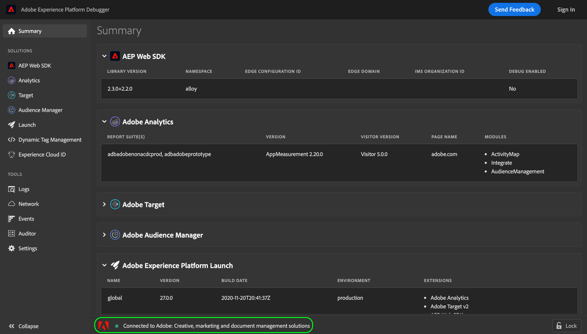

# 使用 Adobe Experience Platform Debugger 測試內嵌程式碼

>[!NOTE]
>
>Adobe Experience Platform Launch 已進行品牌重塑，現在是 Adobe Experience Platform 中的一套資料彙集技術。 因此，這些產品文件都推出多項幾術語變更。如需術語變更的彙整參考資料，請參閱以下[文件](../../term-updates.md)。

當您在Adobe Experience Platform中變更標籤程式庫組建時，應先測試這些變更，再將組建部署至生產環境。 如果您的網站沒有專用的測試或開發環境，您可以使用 Adobe Experience Platform Debugger 在本機測試網站中不同的內嵌程式碼。

## 先決條件

本教學課程需要您實際瞭解如何使用環境和標籤的內嵌程式碼。 如需詳細資訊，請參閱[環境概觀](./environments.md)。

此外，您也必須安裝Experience Platform Debugger瀏覽器擴充功能，才能完成本教學課程。 Experience Platform Debugger適用於Chrome瀏覽器。 開始教學課程之前，請先透過下列連結安裝擴充功能：

* 適用於Chrome的[Experience Platform Debugger](https://chrome.google.com/webstore/detail/adobe-experience-platform/bfnnokhpnncpkdmbokanobigaccjkpob)

## 在您的網站上開啟Experience Platform Debugger

使用您選擇的瀏覽器，導覽至您的網站並開啟Experience Platform Debugger擴充功能。 Experience Platform Debugger目前所連線的網站會顯示在視窗底部。 如果標籤目前正在您的網站上執行，則會列在[!UICONTROL 摘要]索引標籤中。

>[!NOTE]
>
>如果Experience Platform Debugger一開始無法連線，您可能需要重新載入顯示您網站的瀏覽器索引標籤，才能再試一次。

## 更換內嵌程式碼

Experience Platform Debugger連線至您的網站後，請在左側導覽中選取&#x200B;**[!UICONTROL Launch]**。 您可在此處查看網站上目前所執行程式庫組建的相關資訊，包括其環境和關聯的擴充功能。從這裡，選取&#x200B;**[!UICONTROL 組態]**&#x200B;以顯示管理內嵌程式碼的控制項。

在[!UICONTROL 頁面內嵌程式碼]下方，會顯示您網站目前使用的內嵌程式碼。 在內嵌程式碼的右側選取&#x200B;**[!UICONTROL 動作]**，然後選取&#x200B;**[!UICONTROL 取代]**。

此時畫面會顯示彈出視窗，提示您提供內嵌程式碼，以取代目前的程式碼。請注意，使用Experience Platform Debugger取代內嵌程式碼不會變更網站上已部署的內嵌程式碼。 相反地，這只會變更本機所執行的內嵌程式碼，以利您測試內嵌程式碼實作與偵測錯誤。

將您要測試的內嵌程式碼貼到提供的文字方塊，然後選取[套用]。**&#x200B;**

**[!UICONTROL 設定]**&#x200B;標籤會重新出現，顯示即時內嵌程式碼已取代為您提供的程式碼。 您現在可以使用網頁瀏覽器，查看您測試的內嵌程式碼能否正常運作。

## 後續步驟

本教學課程說明如何使用Experience Platform Debugger在本機切換內嵌程式碼以進行測試。 如需各種功能的詳細資訊，請參閱[Experience Platform Debugger檔案](../../../debugger/home.md)。
