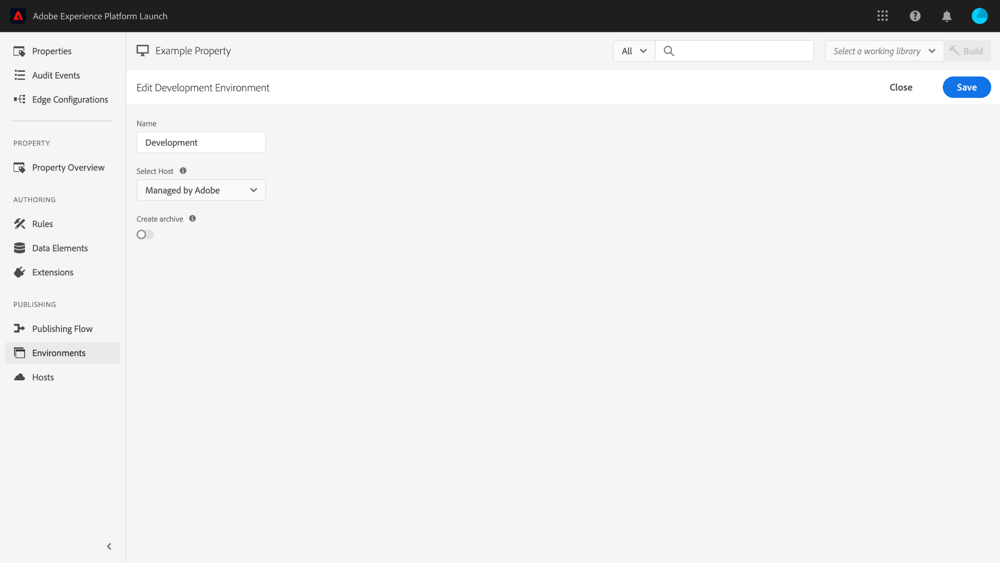
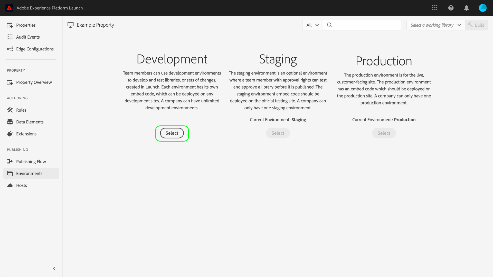

# 環境

>[!NOTE]
>
>Adobe Experience Platform Launch在Adobe Experience Platform中已重新命名為一套資料收集技術。 因此，所有產品文件中出現了幾項術語變更。 如需術語變更的彙整參考資料，請參閱以下[文件](../../term-updates.md)。

標籤環境會定義您在網站或應用程式上部署的程式庫組建的幾個關鍵層面：

* 組建的檔案名稱。
* 組建的網域和路徑 (取決於環境的指派主機)。
* 組建的檔案格式 (取決於選擇的封存方法)。

建立程式庫組建時，必須將其指派給環境。 隨後組建的擴充功能、規則和資料元素會經過編譯，並放入指派的環境中。每個環境都會提供唯一的內嵌程式碼，可讓您將指派的組建整合至您的網站。

每個環境中都可能存在不同的 成品。這可讓您透過工作流程推送不同的程式庫，藉此在不同環境中測試這些程式庫。

本檔案提供在資料收集使用者介面中安裝、設定和建立不同環境的步驟。

## 環境類型

標籤支援三種不同的環境類型，每種都對應於 [發佈工作流程](./publishing-flow.md):

| 環境類型 | 說明 |
| --- | --- |
| 開發 | 此環境對應發佈工作流程中的&#x200B;**「開發」**&#x200B;欄。 |
| 預備 | 此環境對應發佈工作流程中的&#x200B;**「已提交」**&#x200B;和&#x200B;**「已核准」**&#x200B;欄。 |
| 生產 | 此環境對應發佈工作流程中的&#x200B;**「已發佈」**&#x200B;欄。 |

每個環境中都可能存在不同的  成品。這可讓您隨著在發佈工作流程推進程式庫，藉此在不同環境中測試不同程式庫。

>[!NOTE]
>
>每個環境一次只能指派一個程式庫組建。不過，預計單一環境日後將含有許多不同的組建，因為您會在發佈工作流程中移動這些組建，從而視需要重新為組建指派環境。

## 安裝 {#installation}

每個環境都有一組用來與應用程式連接的指示。針對 Web 屬性，這些指示會提供內嵌程式碼。針對行動屬性，這些指示會提供必要的程式碼，用於將使用中的程式庫實例化，以及在執行階段擷取設定。

>[!IMPORTANT]
>
>每種環境類型各自有相應的安裝指示。根據您使用的環境，您必須確保使用正確的相應內嵌程式碼和/或相依性。
>
>例如，Web 屬性的生產內嵌程式碼支援瀏覽器快取，而開發和預備內嵌程式碼則不支援。因此，請勿在高流量或生產環境中使用開發或預備內嵌程式碼。

若要存取環境的安裝指示，請導覽至 **[!UICONTROL 環境]** 索引標籤，然後選取 **[!UICONTROL 安裝]** 圖示。

如果使用 Web 屬性，您會獲得要在文件的 `<head>` 標記中使用的內嵌程式碼。此外，您可以選擇在執行階段要以同步或非同步方式部署程式庫檔案。系統會根據您選擇的設定，顯示不同的安裝指示。本文件稍後將詳細說明內嵌程式碼。

如果您使用行動屬性，系統則會針對 Android (透過 [Gradle](https://gradle.org/)) 和 iOS (透過 [CocoaPods](https://cocoapods.org/)) 安裝相依性提供不同指示。

## 行動設定

如需設定行動屬性，您可從清單中選擇相關選項，查看環境所適用的設定選項。您可以在這裡變更環境名稱。行動環境目前只能使用 Adobe 管理的主機。

如需詳細資訊，請參閱[主機](./hosts/hosts-overview.md)的相關概述。

## Web 設定

指派環境中的設定會決定Web屬性的下列項目：

* **主機**：您要部署組建的伺服器位置。
* **封存設定**：系統應輸出一組可部署的檔案，或是將這些檔案壓縮為封存格式。
* **內嵌程式碼**：要在網站頁面的 HTML 中嵌入的 `<script>` 程式碼，用於在執行階段部署程式庫組建。

在 [!UICONTROL 環境] 頁簽，選擇列出的環境以顯示其配置控制項。

### Host {#host}

選擇 **[!UICONTROL 主機]** 從下拉式選單中選擇為環境預先設定的主機。

建立組建時，該組建會傳送至您為指派主機指定的位置。 有關如何建立和配置標籤主機的資訊，請參閱 [主機概述](./hosts/hosts-overview.md).

### 封存設定 {#archive}

大部分的組建都包含多個檔案。多檔案組建包含一個主要程式庫檔案 (在內嵌程式碼中連結)，其中包含其他隨需提取檔案的內部參照。

此 **[!UICONTROL 建立封存]** 按鈕可讓您切換環境的封存設定。 封存選項預設為關閉，而組建會以原樣執行的格式傳送 (Web 屬性為 JavaScript，行動屬性為 JSON)。

如果您選擇開啟封存設定，UI 中會顯示其他設定，讓您選擇性加密封存檔案，並定義程式庫的路徑 (如果您使用自行託管)。

路徑可以是完整的 URL，或是可跨多個網域使用的相對路徑。這很重要，因為大部分的組建都具有包含內部參照的多個檔案。

如果您使用封存選項，所有組建檔案都會改以 ZIP 檔案傳送。這在下列情況中相當實用：

1. 您自行託管程式庫，但不想設定 SFTP 主機用於傳送。
1. 部署之前，您需要對組建進行程式碼分析。
1. 您只想查看組建包含的內容。

### 內嵌程式碼 {#embed-code}

內嵌程式碼是 `<script>` 標籤 `<head>` 網頁的區段，以載入並執行您建立的程式碼。 每個環境設定都會自動產生各自的內嵌程式碼，因此您只需復製程式碼並貼到要執行標籤的網頁上。

當您檢視安裝指示時，您可以選擇讓指令碼以同步或非同步方式載入程式庫檔案。此設定不具持續性，也不會反映您實際在網站上實作標籤的方式。 目的只是為了顯示安裝環境的適當方法。

>[!WARNING]
>
>根據標籤程式庫的內容，規則和其他元素的行為可能會隨著同步和非同步部署而變更。 因此，完整測試您所做的任何變更相當重要。

#### 非同步部署

非同步部署可讓瀏覽器在擷取程式庫時繼續載入頁面其餘部分。使用此設定時，只有一段內嵌程式碼，必須放在文件 `<head>` 中。

如需此設定的詳細資訊，請參閱[非同步部署](../client-side/asynchronous-deployment.md)的指南。

#### 同步部署

當瀏覽器使用同步部署讀取內嵌程式碼時，會擷取並執行標籤程式庫，再繼續載入頁面。

同步內嵌程式碼有兩個必須放置在網站 HTML 中的 `<script>` 標記。一個 `<script>` 標記必須放在文件 `<head>` 中，另一個標記則必須放在結束 `</body>` 標記之前。

#### 內嵌程式碼更新

由於內嵌程式碼是根據您的環境設定而產生，因此某些設定變更會自動更新相關環境的內嵌程式碼。這些變更包括：

* 從 Adobe 管理主機切換至 SFTP 主機 (反之亦然)。
* 變更封存設定。
* 更新路徑欄位 (如果已啟用封存設定)。

>[!WARNING]
>
>標籤環境的內嵌程式碼變更時，您必須手動更新HTML中的內嵌程式碼。 建議您只有在絕對必要時更新內嵌程式碼，以免維護成本過高。

## 建立環境

首次建立屬性時，系統會自動將三個環境指派給屬性：開發、預備和生產。這三種環境足以執行發佈工作流程。不過，您可視需要新增其他開發環境，因為這對同時有多位開發人員處理不同專案的大型團隊非常有用。

在 [!UICONTROL 環境] 索引標籤，選取 **[!UICONTROL 新增環境]**.

在下一個畫面中，選取 **[!UICONTROL 開發]** 選項。

下一個畫面可讓您為新環境命名、選取主機，以及選擇封存設定。完成後，請選取 **[!UICONTROL 儲存]** 來建立環境。

此 [!UICONTROL 環境] 頁簽會重新顯示，並顯示新環境的安裝指示。

## 後續步驟

閱讀本文件後，您應該已經實際了解如何在 UI 中設定環境，並且將環境安裝至您的網站或應用程式中。您現在可以開始發佈程式庫組建。

當您隨著時間推移發佈程式庫的反覆項目時，可能會發現必須追蹤並封存舊版組建，以便疑難排解和復原。如需詳細資訊，請參閱[重新發佈舊版程式庫](./republish.md)的指南。
