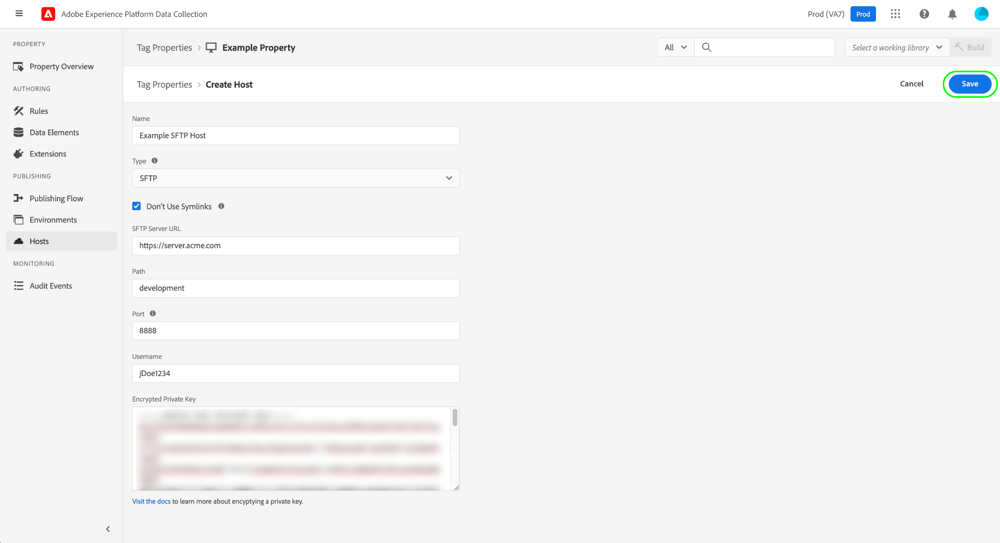

# SFTP主機

>[!NOTE]
>
>Adobe Experience Platform Launch已經過品牌重塑，現在是Adobe Experience Platform中的一套資料收集技術。 因此，所有產品檔案中出現了幾項術語變更。 請參閱下列[檔案](../../../term-updates.md)，以取得術語變更的彙總參考資料。

Adobe Experience Platform可讓您將標籤程式庫組建傳送至您自行託管的安全SFTP伺服器，讓您更能掌控組建的儲存和管理方式。 本指南說明如何在Experience Platform UI或資料收集UI中為標籤屬性設定SFTP主機。

>[!NOTE]
>
>您也可以選擇改用Adobe管理的主機。 如需詳細資訊，請參閱[Adobe管理主機](./managed-by-adobe-host.md)的指南。
>
>如需自行託管程式庫的優點和限制的相關資訊，請參閱[自行託管指南](./self-hosting-libraries.md)。

## 設定伺服器的存取金鑰 {#access-key}

Platform會使用加密的金鑰連線至您的SFTP網站。 正確設定此項目的幾個步驟：

### 建立公開/私密金鑰組

您的SFTP伺服器上必須安裝公開/私用金鑰組。 您可以在伺服器上產生這些金鑰，也可以在其他地方產生金鑰再安裝在伺服器上。 如需詳細資訊，請參閱有關[如何產生SSH金鑰](https://help.github.com/articles/generating-a-new-ssh-key-and-adding-it-to-the-ssh-agent/#generating-a-new-ssh-key)的GitHub檔案。

### 加密您的金鑰

私密金鑰是用來加密公開金鑰。 在SFTP主機建立過程中，您需要提供私密金鑰。 請參閱Reactor API指南中有關[加密值](../../../api/guides/encrypting-values.md)的章節，以取得加密公開金鑰的指示。 使用生產環境的GPG金鑰，除非您確定您需要特定金鑰。 最後，您可以從任何電腦加密私密金鑰，因此不需要在伺服器上安裝GPG即可完成此步驟。

### 允許清單平台IP位址

您可能需要核准一組IP位址，以便在公司防火牆內使用，以允許Platform連線您的SFTP伺服器並與其連線。 這些IP位址包括：

* `184.72.239.68`
* `23.20.85.113`
* `54.226.193.184`

>[!NOTE]
>
>標籤組建的結構已隨著時間而改變。 它們在內部使用符號連結(symlink)來維持回溯相容性，以便舊版內嵌程式碼繼續與最新的組建結構搭配使用。 您的SFTP伺服器必須支援使用symlink，才能當做標籤組建的有效目的地。

如需更多詳細資訊，請參閱以下Medium文章，瞭解如何設定SFTP伺服器以傳遞組建](https://medium.com/launch-by-adobe/configuring-an-sftp-server-for-use-with-adobe-launch-bc626027e5a6)。[

## 建立 SFTP 主機 {#create}

在左側導覽中選取&#x200B;**[!UICONTROL 主機]**，然後選取&#x200B;**[!UICONTROL 新增主機]**。

![影像顯示UI中正在選取[新增主機]按鈕](../../../images/ui/publishing/sftp-hosts/add-host-button.png)

主機建立對話方塊隨即顯示。 提供主機的名稱，並在&#x200B;**[!UICONTROL 型別]**&#x200B;底下選取&#x200B;**[!UICONTROL SFTP]**。

### 設定SFTP主機 {#configure}

此對話方塊會展開，包含SFTP主機的其他設定選項。 下文將說明這些內容。

| 設定欄位 | 說明 |
| --- | --- |
| [!UICONTROL 不使用Symlink] | 依預設，所有SFTP主機都會使用符號連結(symlink)來參照儲存至伺服器的程式庫[組建](../builds.md)。 不過，並非所有伺服器都支援使用symlink。 選取此選項時，主機會使用複製操作直接更新組建資產，而非使用符號連結。 |
| [!UICONTROL SFTP伺服器URL] | 您伺服器的URL基底路徑。 |
| [!UICONTROL 路徑] | 要附加至此主機之基本伺服器URL的路徑。 |
| [!UICONTROL 連線埠] | 連接埠必須為下列任一項：<ul><li>`21`</li><li>`22`</li><li>`80`</li><li>`200-299`</li><li>`443`</li><li>`2000-2999`</li><li>`4343`</li><li>`8080`</li><li>`8888`</li></ul>Adobe 會限制可用於傳出流量的連接埠數量，當作安全性最佳實務。通常允許所選連線埠通過公司防火牆，並包含一些彈性範圍。 |
| [!UICONTROL 使用者名稱] | 存取伺服器時要使用的使用者名稱。 |
| [!UICONTROL 加密的私密金鑰] | 您在[先前步驟](#access-key)中建立的加密私密金鑰。 |

選取&#x200B;**[!UICONTROL 儲存]**&#x200B;以使用選取的組態建立主機。

當您選取&#x200B;**[!UICONTROL 儲存]**&#x200B;時，會測試連線及將檔案傳送至SFTP伺服器的能力。 Platform會建立資料夾、在該資料夾中寫入檔案、檢查檔案是否確實存在，然後自行清除。 若您SFTP伺服器上的使用者帳戶（與您提供給Platform的安全憑證連結的帳戶）沒有執行此動作的必要許可權，則主機會進入「失敗」狀態。

## 後續步驟

本指南說明如何設定自家託管的SFTP伺服器，以用於標籤。 建立主機後，您就可以將其與您的一個或多個[環境](../environments.md)建立關聯，以發佈標籤程式庫。 如需在網頁或行動屬性上啟用標籤功能的高階程式詳細資訊，請參閱[發佈總覽](../overview.md)。
