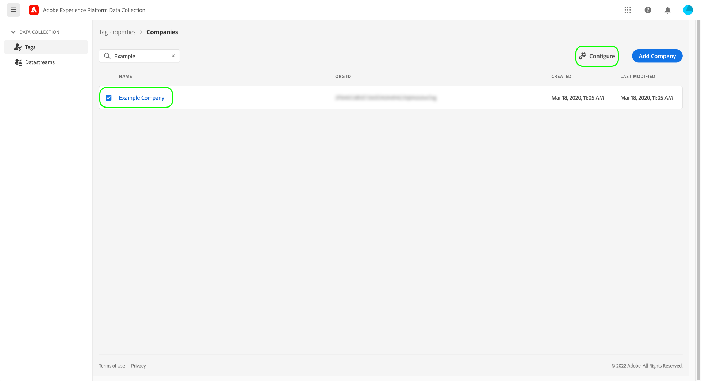

# 對標籤的高級CDN支援(Beta)

>[!IMPORTANT]
>
>標籤的高級CDN功能當前處於測試版中，您的組織可能尚未訪問它。 本文檔可能會更改。

使用 [Adobe管理的主機](./hosts/managed-by-adobe-host.md) 要在您的網站上交付您的Adobe Experience Platform標籤資產，這些資產將分佈在世界各地的各種內容交付網路(CDN)中，以提供最快的下載速度。 但是，某些區域要求在該區域內的伺服器上複製和托管所有網站資產。

為此，Experience Platform中的標籤提供了高級CDN功能，允許您將內容分發到這些特殊區域。

高級CDN支援是付費功能，必須由您的組織購買才能啟用和使用它。 本指南介紹在購買資料收集UI後如何配置和使用此功能。

## 為公司啟用高級CDN

在公司級別啟用了高級CDN，這意味著您必須擁有公司編輯權限才能啟用該功能。

在資料收集UI中，導航到 **[!UICONTROL 標籤]** > **[!UICONTROL 公司]**。 在此處，選擇要為其啟用功能的公司，然後選擇 **[!UICONTROL 配置]** 。

在出現的配置對話框中，選擇 **[!UICONTROL 已啟用高級CDN]** 選擇 **[!UICONTROL 保存]** 確認更改。

## 使用更新的嵌入代碼重建和安裝標籤庫

啟用高級CDN功能並不意味著您的標籤資產會立即複製並準備在新區域內使用。 這隻意味著您現在可以選擇何時選擇使用此功能。

>[!IMPORTANT]
>
>在啟用高級CDN之前構建的庫將繼續像現在一樣按原樣運行。 這也適用於不由Adobe管理的庫，因為 [歸檔環境](./environments.md#archive) 僅對其資產路徑使用相對URL。 請注意，在啟用高級CDN後，您生成的未由Adobe管理的任何庫都將像未啟用高級CDN功能一樣運行。

啟用高級CDN並重新構建任何希望從新托管區域使用的庫後，您就可以檢索新托管區域嵌入代碼以添加到網站。

>[!NOTE]
>
>列在 [!UICONTROL 標準] 托管區域將繼續按原樣工作，以及網站上已有的任何「頁頂」或「頁底」嵌入代碼。

訪問 **[!UICONTROL 環境]** 頁面或查看庫編輯螢幕中的環境安裝說明，以查找新的嵌入代碼。 每個新支援的托管區域都顯示在 [!UICONTROL 標準] 托管區域（用於世界上不支援高級CDN的區域）。 下面的螢幕截圖顯示了中國地區的嵌入代碼，該代碼使用 `.cn` 作為其頂級域(TLD)。

為網頁選擇適當的嵌入代碼，並將其貼上到 `<head>` 文檔的標籤。 有關使用嵌入代碼安裝標籤庫的詳細資訊，請參閱 [環境UI指南](./environments.md#installation)。

## 後續步驟

本指南介紹了如何啟用和安裝用於標籤實施的高級CDN功能。 有關在Web和移動屬性上安裝和測試標籤庫的詳細資訊，請參閱 [發佈概述](./overview.md)。
