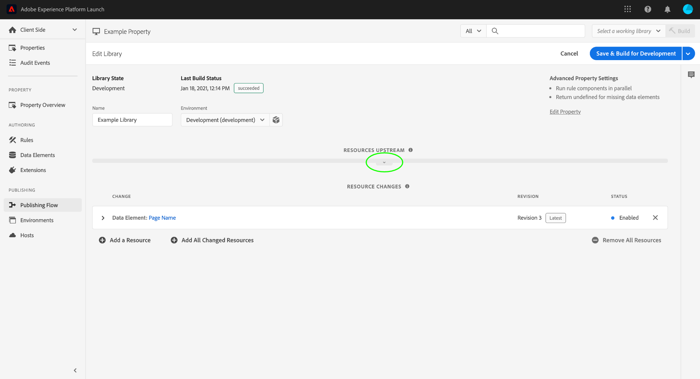

# 發佈流程

>[!NOTE]
>
>Adobe Experience Platform Launch已重新命名為Experience Platform中的資料收集技術套件。 因此，產品檔案中已推出數個術語變更。 有關術語更改的綜合參考，請參閱以下[document](../../term-updates.md)。

Adobe Experience Platform中的標籤發佈流程是指建立程式庫、測試組建以及核准以供生產的程式。

您可以對程式庫執行的可用動作取決於程式庫的狀態和您擁有的權限層級。 此外，程式庫的狀態也會根據發佈流程上游的內容，影響其包含的資源（規則、資料元素和擴充功能）。

以下各節涵蓋與發佈流程相關的權限、程式庫狀態和上游的詳細資訊。

## 權限 {#permissions}

有不同層級的使用者權限對發佈流程非常重要；具體來說，[!UICONTROL Develop]、[!UICONTROL Approve]和[!UICONTROL Publish]屬性權利：

* **[!UICONTROL 開發]**:包括建立程式庫、建置以供開發，以及提交以供核准的功能。
* **[!UICONTROL 核准]**:包括為測試建置和核准分段組建的能力。
* **[!UICONTROL 發佈]**:包括發佈已核准程式庫的功能。

這些權利不包容。 若要讓一個人員從頭到尾執行工作流程，該人員必須在指定屬性內被授予所有這三個權利。

如需管理標籤權限的詳細資訊，請參閱[使用者權限指南](../administration/user-permissions.md) 。

## 程式庫狀態 {#state}

關於發佈流程，程式庫可以處於四種基本狀態：

* [[!UICONTROL 開發]](#development)
* [[!UICONTROL 已提交]](#submitted)
* [[!UICONTROL 已核准]](#approved)
* [[!UICONTROL 已發佈]](#published)

這四種狀態在資料收集UI的&#x200B;**[!UICONTROL 發佈流量]**&#x200B;標籤內會以欄的形式表示。

您必須執行特定動作，才能讓程式庫在這些狀態之間移動。下圖概述在狀態之間移動程式庫的每個動作：

### [!UICONTROL 開發] {#development}

建立新程式庫時，它們會以[!UICONTROL Development]狀態啟動。 程式庫位於[!UICONTROL Development]時，必須對程式庫進行任何變更。 完成開發和測試後，即可提交程式庫進行核准。

下表概述處於[!UICONTROL Development]狀態的程式庫的可用動作：

| 動作 | 說明 |
| --- | --- |
| [!UICONTROL 編輯] | 使用[!UICONTROL Edit Library]畫面，新增元件或從程式庫中移除元件。 |
| [!UICONTROL 建置至開發] | 為程式庫建立組建。組建會編譯並部署至指派給程式庫的環境。 如果程式庫尚未指派給環境，或包含已在上游定義的變更，則此步驟會失敗。 |
| [!UICONTROL 提交以進行核准] | 從開發環境中取消指派程式庫，並將程式庫移至[!UICONTROL Submitted]欄，讓具有要處理的核准權限的使用者執行。 程式庫的最新組建必須成功，才能啟用此選項。 |
| [!UICONTROL 提交並建置到測試環境] | 這只能由同時具有開發和核准權限的使用者執行。 此動作會從開發環境中取消指派程式庫，將程式庫移動至[!UICONTROL Submitted]狀態，並將程式庫建置至測試環境。 程式庫的最新組建必須成功，才能啟用此選項。 |
| [!UICONTROL 核准以發佈] | 這只能由同時具有開發和核准權限的使用者執行。 此動作會從開發環境中取消指派程式庫，並將其移至[!UICONTROL 已核准]狀態 — 略過測試環境，而完全跳過[!UICONTROL 已提交]狀態。 程式庫的最新組建必須成功，才能啟用此選項。 |
| [!UICONTROL 核准並發佈至生產環境] | 這只能由具有開發、核准和發佈權限的使用者執行。 此動作會從開發環境中取消指派程式庫，將其移至[!UICONTROL 已核准]狀態，然後發佈至生產環境。 生產組建完成後，程式庫會移至[!UICONTROL Published]狀態。 程式庫的最新組建必須成功，才能啟用此選項。 |
| [!UICONTROL 刪除] | 將程式庫從Platform launch中移除。 這不會從環境中移除組建。 |

### [!UICONTROL 已提交] {#submitted}

當程式庫處於[!UICONTROL Submitted]狀態時，具有核准權限的使用者可以在測試環境中測試程式庫。 測試完成時，程式庫可以獲核准或拒絕。 已拒絕的組建會回到[!UICONTROL Development]，以便在重新啟動發佈流程之前進行其他變更。

下表概述[!UICONTROL Submitted]狀態下的程式庫的可用操作：

| 動作 | 說明 |
| --- | --- |
| [!UICONTROL 開啟] | 檢視程式庫的內容。[!UICONTROL Development]欄外的程式庫不允許變更。 如果需要變更，應拒絕程式庫，以便在[!UICONTROL Development]中進行變更。 |
| [!UICONTROL 為測試環境建置] | 在測試環境中建立程式庫以進行部署。 |
| [!UICONTROL 核准以發佈] | 將程式庫移至[!UICONTROL 已核准]欄，讓具有發佈權限的使用者繼續使用。 |
| [!UICONTROL 核准並發佈至生產環境] | 這只能由同時具有「核准」和「發佈」權限的使用者執行。 此動作會從測試環境中取消指派程式庫，將其移至[!UICONTROL 已核准]狀態，然後發佈至生產環境。 生產組建完成後，程式庫會移至[!UICONTROL Published]狀態。 若未在預備環境中成功建置，即可透過我們的執行。 |
| [!UICONTROL 拒絕] | 從測試環境中取消指派程式庫，並將程式庫移回[!UICONTROL Development]欄以進行進一步變更。 |

### [!UICONTROL 已核准] {#approved}

一旦程式庫獲核准後，具有發佈權限的使用者就可以發佈或拒絕程式庫。 已拒絕的組建會回到[!UICONTROL 開發]，以便在發佈流程重新開始之前，可以進一步變更。

下表概述處於[!UICONTROL Approved]狀態的程式庫的可用操作：

| 動作 | 說明 |
| --- | --- |
| [!UICONTROL 開啟] | 檢視程式庫的內容。[!UICONTROL Development]欄外的程式庫不允許變更。 如果需要變更，應拒絕程式庫，以便在[!UICONTROL Development]中進行變更。 |
| [!UICONTROL 建置並發佈到生產環境] | 從測試環境中取消指派程式庫、將程式庫指派至生產環境，然後加以部署。  **重要**:選取此選項後，程式庫就會在生產環境中上線。選取此選項之前，請確定程式庫包含您想要的變更。 |
| [!UICONTROL 拒絕] | 從測試環境中取消指派程式庫，並將程式庫移至[!UICONTROL Development]欄以進行進一步變更。 |

### [!UICONTROL 已發佈] {#published}

[!UICONTROL Published]欄顯示已發佈的程式庫及其發佈日期。 目前發佈的程式庫會在旁邊顯示一個綠色圓點。 除非您已在先前的程式庫上執行重新發佈，否則這一律會是欄頂端的程式庫。

| 動作 | 說明 |
| --- | --- |
| [!UICONTROL 開啟] | 檢視程式庫的內容。[!UICONTROL Development]欄外的程式庫不允許變更。 如果您想要變更生產環境中的內容，必須建立新程式庫，並在完整的發佈程式中移動。 |
| [!UICONTROL 重新發佈] | 此動作僅適用於最近發佈的五個程式庫，且僅限於生產環境(A)已設定「封存」選項為關閉，且(b)在建置時使用[!UICONTROL 由Adobe管理]主機時。 |
| [!UICONTROL 下載] | 此動作僅適用於最近發佈的五個程式庫，且僅限於當生產環境(A)在上以「封存」選項設定且(b)在建置時使用[!UICONTROL 由Adobe管理]主機時。 |

## 上游 {#upstream}

發佈第一個程式庫後，當您透過發佈流程移動較新的程式庫時，請務必了解上游的角色。

如果程式庫目前位於[!UICONTROL Development]、[!UICONTROL Submitted]或[!UICONTROL Approved]階段，該程式庫將繼承上游任何程式庫的規則、資料元素和擴充功能。 這些繼承的資源在發佈流程中移動時，會構成每個程式庫的「基線」。 基本上，您可以將每個新程式庫視為上游所建立基線的一系列變更。 這可確保在發佈新小版本時，不會意外覆寫先前程式庫的任何內容。

上游包含的項目取決於程式庫的目前階段。 例如，[!UICONTROL Approved]欄中的程式庫僅繼承[!UICONTROL Published]程式庫的資源，而[!UICONTROL Development]下的程式庫繼承所有其他欄的資源。

在資料收集UI中編輯程式庫時，從上游繼承的所有資源都會顯示在&#x200B;**[!UICONTROL Resources Upstream]**&#x200B;區段中。 若要檢視這些資源，請選取區段標題下方的展開標籤。

區段會展開並顯示繼承自上游的個別資源。 您可以使用左側邊欄在[!UICONTROL Rules]、[!UICONTROL 資料元素]和[!UICONTROL 擴充功能]之間進行篩選，或使用搜尋列依名稱尋找特定資源。

## 後續步驟

本指南提供Adobe Experience Platform中資料庫發佈流程的概觀。 若要進一步了解如何發佈您的程式庫，請參閱[發佈概述](./overview.md)。
