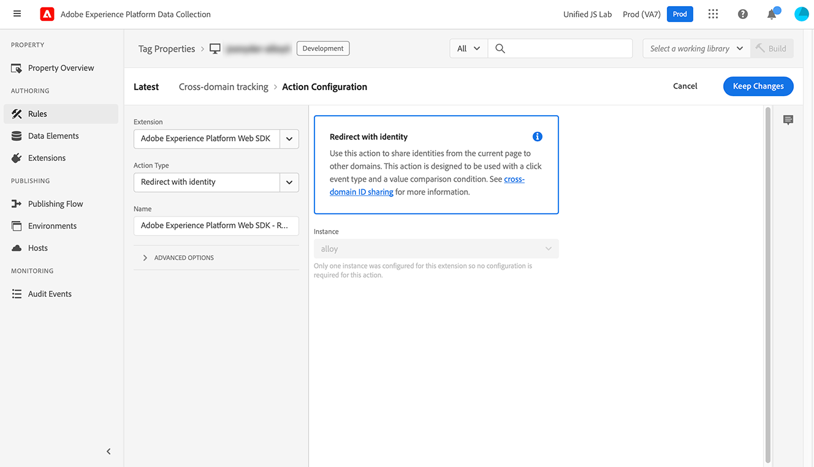

# `appendIdentityToUrl`

`appendIdentityToUrl`命令可讓您將使用者識別碼新增至URL做為查詢字串。 此動作可讓您在網域之間攜帶訪客的身分，以防止同時包含網域或管道的資料集出現重複訪客計數。 它適用於Web SDK 2.11.0或更新版本。

產生並附加至URL的查詢字串為`adobe_mc`。 如果網頁SDK找不到ECID，它會呼叫`/acquire`端點以產生一個。

>[!NOTE]
>
>如果尚未提供同意，則傳回此方法的URL不會變更。 此命令會立即執行；不會等待同意更新。

## 使用網頁SDK擴充功能將身分附加至URL {#extension}

將身分附加至URL是在Adobe Experience Platform資料收集標籤介面的規則中作為動作執行的。

1. 使用您的Adobe ID憑證登入[experience.adobe.com](https://experience.adobe.com)。
1. 導覽至&#x200B;**[!UICONTROL 資料彙集]** > **[!UICONTROL 標籤]**。
1. 選取所需的標籤屬性。
1. 導覽至&#x200B;**[!UICONTROL 規則]**，然後選取所要的規則。
1. 在[!UICONTROL 動作]下，選取現有動作或建立動作。
1. 將[!UICONTROL 擴充功能]下拉式欄位設定為&#x200B;**[!UICONTROL Adobe Experience Platform Web SDK]**，並將[!UICONTROL 動作型別]設定為&#x200B;**[!UICONTROL 使用身分識別重新導向]**。
1. 按一下&#x200B;**[!UICONTROL 保留變更]**，然後執行您的發佈工作流程。

這個命令通常會與特定規則搭配使用，此規則會監聽點按次數並檢查所需的網域。

+++規則事件條件

當具有`href`屬性的錨點標籤被點按時觸發。

* **[!UICONTROL 延伸模組]**：核心
* **[!UICONTROL 事件型別]**：按一下
* **[!UICONTROL 當使用者按一下]**&#x200B;時：特定元素
* **[!UICONTROL 符合CSS選擇器的元素]**： `a[href]`


+++

+++規則條件

僅在所需的網域上觸發。

* **[!UICONTROL 邏輯型別]**：一般
* **[!UICONTROL 延伸模組]**：核心
* **[!UICONTROL 條件型別]**：值比較
* **[!UICONTROL 左運算元]**： `%this.hostname%`
* **[!UICONTROL 運運算元]**：符合Regex
* **[!UICONTROL 右運算元]**：符合所需網域的規則運算式。 例如, `adobe.com$|behance.com$`


+++

+++規則動作

將身分識別附加至URL。

* **[!UICONTROL 擴充功能]**： Adobe Experience Platform Web SDK
* **[!UICONTROL 動作型別]**：使用身分重新導向



+++

## 使用Web SDK JavaScript資料庫將身分附加至URL

以URL作為引數執行`appendIdentityToUrl`命令。 此方法會傳回URL，並附加識別碼作為查詢字串。

```js
alloy("appendIdentityToUrl",
  {
    url: document.location.href
  }
);
```

您可以為頁面上收到的所有點按新增事件接聽程式，並檢視URL是否符合任何需要的網域。 如果包含，則將身分附加至URL並重新導向使用者。

```js
document.addEventListener("click", event => {
  // Check if the click was a link
  const anchor = event.target.closest("a");
  if (!anchor || !anchor.href) return;

  // Check if the link points to the desired domain
  const url = new URL(anchor.href);
  if (!url.hostname.endsWith(".adobe.com") && !url.hostname.endsWith(".behance.com")) return;

  // Append the identity to the URL, then direct the user to the URL
  event.preventDefault();
  alloy("appendIdentityToUrl", {url: anchor.href}).then(result => {document.location = result.url;});
});
```

## 回應物件

如果您決定使用此命令[處理回應](command-responses.md)，回應物件會包含&#x200B;**`url`**，新的URL具有加入為查詢字串引數的身分資訊。
