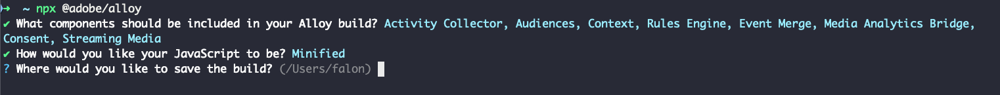

# 建立自訂網頁SDK組建

Experience Platform Web SDK資料庫包含多個模組，用於各種功能，例如個人化、身分、連結追蹤等。 根據您的使用案例，您可能只需要特定功能，而不需要整個程式庫。 建立自訂的Web SDK組建可讓您僅選取所需的模組，藉此縮小程式庫大小並提升效能。

## 使用案例 {#use-case}

建立自訂Web SDK組建有助於減少程式庫大小並提高效能。 以下是一些範例：

### 移除Media Analytics {#media-analytics-removal}

如果您的網站沒有媒體內容，您可以從組建排除[!DNL Media Analytics]和[!DNL Streaming Media]模組。 這樣可以將網頁SDK組建大小縮減高達50%，並提升載入速度。

### 移除Personalization {#personalization}

如果您只需要收集使用者量度，並且不打算使用Adobe Target或Journey Optimizer進行個人化，您可以排除[!DNL Personalization]模組。 這樣可在縮減程式庫大小的同時，仍能收集必要的量度。

## 先決條件 {#prerequisites}

若要建立自訂Web SDK建置版本，您需要Web SDK NPM套件。 確定您的電腦上已安裝[Node.js](https://nodejs.org/en/download/package-manager/all)。 如需詳細資訊，請參閱有關如何使用NPM套件[安裝Web SDK](npm.md)的檔案。

## 元件和相依性 {#components-dependencies}

在建立自訂Web SDK組建之前，請定義您計畫使用的Web SDK元件和命令。 有些命令取決於組建中包含的特定模組。

下表顯示Web SDK模組與其所包含命令之間的關係：

| 模組相依性 | 設定參數 | 命令 | 大小類別 |
|---------|----------|---------|---------|
| 活動收集器 | [`clickCollectionEnabled`](../commands/configure/clickcollectionenabled.md) | 不適用 | 媒體 |
| 客群 | 不適用 | 不適用 | 小 |
| 內容 | [`context`](../commands/configure/context.md) | 不適用 | 小 |
| 規則引擎 | `personalizationStorageEnabled` | | <ul><li>`evaluateRulesets`</li><li>[`subscribeRulesetItems`](../commands/subscriberulesetitems.md)</li></ul> | 媒體 |
| 事件合併 | 不適用 | `createEventMergeId` | 小 |
| Media Analytics Bridge | 不適用 | [`getMediaAnalyticsTracker`](../commands/getmediaanalyticstracker.md) | 大 |
| 個人化 | <ul><li>[`prehidingStyle`](../commands/configure/prehidingstyle.md)</li><li>[`targetMigrationEnabled`](../commands/configure/targetmigrationenabled.md)</li><li>[`autoCollectPropositionInteractions`](../commands/configure/autocollectpropositioninteractions.md)</li></ul> | 不適用 | 大 |
| 同意 | [`defaultConsent`](../commands/configure/defaultconsent.md) | [`setConsent`](../commands/setconsent.md) | 小 |
| 串流媒體 | [`streamingMedia`](../commands/configure/streamingmedia.md) | <ul><li>[`createMediaSession`](../commands/createmediasession.md)</li><li>[`sendMediaEvent`](../commands/sendmediaevent.md)</li></ul> | 大 |

## 使用NPM套件建立自訂Web SDK組建 {#create-custom-build}

1. 開啟您的終端機並執行`npx @adobe/alloy`。 系統會要求您選取要納入自訂組建的網頁SDK元件。

   

   使用方向鍵在模組清單中上下移動。

   * 按下&#x200B;**空間**&#x200B;以啟用或停用選取的模組。
   * 按下`A`以啟用或停用所有模組。
   * 按下`I`以反轉您的選取範圍。
   * 按下`Enter`以確認您的選擇，並前往下一個步驟。

1. 選取要納入自訂組建的模組後，您可以選擇儲存自訂Web SDK程式庫組建的縮制或未縮製版本。 選取您想要的選項，然後按`Enter`。

   

1. 接著，系統會詢問您要將組建儲存在本機電腦上的哪個位置。 按下`Enter`以確認預先選取的位置，或輸入新位置。

   

1. 在您確認位置後，就會產生並儲存您的自訂組建。

   

