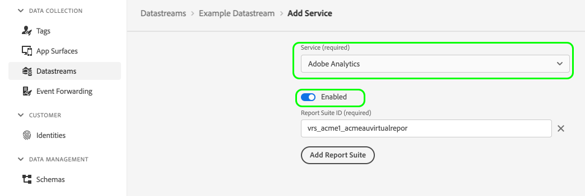

# Experience Platform Web SDK中A4T資料的伺服器端記錄

Adobe Experience Platform Web SDK可讓您在Experience Platform Edge Network上實作Adobe Analytics for Target (A4T)功能。 啟用伺服器端記錄時，所有透過Edge Network傳送的Analytics點選都會在伺服器端以Target詳細資料增加，不必經過點選拼接程式。

在資料流設定中啟用Analytics時，Analytics的伺服器端記錄會啟用：

下圖顯示啟用伺服器端Analytics記錄時，資料如何流經系統：

## 後續步驟

本指南涵蓋Web SDK中A4T資料的伺服器端記錄。 請參閱[使用者端記錄](./client-side.md)的指南，以取得如何在使用者端處理A4T資料的詳細資訊。
