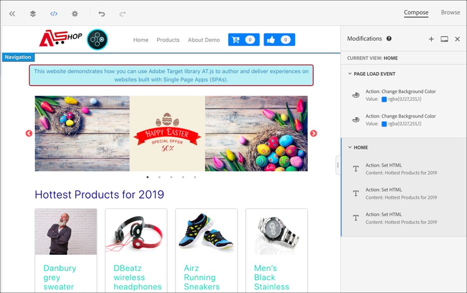
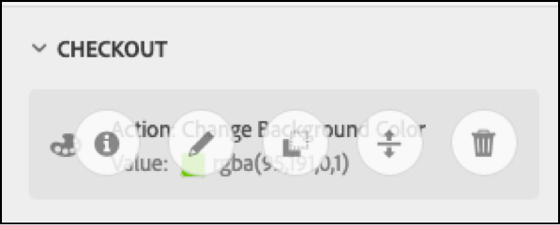

# 實作單頁應用程式

Adobe Experience Platform Web SDK提供豐富的功能，讓貴公司能以新世代使用者端技術(例如單頁應用程式(SPA))為基礎進行個人化。

傳統網站採用「頁面至頁面」導覽模型（又稱為「多頁應用程式」），網站設計與URL緊密結合，而從某網頁轉換到另一個網頁，需要頁面載入。

單頁應用程式等新式Web應用程式已改為採用可加快瀏覽器UI呈現速度的模型，且通常與頁面重新載入無關。 這些體驗可由客戶互動觸發，例如捲動、點按和游標移動。 隨著現代網路環境的不斷演化，傳統的一般事件（例如頁面載入）與部署個人化和實驗不再具有相關性。


## 適用於SPA的Platform Web SDK的優點

以下是為單頁應用程式使用Adobe Experience Platform Web SDK的一些好處：

* 可在頁面載入時快取所有選件，以減少對單一伺服器呼叫發出的多個伺服器呼叫。
* 顯著改善網站的使用者體驗，因為選件可透過快取立即顯示，避免傳統伺服器呼叫造成的時間延遲。
* 只要編寫一行程式碼和進行開發人員一次性設定，行銷人員就能透過SPA上的視覺化體驗撰寫器(VEC)建立及執行A/B和體驗鎖定目標(XT)活動。

## xdm檢視和單頁應用程式

適用於SPA的Adobe Target VEC充分利用「檢視」的概念：視覺化元素的邏輯組合，共同構成SPA體驗。 因此，單頁應用程式可視為根據使用者互動轉換檢視，而不是轉換URL。 檢視通常可代表整個網站或網站內的分組視覺元素。

為了進一步說明什麼是檢視，以下範例使用在React中實作的假想線上電子商務網站來探索範例檢視。

導覽至首頁後，主圖影像會宣傳復活節特賣以及網站上提供的最新產品。 在這種情況下，可以為整個主畫面定義檢視。 此檢視可以簡單地稱為「home」。


當客戶對該企業所銷售的產品越來越感興趣時，他們決定按一下&#x200B;**產品**&#x200B;連結。 與首頁相似，產品網站整體可定義為一個檢視。 此檢視可命名為「products-all」。


由於檢視可定義為整個網站或網站上一組視覺元素，因此產品網站上顯示的四個產品可分組並視為檢視。 此檢視可命名為「products」。


當客戶決定按一下「**載入更多**」按鈕來探索網站上的更多產品時，在此情況下，網站URL不會變更，但可在此處建立檢視，以僅代表顯示的第二列產品。 檢視名稱可以是「products-page-2」。


客戶決定從網站購買一些產品，然後進入結帳畫面。 在結帳站台，客戶可以選擇一般配送或快捷配送。 檢視可以是網站上的任何一組視覺元素，因此可以為傳遞偏好設定建立檢視，並稱為「傳遞偏好設定」。


檢視的概念可以進一步延伸。 以下只是可在網站上定義的一些檢視範例。

## 實施XDM檢視

在Adobe Target中可運用XDM檢視，讓行銷人員透過視覺化體驗撰寫器在SPA上執行A/B和XT測試。 若要完成一次性開發人員設定，需要執行下列步驟：

1. 安裝[Adobe Experience Platform Web SDK](/help/web-sdk/install/overview.md)
2. 決定您單頁應用程式中要個人化的所有XDM檢視。
3. 定義XDM檢視後，為了傳遞AB或XT VEC活動，請在單頁應用程式中實作`sendEvent()`函式並將`renderDecisions`設定為`true`以及對應的XDM檢視。 必須在`xdm.web.webPageDetails.viewName`中傳遞XDM檢視。 此步驟可讓行銷人員運用視覺化體驗撰寫器，針對這些XDM啟動A/B和XT測試。

   ```javascript
   alloy("sendEvent", { 
     "renderDecisions": true, 
     "xdm": { 
       "web": { 
         "webPageDetails": { 
         "viewName":"home" 
         }
       } 
     } 
   });
   ```

>[!NOTE]
>
>在前`sendEvent()`個呼叫中，將會擷取並快取所有應呈現給使用者的XDM檢視。 後續的`sendEvent()`呼叫若包含XDM檢視已傳入，將會從快取讀取並轉譯，而不需要伺服器呼叫。

## `sendEvent()`函式範例

本節概述三個範例，說明如何在React中叫用假設性的電子商務SPA的`sendEvent()`函式。

### 範例1：A/B測試首頁

行銷團隊想要在整個首頁上執行A/B測試。


若要在整個主網站上執行A/B測試，必須在將XDM `viewName`設為`home`的情況下叫用`sendEvent()`：

```jsx
function onViewChange() { 
  
  var viewName = window.location.hash; // or use window.location.pathName if router works on path and not hash 

  viewName = viewName || 'home'; // view name cannot be empty 

  // Sanitize viewName to get rid of any trailing symbols derived from URL 

  if (viewName.startsWith('#') || viewName.startsWith('/')) { 
    viewName = viewName.substr(1); 
  }
   
  alloy("sendEvent", { 
    "renderDecisions": true, 
    "xdm": { 
      "web": { 
        "webPageDetails": { 
          "viewName":"home" 
        } 
      } 
    }
  }); 
} 

// react router v4 

const history = syncHistoryWithStore(createBrowserHistory(), store); 

history.listen(onViewChange); 

// react router v3 

<Router history={hashHistory} onUpdate={onViewChange} > 
```

### 範例2：個人化產品

行銷團隊想要在使用者按一下&#x200B;**載入更多**&#x200B;後，將價格標籤顏色變更為紅色，以個人化第二列產品。


```jsx
function onViewChange(viewName) { 

  alloy("sendEvent", { 
    "renderDecisions": true, 
    "xdm": { 
      "web": { 
        "webPageDetails": { 
          "viewName": viewName
        }
      } 
    } 
  }); 
} 

class Products extends Component { 
  
  render() { 
    return ( 
      <button type="button" onClick={this.handleLoadMoreClicked}>Load more</button> 
    ); 
  } 

  handleLoadMoreClicked() { 
    var page = this.state.page + 1; // assuming page number is derived from component's state 
    this.setState({page: page}); 
    onViewChange('PRODUCTS-PAGE-' + page); 
  } 

} 
```

### 範例3：A/B測試傳送偏好設定

行銷團隊想要執行A/B測試，以檢視在選取&#x200B;**快捷配送**&#x200B;時，將按鈕的顏色從藍色變更為紅色是否能增加轉換次數（與將兩個配送選項的按鈕顏色保持為藍色相反）。


若要根據選取的傳遞偏好設定個人化網站內容，可針對每個傳遞偏好設定建立「檢視」。 選取&#x200B;**一般傳遞**&#x200B;時，可將檢視命名為「checkout-normal」。 如果選取&#x200B;**快速運送**，則可將該檢視命名為「checkout-express」。

```jsx
function onViewChange(viewName) { 
  alloy("sendEvent", { 
    "renderDecisions": true, 
    "xdm": { 
      "web": { 
        "webPageDetails": { 
          "viewName": viewName 
        }
      }
    }
  }); 
} 

class Checkout extends Component { 

  render() { 
    return ( 
      <div onChange={this.onDeliveryPreferenceChanged}> 
        <label> 
          <input type="radio" id="normal" name="deliveryPreference" value={"Normal Delivery"} defaultChecked={true}/> 
          <span> Normal Delivery (7-10 business days)</span> 
        </label> 
        <label> 
          <input type="radio" id="express" name="deliveryPreference" value={"Express Delivery"}/> 
          <span> Express Delivery* (2-3 business days)</span> 
        </label> 
      </div> 
    ); 
  } 

  onDeliveryPreferenceChanged(evt) { 
    var selectedPreferenceValue = evt.target.value; 
    onViewChange(selectedPreferenceValue); 
  } 

} 
```

## 使用適用於SPA的視覺化體驗撰寫器

當您完成定義XDM檢視並透過傳入的XDM檢視實作`sendEvent()`時，VEC將能夠偵測這些檢視，並允許使用者建立A/B或XT活動的動作和修改。

>[!NOTE]
>
>若要針對SPA使用VEC，您必須安裝並啟動[Firefox](https://addons.mozilla.org/en-US/firefox/addon/adobe-target-vec-helper/)或[Chrome](https://chrome.google.com/webstore/detail/adobe-target-vec-helper/ggjpideecfnbipkacplkhhaflkdjagak) VEC Helper擴充功能。

### 「修改」面板

「修改」面板會擷取為特定檢視所建立的動作。 「檢視」的所有動作會分組到「該檢視」下。



### 動作

按一下動作會醒目顯示將套用該動作之網站上的元素。 在檢視下建立的每個VEC動作都有下列圖示： **資訊**、**編輯**、**複製**、**移動**&#x200B;和&#x200B;**刪除**。 下表會詳細說明這些圖示。



| 圖示 | 說明 |
|---|---|
| 資訊 | 顯示動作的詳細資訊。 |
| 編輯 | 可讓您直接編輯動作的屬性。 |
| 原地複製 | 將動作原地複製至一或多個存在於修改面板上的檢視，或原地複製至一或多個您已在VEC中瀏覽及導覽的目標檢視。 動作未必會存在於修改面板中。<br/><br/>**注意：**&#x200B;執行原地復製作業後，您必須透過瀏覽導覽至VEC中的檢視，才能檢視該原地複製動作的作業是否有效。 如果無法將動作套用到檢視，則會出現錯誤。 |
| 移動 | 將動作移動至頁面載入事件或修改面板中已存在的任何其他檢視。<br/><br/>**頁面載入事件：**&#x200B;任何對應至頁面載入事件的動作，都會套用到網頁應用程式的初始頁面載入上。 <br/><br/>**注意：**&#x200B;執行移動作業後，您必須透過瀏覽導覽至VEC中的檢視，才能檢視該移動作業是否有效。 如果無法將動作套用到檢視，則會出現錯誤。 |
| 刪除 | 刪除動作。 |

## 使用適用於SPA的VEC範例

本節概述三個使用視覺化體驗撰寫器建立A/B或XT活動之動作和修改的範例。

### 範例1：更新「首頁」檢視

在此檔案的早些時候，曾為整個首頁網站定義名為「home」的檢視。 現在，行銷團隊想要以下列方式更新「首頁」檢視：

* 將&#x200B;**加入購物車**&#x200B;和&#x200B;**類似**&#x200B;按鈕變更為較淺的藍色。 這應在頁面載入期間發生，因為它涉及變更標題的元件。
* 將2019年的&#x200B;**最新產品**&#x200B;標籤變更為&#x200B;**2019年最暢銷的產品**，並將文字顏色變更為紫色。

若要在VEC中進行這些更新，請選取&#x200B;**撰寫**，並將這些變更套用至「首頁」檢視。


### 範例2：變更產品標籤

針對「products-page-2」檢視，行銷團隊想要將&#x200B;**Price**&#x200B;標籤變更為&#x200B;**Sale Price**，並將標籤顏色變更為紅色。

若要在VEC中進行這些更新，需執行下列步驟：

1. 在VEC中選取&#x200B;**瀏覽**。
2. 在網站頂端導覽列中選取&#x200B;**產品**。
3. 選取&#x200B;**載入更多**&#x200B;一次，以檢視產品的第二列。
4. 在VEC中選取&#x200B;**撰寫**。
5. 套用動作以將文字標籤變更為&#x200B;**促銷價**，且顏色為紅色。


### 範例3：個人化傳送偏好設定樣式

您可以在精細層次定義檢視，例如單選按鈕的狀態或選項。 本檔案先前針對傳遞偏好設定「checkout-normal」和「checkout-express」定義了「檢視」。 行銷團隊想要將「checkout-express」檢視的按鈕顏色變更為紅色。

若要在VEC中進行這些更新，需執行下列步驟：

1. 在VEC中選取&#x200B;**瀏覽**。
2. 將產品新增至網站上的購物車。
3. 選取網站右上角的購物車圖示。
4. 選取&#x200B;**結帳您的訂單**。
5. 選取&#x200B;**傳遞偏好設定**&#x200B;下的&#x200B;**快速傳遞**&#x200B;選項按鈕。
6. 在VEC中選取&#x200B;**撰寫**。
7. 將&#x200B;**付款**&#x200B;按鈕顏色變更為紅色。

>[!NOTE]
>
>在選取&#x200B;**快速運送**&#x200B;選項按鈕之前，「checkout-express」檢視不會出現在「修改」面板中。 這是因為選取&#x200B;**快速運送**&#x200B;選項按鈕時會執行`sendEvent()`函式，因此，在選取選項按鈕之前，VEC不會察覺「checkout-express」檢視。


