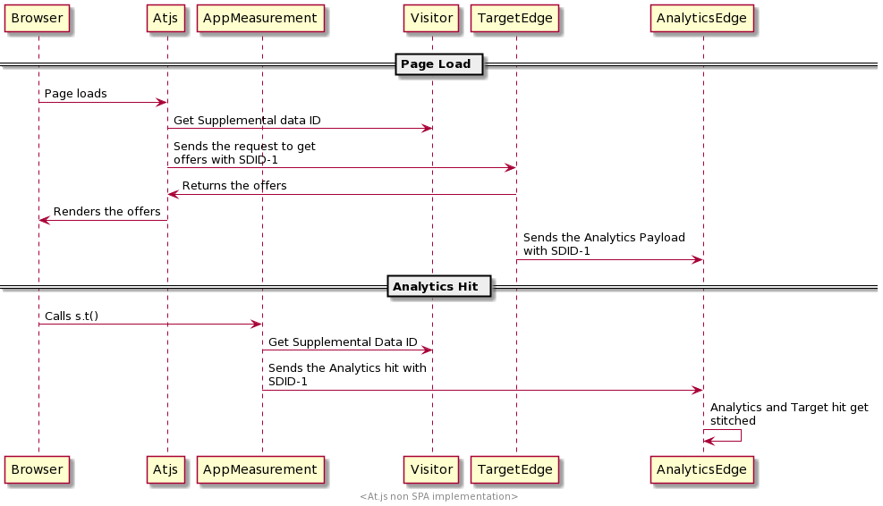

# 比較at.js程式庫與Web SDK

## 概觀

本文概述兩者之間的差異 `at.js` 程式庫和Experience Platform Web SDK。

## 安裝程式庫

### 安裝at.js

我們允許客戶直接從Adobe Experience Cloud的「實作」標籤下載程式庫。 at.js程式庫已根據客戶的下列設定加以自訂： clientCode、imsOrgId等。

### 安裝Web SDK

預先建立的版本可在CDN上取得。 您可以直接在頁面上在CDN上參考程式庫，或將其下載並託管在您自己的基礎架構上。 它提供縮制和未縮制的格式。 未縮制的版本對於除錯而言相當實用。

另請參閱 [使用JavaScript程式庫安裝Web SDK](/help/web-sdk/install/library.md) 以取得詳細資訊。

## 設定程式庫

### 設定at.js

在每個at.js檔案的結尾，您會找到我們會例項化並傳遞設定物件的區段。 這是可自訂的，下載時，我們會將該區段填入目前的客戶設定。

```javascript
window.adobe.target.init(window, document, {
  "clientCode": "demo",
  "imsOrgId": "",
  "serverDomain": "localhost:5000",
  "timeout": 2000,
  "globalMboxName": "target-global-mbox",
  "version": "2.0.0",
  "defaultContentHiddenStyle": "visibility: hidden;",
  "defaultContentVisibleStyle": "visibility: visible;",
  "bodyHiddenStyle": "body {opacity: 0 !important}",
  "bodyHidingEnabled": true,
  "deviceIdLifetime": 63244800000,
  "sessionIdLifetime": 1860000,
  "selectorsPollingTimeout": 5000,
  "visitorApiTimeout": 2000,
  "overrideMboxEdgeServer": false,
  "overrideMboxEdgeServerTimeout": 1860000,
  "optoutEnabled": false,
  "optinEnabled": false,
  "secureOnly": false,
  "supplementalDataIdParamTimeout": 30,
  "authoringScriptUrl": "//cdn.tt.omtrdc.net/cdn/target-vec.js",
  "urlSizeLimit": 2048,
  "endpoint": "/rest/v1/delivery",
  "pageLoadEnabled": true,
  "viewsEnabled": true,
  "analyticsLogging": "server_side",
  "serverState": {},
  "decisioningMethod": "server-side",
  "legacyBrowserSupport":  false
});
```

[了解更多](https://experienceleague.adobe.com/docs/target/using/implement-target/client-side/at-js-implementation/functions-overview/targetgobalsettings.html)


### 設定Web SDK

SDK的設定已完成 [`configure`](/help/web-sdk/commands/configure/overview.md) 命令。 此 `configure` 命令為 *一直* 先呼叫。

## 如何請求並自動轉譯頁面載入Target選件

### 使用at.js

使用at.js 2.x，如果您啟用設定 `pageLoadEnabled`，程式庫會透過以下動作觸發對Target Edge的呼叫： `execute -> pageLoad`. 如果所有設定都設為預設值，則不需要進行自訂編碼。將at.js新增至頁面並由瀏覽器載入後，就會執行Target Edge呼叫。

### 使用Web SDK

在Adobe Target中建立的內容 [視覺化體驗撰寫器](https://experienceleague.adobe.com/docs/target/using/experiences/vec/visual-experience-composer.html) 可由SDK自動擷取及轉譯。

若要請求並自動轉譯Target選件，請使用 `sendEvent` 命令並設定 `renderDecisions` 選項至 `true`. 這麼做會強制SDK自動轉譯任何符合自動轉譯條件的個人化內容。

範例：

```javascript
alloy("sendEvent", {
  "renderDecisions": true,
  "xdm": {
    "commerce": {
      "order": {
        "purchaseID": "a8g784hjq1mnp3",
        "purchaseOrderNumber": "VAU3123",
        "currencyCode": "USD",
        "priceTotal": 999.98
      }
    }
  }
});
```

Experience Platform Web SDK會自動傳送包含WEB SDK所執行選件的通知，此為通知要求裝載外觀的範例：

```json
{
  "events": [{
      "xdm": {
        "_experience": {
          "decisioning": {
            "propositions": [
              {
                "id": "AT:eyJhY3Rpdml0eUlkIjoiMTI3MDE5IiwiZXhwZXJpZW5jZUlkIjoiMCJ9",
                "scope": "cart",
                "scopeDetails": {
                  "decisionProvider": "TGT",
                  "activity": {
                    "id": "127019"
                  },
                  "experience": {
                    "id": "0"
                  },
                  "strategies": [
                    {
                      "step": "entry",
                      "algorithmID": "0",
                      "trafficType": "0"
                    },
                    {
                      "step": "display",
                      "algorithmID": "0",
                      "trafficType": "0"
                    }
                  ],
                  "characteristics": {
                    "eventToken": "bKMxJ8dCR1XlPfDCx+2vSGqipfsIHvVzTQxHolz2IpSCnQ9Y9OaLL2gsdrWQTvE54PwSz67rmXWmSnkXpSSS2Q=="
                  }
                }
              }
            ]
          }
        },
        "eventType": "display",
        "web": {
          "webPageDetails": {
            "viewName": "cart",
            "URL": "https://alloyio.com/personalizationSpa/cart"
          },
          "webReferrer": {
            "URL": ""
          }
        },
        "device": {
          "screenHeight": 800,
          "screenWidth": 1280,
          "screenOrientation": "landscape"
        },
        "environment": {
          "type": "browser",
          "browserDetails": {
            "viewportWidth": 1280,
            "viewportHeight": 284
          }
        },
        "placeContext": {
          "localTime": "2021-12-10T15:50:34.467+02:00",
          "localTimezoneOffset": -120
        },
        "timestamp": "2021-12-10T13:50:34.467Z",
        "implementationDetails": {
          "name": "https://ns.adobe.com/experience/alloy",
          "version": "2.6.2",
          "environment": "browser"
        }
      }
    }
  ]
}
```

[更多詳情](../rendering-personalization-content.md)

## 如何請求且不會自動轉譯頁面載入Target選件

### 使用at.js

有兩種方法可以觸發對Target Edge的呼叫，該呼叫會擷取選件以供頁面載入。

範例 1：

```javascript
adobe.target.getOffer({
   mbox: "target-global-mbox", 
   success: console.log,
   error: console.error
});
```

範例 2：

```javascript
adobe.target.getOffers({
    request: {
      execute: {
        pageLoad: {}
    }
  }
})
.then(console.log)
.catch(console.error);
```

[了解更多](https://experienceleague.adobe.com/docs/target/using/implement-target/client-side/at-js-implementation/functions-overview/cmp-atjs-functions.html)

### 使用Web SDK

執行 `sendEvent` 下具有特殊範圍的指令 `decisionScopes`： `__view__`. 我們使用此範圍當作訊號，從Target擷取所有頁面載入活動，並預先擷取所有檢視。 Web SDK也會嘗試評估所有VEC檢視型活動。 Web SDK目前不支援停用檢視預先擷取。

若要存取任何個人化內容，您可以提供回呼函式，SDK從伺服器收到成功回應後，就會呼叫此函式。 系統會為您的回呼提供結果物件，其中可能包含包含任何傳回之個人化內容的建議屬性。

範例：

```javascript
alloy("sendEvent", {
    xdm: {...},
    decisionScopes: ["__view__"]
  }).then(function(result) {
    if (result.propositions) {
      result.propositions.forEach(proposition => {
        proposition.items.forEach(item => {
          if (item.schema === HTML_SCHEMA) {
            // manually apply offer
            document.getElementById("form-based-offer-container").innerHTML =
              item.data.content;
            const executedPropositions = [
              {
                id: proposition.id,
                scope: proposition.scope,
                scopeDetails: proposition.scopeDetails
              }
            ];
          // manually send the display notification event, so that Target/Analytics impressions aare increased
            alloy("sendEvent",{
              "xdm": {
                "eventType": "decisioning.propositionDisplay",
                "_experience": {
                  "decisioning": {
                    "propositions": executedPropositions
                  }
                }
              }
            });
          }
        });
      });
    }
  });
```

[更多詳情](../rendering-personalization-content.md#manually-rendering-content)


## 如何請求特定的表單式Target mbox


### 使用at.js

您可以使用擷取表單式撰寫器活動 `getOffer` 函式：

範例 1：

```javascript
adobe.target.getOffer({
   mbox: "hero-banner", 
   success: console.log,
   error: console.error
});
```

範例 2：

```javascript
adobe.target.getOffers({
    request: {
      execute: {
        mboxes: [
        {
          index: 0,
          name: "hero-banner"
        }]
    }
  }
})
.then(console.log)
.catch(console.error);
```

[了解更多](https://experienceleague.adobe.com/docs/target/using/implement-target/client-side/at-js-implementation/functions-overview/cmp-atjs-functions.html)


### 使用Web SDK

您可以使用擷取表單式撰寫器型活動 `sendEvent` 命令並將mbox名稱傳遞至 `decisionScopes` 選項。 此 `sendEvent` 命令會傳回以包含請求之活動/主張的物件解析的Promise：這就是 `propositions` 陣列看起來像這樣：

```javascript
[
  {
    "id": "AT:eyJhY3Rpdml0eUlkIjoiNDM0Njg5IiwiZXhwZXJpZW5jZUlkIjoiMCJ9",
    "scope": "hero-banner",
    "scopeDetails": {
      "decisionProvider": "TGT",
      "activity": {
        "id": "434689"
      },
      "experience": {
        "id": "0"
      },
      "strategies": [
        {
          "algorithmID": "0",
          "trafficType": "0"
        }
      ],
      "characteristics": {
        "eventToken": "2lTS5KA6gj4JuSjOdhqUhGqipfsIHvVzTQxHolz2IpTMromRrB5ztP5VMxjHbs7c6qPG9UF4rvQTJZniWgqbOw=="
      }
    },
    "items": [
      {
        "id": "1184844",
        "schema": "https://ns.adobe.com/personalization/html-content-item",
        "meta": {
          "geo.state": "bucuresti",
          "activity.id": "434689",
          "experience.id": "0",
          "activity.name": "a4t test form based activity",
          "offer.id": "1184844",
          "profile.tntId": "04608610399599289452943468926942466370-pybgfJ"
        },
        "data": {
          "id": "1184844",
          "format": "text/html",
          "content": "<div> analytics impressions </div>"
        }
      }
    ]
  },
  {
    "id": "AT:eyJhY3Rpdml0eUlkIjoiNDM0Njg5IiwiZXhwZXJpZW5jZUlkIjoiMCJ9",
    "scope": "hero-banner",
    "scopeDetails": {
      "decisionProvider": "TGT",
      "activity": {
        "id": "434689"
      },
      "characteristics": {
        "eventToken": "E0gb6q1+WyFW3FMbbQJmrg=="
      }
    },
    "items": [
      {
        "id": "434689",
        "schema": "https://ns.adobe.com/personalization/measurement",
        "data": {
          "type": "click",
          "format": "application/vnd.adobe.target.metric"
        }
      }
    ]
  }
]
```

範例：

```javascript
alloy("sendEvent", {
  xdm: { ...},
  decisionScopes: ["hero-banner"]
}).then(function (result) {
  var propositions = result.propositions;

  if (propositions) {
    // Find the discount proposition, if it exists.
    for (var i = 0; i < propositions.length; i++) {
      var proposition = propositions[i];
      for (var j = 0; j < proposition.items; j++) {
        var item = proposition.items[j];
        if (item.schema === HTML_SCHEMA) {
          // apply offer
          document.getElementById("form-based-offer-container").innerHTML =
            item.data.content;
          const executedPropositions = [
            {
              id: proposition.id,
              scope: proposition.scope,
              scopeDetails: proposition.scopeDetails
            }
          ];

          alloy("sendEvent", {
            "xdm": {
              "eventType": "decisioning.propositionDisplay",
              "_experience": {
                "decisioning": {
                  "propositions": executedPropositions
                }
              }
            }
          });
        }
      }
    }
  }
});
```

[更多詳情](../rendering-personalization-content.md#manually-rendering-content)

## 如何套用Target活動

### 使用at.js

您可以使用套用Target活動 `applyOffers` 函式： `adobe.target.applyOffer(options)`

範例：

```javascript
adobe.target.getOffers({...})
  .then(response => adobe.target.applyOffers({ response: response }))
  .then(() => console.log("Success"))
  .catch(error => console.log("Error", error));
```

進一步瞭解 `applyOffers` 命令來自 [專屬檔案](https://experienceleague.adobe.com/docs/target/using/implement-target/client-side/at-js-implementation/functions-overview/adobe-target-applyoffers-atjs-2.html).


### 使用Web SDK

您可以使用套用Target活動 `applyPropositions` 命令。

範例：

```javascript
alloy("applyPropositions", {
    propositions: [...]
});
```

進一步瞭解 `applyPropositions` 命令來自 [專屬檔案](../../personalization/rendering-personalization-content.md#applypropositions).

## 如何追蹤事件

### 使用at.js

您可以使用 `trackEvent` 函式或使用 `sendNotifications`.

此函式會引發要求來報告使用者動作，例如點按和轉換。 它不會在回應中傳遞活動。


**範例 1**

```javascript
adobe.target.trackEvent({ 
    "type": "click",
    "mbox": "some-mbox"
});
```

**範例 2**

```javascript
adobe.target.sendNotifications({ 
    request: {
       notifications: [{
          ...,
          mbox: {
            name: "some-mbox"
          },
          type: "click",
          ...
       }]
    }
});
```

[了解更多](https://experienceleague.adobe.com/docs/target/using/implement-target/client-side/at-js-implementation/functions-overview/adobe-target-trackevent.html)

### 使用Web SDK

您可以呼叫「 」，追蹤事件和使用者動作 `sendEvent` 命令，填入 `_experience.decisioning.propositions` XDM欄位群組，並設定 `eventType` 為2個值之一：

* `decisioning.propositionDisplay`：代表Target活動轉譯。
* `decisioning.propositionInteract`：代表使用者與活動的互動，例如滑鼠點按。

此 `_experience.decisioning.propositions` XDM欄位群組是物件的陣列。 每個物件的屬性衍生自 `result.propositions` 在中傳回的專案 `sendEvent` 命令： `{ id, scope, scopeDetails }`

**範例1 — 追蹤a `decisioning.propositionDisplay` 呈現活動後的事件**

```javascript
alloy("sendEvent", {
  xdm: {},
  decisionScopes: ['discount']
}).then(function(result) {
  var propositions = result.propositions;

  var discountProposition;
  if (propositions) {
    // Find the discount proposition, if it exists.
    for (var i = 0; i < propositions.length; i++) {
      var proposition = propositions[i];
      if (proposition.scope === "discount") {
        discountProposition = proposition;
        break;
      }
    }
  }

  if (discountProposition) {
    // Find the item from proposition that should be rendered.
    // Rather than assuming there a single item that has HTML
    // content, find the first item whose schema indicates
    // it contains HTML content.
    for (var j = 0; j < discountProposition.items.length; j++) {
      var discountPropositionItem = discountProposition.items[i];
      if (discountPropositionItem.schema === "https://ns.adobe.com/personalization/html-content-item") {
        var discountHtml = discountPropositionItem.data.content;
        // Render the content
        var dailySpecialElement = document.getElementById("daily-special");
        dailySpecialElement.innerHTML = discountHtml;
        
        // For this example, we assume there is only a single place to update in the HTML.
        break;  
      }
    }
      // Send a "decisioning.propositionDisplay" event signaling that the proposition has been rendered.
    alloy("sendEvent", {
      xdm: {
        eventType: "decisioning.propositionDisplay",
        _experience: {
          decisioning: {
            propositions: [
              {
                id: discountProposition.id,
                scope: discountProposition.scope,
                scopeDetails: discountProposition.scopeDetails
              }
            ]
          }
        }
      }
    });
  }
});
```

**範例2 — 追蹤a `decisioning.propositionInteract` 點選量度發生後的事件**

```javascript
alloy("sendEvent", {
  xdm: { ...},
  decisionScopes: ["hero-banner"]
}).then(function (result) {
  var propositions = result.propositions;

  if (propositions) {
    // Find the discount proposition, if it exists.
    for (var i = 0; i < propositions.length; i++) {
      var proposition = propositions[i];
      for (var j = 0; j < proposition.items.length; j++) {
        var item = proposition.items[j];

        if (item.schema === "https://ns.adobe.com/personalization/measurement") {
          // add metric to the DOM element
          const button = document.getElementById("form-based-click-metric");

          button.addEventListener("click", event => {
            const executedPropositions = [
              {
                id: proposition.id,
                scope: proposition.scope,
                scopeDetails: proposition.scopeDetails
              }
            ];
            // send the click track event
            alloy("sendEvent", {
              "xdm": {
                "eventType": "decisioning.propositionInteract",
                "_experience": {
                  "decisioning": {
                    "propositions": executedPropositions
                  }
                }
              }
            });
          });
        }
      }
    }
  }
});
```

[更多詳情](../rendering-personalization-content.md#manually-rendering-content)

## 如何在單頁應用程式中觸發檢視變更

### 使用at.js

使用 `adobe.target.triggerView` 函式。 每當新頁面載入或頁面上的元件重新呈現時，就可呼叫此函數。應該為單頁應用程式(SPA)實作adobe.target.triggerView()，以便使用視覺化體驗撰寫器(VEC)來建立A/B測試和體驗鎖定目標(XT)活動。 如果網站上未實作adobe.target.triggerView()，VEC就無法用於SPA。

**範例**

```javascript
adobe.target.triggerView("homeView")
```

[了解更多](https://experienceleague.adobe.com/docs/target/using/implement-target/client-side/at-js-implementation/functions-overview/adobe-target-triggerview-atjs-2.html)


### 使用Web SDK

若要觸發或表示單頁應用程式的檢視變更，請設定 `web.webPageDetails.viewName` 下的屬性 `xdm` 的選項 `sendEvent` 命令。 如果有選件，Web SDK會檢查檢視快取。 `viewName` 指定於 `sendEvent` 它會執行提示並傳送顯示通知事件。

**範例**

```javascript
alloy("sendEvent", {
  renderDecisions: true,
  xdm:{
    web:{
      webPageDetails:{
        viewName: "homeView"
      }
    }
  }
});
```

[更多詳情](./spa-implementation.md#implementing-xdm-views)

## 如何運用回應Token

Adobe Target傳回的個人化內容包括 [回應Token](https://experienceleague.adobe.com/docs/target/using/administer/response-tokens.html)，此為活動、選件、體驗、使用者設定檔、地理資訊等的詳細資訊。 這些詳細資料可與協力廠商工具共用或用於偵錯。 回應Token可在Adobe Target使用者介面中設定。

### 使用at.js

使用at.js自訂事件接聽Target回應並讀取回應Token。

**範例**

```javascript
document.addEventListener(adobe.target.event.REQUEST_SUCCEEDED, function(e) { 
  console.log("Request succeeded", e.detail); 
}); 
```

[了解更多](https://experienceleague.adobe.com/docs/target/using/administer/response-tokens.html)


### 使用Web SDK

>[!IMPORTANT]
>
>確保您使用Platform Web SDK 2.6.0版或更新版本。

回應Token會作為 `propositions` 在結果中公開的 `sendEvent` 命令。 每個主張都包含一系列 `items`，則每個專案都會有 `meta` 已在Target管理UI中啟用回應Token的物件。 [了解更多](https://experienceleague.adobe.com/docs/target/using/administer/response-tokens.html)

**範例**

```javascript
alloy("sendEvent", {
    renderDecisions: true,
    xdm: {}
  }).then(function(result) {
    if (result.propositions) {
      // Format of result.propositions:
      /*
        [
            {
                "id": "",
                "scope": "",
                "items": [
                    {
                        "id": "",
                        "schema": "",
                        "data": {},
                        "meta": { // RESPONSE TOKENS
                            "activity.name": ...,
                            "offer.id": ...,
                            "profile.activeActivities": ...
                        }
                    }
                ],
                "scopeDetails": {}
                "renderAttempted": false
            }
        ]
      */
    }
  });
```

[更多詳情](./accessing-response-tokens.md)

## 如何管理忽隱忽現情形

### 使用at.js

使用at.js，您可以透過設定來管理忽隱忽現的情形 `bodyHidingEnabled: true` 因此，at.js會在擷取並套用DOM變更之前，負責預先隱藏個人化容器。
可以透過覆寫at.js預先隱藏包含個人化內容的頁面區段 `bodyHiddenStyle`.
預設 `bodyHiddenStyle` 隱藏整個HTML `body`.
這兩個設定都可以覆寫使用 `window.targetGlobalSettings`. `window.targetGlobalSettings` 應放置在載入at.js之前。

### 使用Web SDK

客戶可以使用Web SDK，在configure命令中設定其預先隱藏樣式，如下列範例所示：

```javascript
alloy("configure", {
  edgeConfigId: "configurationId",
  orgId: "orgId@AdobeOrg",
  debugEnabled: true,
  prehidingStyle: "body { opacity: 0 !important }"
});
```

非同步載入Web SDK時，建議在插入Web SDK之前，先在頁面中插入下列程式碼片段：

```html
<script>
  !function(e,a,n,t){
  if (a) return;
  var i=e.head;if(i){
  var o=e.createElement("style");
  o.id="alloy-prehiding",o.innerText=n,i.appendChild(o),
  setTimeout(function(){o.parentNode&&o.parentNode.removeChild(o)},t)}}
  (document, document.location.href.indexOf("adobe_authoring_enabled") !== -1, "body { opacity: 0 !important }", 3000);
</script>
```

## 如何處理A4T

### 使用at.js

使用at.js支援兩種A4T記錄：

* Analytics使用者端記錄
* Analytics伺服器端記錄

#### Analytics使用者端記錄

**範例1：使用Target全域設定**

可透過設定啟用Analytics使用者端記錄 `analyticsLogging: client_side` ，或是覆寫 `window.targetglobalSettings` 物件。
設定此選項時，傳回的裝載格式如下所示：

```json
{
  "analytics": {
    "payload": {
      "pe": "tnt",
      "tnta": "167169:0:0|0|100,167169:0:0|2|100,167169:0:0|1|100"
    }
  }
}
```

接著，裝載可透過資料插入API轉送至Analytics。

範例2：在中設定，每 `getOffers` 函式：

```javascript
adobe.target.getOffers({
      request: {
        experienceCloud: {
          analytics: {
            logging: "client_side"
          }
        },
        prefetch: {
          mboxes: [{
            index: 0,
            name: "a1-serverside-xt"
          }]
        }
      }
    })
    .then(console.log)
```

此為回應裝載的外觀：

```json
{
  "prefetch": {
    "mboxes": [{
      "index": 0,
      "name": "a1-serverside-xt",
      "options": [{
        "content": "",
        "type": "html",
        "eventToken": "n/K05qdH0MxsiyH4gX05/2qipfsIHvVzTQxHolz2IpSCnQ9Y9OaLL2gsdrWQTvE54PwSz67rmXWmSnkXpSSS2Q==",
        "responseTokens": {
          "profile.memberlevel": "0",
          "geo.city": "bucharest",
          "activity.id": "167169",
          "experience.name": "USA Experience",
          "geo.country": "romania"
        }
      }],
      "analytics": {
        "payload": {
          "pe": "tnt",
          "tnta": "167169:0:0|0|100,167169:0:0|2|100,167169:0:0|1|100"
        }
      }
    }]
  }
}
```

Analytics裝載(`tnta` token)應該包含在使用以下專案的Analytics點選中： [資料插入API](https://github.com/AdobeDocs/analytics-1.4-apis/blob/master/docs/data-insertion-api/index.md).

#### Analytics伺服器端記錄

可透過設定啟用Analytics伺服器端記錄 `analyticsLogging: server_side` ，或是覆寫 `window.targetglobalSettings` 物件。
然後資料會以下列方式流動：



[了解更多](https://experienceleague.adobe.com/docs/target/using/integrate/a4t/a4timplementation.html)

### 使用Web SDK

Web SDK也支援：

* Analytics使用者端記錄
* Analytics伺服器端記錄

#### Analytics使用者端記錄

在該DataStream設定中停用Adobe Analytics時，會啟用Analytics使用者端記錄。


客戶有權存取Analytics權杖(`tnta`)需與Analytics共用的使用者 [資料插入API](https://github.com/AdobeDocs/analytics-1.4-apis/blob/master/docs/data-insertion-api/index.md)
透過鏈結 `sendEvent` 指令，並逐一檢視產生的主張陣列。

**範例**

```javascript
alloy("sendEvent", {
    "renderDecisions": true,
    "xdm": {
      "web": {
        "webPageDetails": {
          "name": "Home Page"
        }
      }
    }
  }
).then(function (results) {
  var analyticsPayloads = new Set();
  for (var i = 0; i < results.propositions.length; i++) {
    var proposition = results.propositions[i];
    var renderAttempted = proposition.renderAttempted;

    if (renderAttempted === true) {
      var analyticsPayload = getAnalyticsPayload(proposition);
      if (analyticsPayload !== undefined) {
        analyticsPayloads.add(analyticsPayload);
      }
    }
  }
  var analyticsPayloadsToken = concatenateAnalyticsPayloads(analyticsPayloads);
  // send the page view Analytics hit with collected Analytics payload using Data Insertion API
});
```

下圖顯示啟用Analytics Client Side時資料的流程：


#### Analytics伺服器端記錄

為該DataStream設定啟用Analytics時，便會啟用Analytics伺服器端記錄。


啟用伺服器端Analytics記錄時，A4T裝載需要與Analytics共用，好讓Analytics報告顯示正確的曝光次數和轉換，才能在Edge Network層級共用，讓客戶不需要執行任何其他處理。

以下是啟用伺服器端Analytics記錄時，資料如何流入我們的系統：


## 如何設定Target全域設定

### 使用at.js

您可以使用 `window.targetGlobalSettings` 覆寫 at.js 資料庫中的設定，而非在 Target Standard/Premium UI 中或使用 REST API 進行設定。

覆寫應在載入at.js之前或在「管理>實作>編輯at.js設定>程式碼設定>資料庫標題」中定義。

範例：

```javascript
window.targetGlobalSettings = {  
   timeout: 200, // using custom timeout  
   visitorApiTimeout: 500, // using custom API timeout  
   enabled: document.location.href.indexOf('https://www.adobe.com') >= 0 // enabled ONLY on adobe.com  
};
```

[了解更多](https://experienceleague.adobe.com/docs/target/using/implement-target/client-side/at-js-implementation/functions-overview/targetgobalsettings.html)

### 使用Web SDK

Web SDK不支援此功能。

## 如何更新Target設定檔屬性

### 使用at.js

**範例 1**

```javascript
adobe.target.getOffer({
   mbox: "target-global-mbox",
   params: {
     "profile.name": "test",
     "profile.gender": "female"
   },
   success: console.log,
   error: console.error
});
```

**範例 2**

```javascript
adobe.target.getOffers({
    request: {
      execute: {
        pageLoad: {
          profileParameters: {
            name: "test",
            gender: "female"
          }
        }
    }
  }
})
.then(console.log)
.catch(console.error);
```

### 使用Web SDK

若要更新Target設定檔，請使用 `sendEvent` 命令並設定 `data.__adobe.target` 屬性，在金鑰名稱前面加上 `profile`.

**範例**

```javascript
alloy("sendEvent", {
  renderDecisions: true,
  data: {
    __adobe: {
      target: {
        "profile.gender": "female",
        "profile.age": 30
      }
    }
  }
});
```

## 如何使用Target Recommendations

### 使用at.js

**範例 1**

```javascript
adobe.target.getOffer({
   mbox: "target-global-mbox",
   params: {
     "entity.name": "T-shirt",
     "entity.id": "1234"
   },
   success: console.log,
   error: console.error
});
```

**範例 2**

```javascript
adobe.target.getOffers({
    request: {
      execute: {
        pageLoad: {
          parameters: {
            "entity.name": "T-shirt",
            "entity.id": "1234"
          }
        }
    }
  }
})
.then(console.log)
.catch(console.error);
```

[了解更多](https://experienceleague.adobe.com/docs/target/using/implement-target/client-side/at-js-implementation/functions-overview/adobe-target-getoffers-atjs-2.html)


### 使用Web SDK

若要傳送建議資料，請使用 `sendEvent` 命令並設定 `data.__adobe.target` 屬性，在金鑰名稱前面加上 `entity`.

**範例**

```javascript
alloy("sendEvent", {
  renderDecisions: true,
  data: {
    __adobe: {
      target: {
        "entity.name": "T-shirt",
        "entity.id": "1234"
      }
    }
  }
});
```

## 如何使用第三方ID

### 使用at.js

使用at.js有多種傳送方式 `mbox3rdPartyId`，使用 `getOffer` 或 `getOffers`：

**範例 1**

```javascript
adobe.target.getOffer({
  mbox:"test",
  params:{
    "mbox3rdPartyId": "1234"
  },
  success: console.log,
  error: console.error
});
```

**範例 2**

```javascript
adobe.target.getOffers({
    request: {
      id:{
        thirdPartyId: "1234"
      },
      execute: {
        pageLoad: {}
    }
  }
})
.then(console.log)
.catch(console.error);
```

或者，您可以透過其他方式設定 `mbox3rdPartyId` 位於 `targetPageParams` 或 `targetPageParamsAll`.
在中設定時 `targetPageParams`，它會以的請求傳送 `target-global-mbox` 也稱為 `pag-lLoad`.
建議應使用進行設定 `targetPageParamsAll` 因為它會在每個目標請求中傳送。
使用的優點 `targetPageParamsAll` 表示您可以定義 `mbox3rdPartyId` 一次，即可確保所有target請求都正確無誤 `mbox3rdPartyId`.

```javascript
window.targetPageParamsAll = function() {
      return {
        "mbox3rdPartyId": "1234"
      };
    };
```

```javascript
window.targetPageParams = function() {
  return {
    "mbox3rdPartyId": "1234"
  };
};
```

[了解更多](https://experienceleague.adobe.com/docs/target/using/implement-target/client-side/at-js-implementation/functions-overview/targetpageparams.html)

### 使用Web SDK

Web SDK支援Target協力廠商ID。 不過，還需要執行幾個步驟。 在深入探討解決方案之前，我們應該先談談 `identityMap`.
身分對應可讓客戶傳送多個身分。 所有身分識別都已設定名稱空間。 每個名稱空間可以有一或多個身分。 特定身分可以標示為主要身分。
有了這些知識，我們就可以瞭解設定Web sdk以使用Target第三方ID的必要步驟。

1. 設定在資料流設定頁面中包含Target第三方ID的名稱空間：


1. 在每個sendEvent命令中傳送該身分名稱空間，如下所示：

```javascript
alloy("sendEvent", {
  "renderDecisions": true,
  "xdm": {
    "identityMap": {
      "TGT3PID": [
        {
          "id": "1234",
          "primary": true
        }
      ]
    }
  }
});
```

## 如何設定屬性代號

### 使用at.js

使用at.js設定屬性代號有2種方式，分別是 `targetPageParams` 或 `targetPageParamsAll`. 使用 `targetPageParams` 將屬性代號新增至 `target-global-mbox` 呼叫，但使用 `targetPageParamsAll` 將權杖新增至所有target呼叫：

**範例 1**

```javascript
   window.targetPageParamsAll = function() {
      return {
        "at_property": "1234"
      };
    };
```

**範例 2**

```javascript
window.targetPageParams = function() {
      return {
        "at_property": "1234"
      };
    };
```

### 使用Web SDK

使用Web SDK，客戶在設定Adobe Target名稱空間下的資料流設定時，可以在更高層級設定屬性：

這表示該特定資料流設定的每個Target呼叫都將包含該屬性Token。

## 如何預先擷取mbox

### 使用at.js

此功能僅適用於at.js 2.x。 at.js 2.x有一個名為的新函式 `getOffers`. `getOffers` 允許客戶預先擷取一或多個mbox的內容。 其範例如下：

```javascript
adobe.target.getOffers({
    request: {
      prefetch: {
        mboxes: [{
          index: 0,
          name: "test-mbox",
          parameters: {
            ...
          },
          profileParameters: {
            ...
          }
        }]
    }
  }
})
.then(console.log)
.catch(console.error);
```

注意：強烈建議確保 `mbox` 在 `mboxes` 陣列有自己的索引。 通常第一個mbox會 `index=0`，下一個 `index=1`等

### 使用Web SDK

Web SDK目前不支援此功能。

## 如何為Target實作除錯

### 使用at.js

At.js會公開這些偵錯功能：

* Mbox停用 — 停用Target的擷取和轉譯功能，以檢查頁面是否損毀，而不進行Target互動
* Mbox除錯 — at.js會記錄每個動作
* 目標追蹤 — 在靶心中產生mbox追蹤權杖時，具有參與決策程式之詳細資訊的追蹤物件可在下找到 `window.___target_trace` 物件

注意：所有這些偵錯功能都可在的增強功能中使用 [Adobe Experience Platform Debugger](https://chrome.google.com/webstore/detail/adobe-experience-platform/bfnnokhpnncpkdmbokanobigaccjkpob)

### 使用Web SDK

使用Web SDK時，您擁有多項偵錯功能：

* 使用 [保證](/help/assurance/home.md)
* [Web SDK偵錯已啟用](/help/web-sdk/use-cases/debugging.md)
* 使用 [Web SDK監視鉤點](https://github.com/adobe/alloy/wiki/Monitoring-Hooks)
* 使用 [Adobe Experience Platform Debugger](/help/debugger/home.md)
* 目標追蹤
