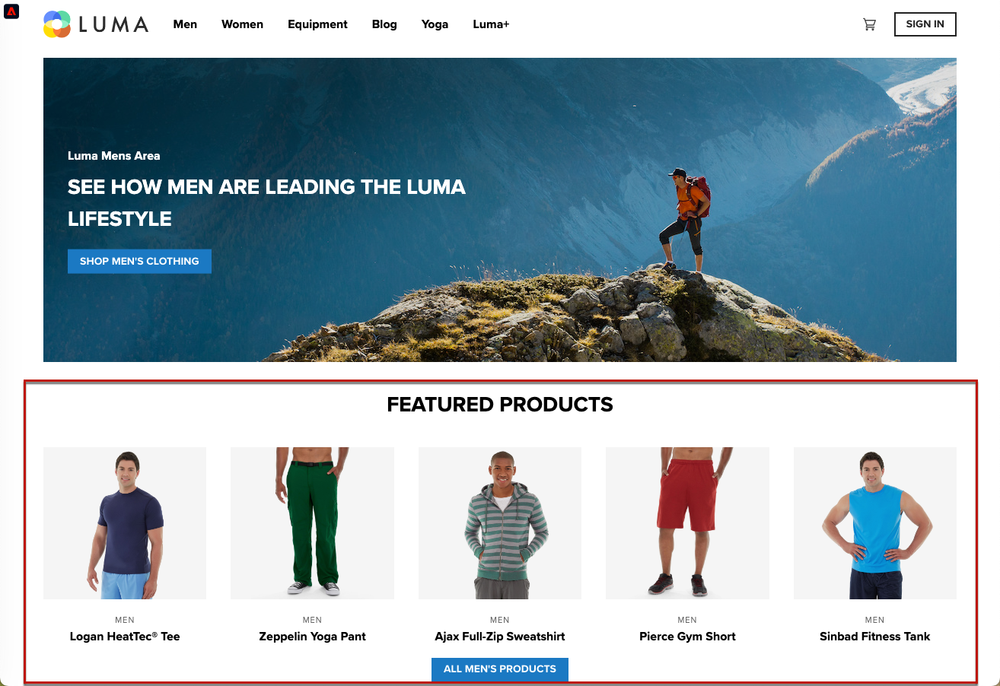

# 實作單頁應用程式(SPA) {#web-spa-implementation}

Adobe Experience Platform Web SDK提供豐富的功能，讓貴公司能以新世代使用者端技術(例如單頁應用程式(SPA))為基礎進行個人化。

傳統網站採用「頁面至頁面」導覽模型（又稱為多頁應用程式），網站設計與URL緊密結合，而從某網頁轉換到另一個網頁，需要頁面載入。

單頁應用程式(SPA)這類新式Web應用程式採用的模型，則可加速瀏覽器UI演算速度，且通常與頁面重新載入無關。 這些體驗可由客戶互動觸發，例如捲動、點按和游標移動。 隨著現代網路環境的不斷演化，傳統的一般事件（例如頁面載入）與部署個人化和實驗不再具有相關性。


## 使用SPA適用的Web SDK的好處 {#web-spa-benefits}

以下是為單頁應用程式使用Web SDK的一些優點：

* 可在頁面載入時快取所有選件，以減少對單一伺服器呼叫發出的多個伺服器呼叫。
* 大幅改善網站上的使用者體驗，因為選件會透過快取立即顯示，避免傳統伺服器呼叫造成的延遲時間。
* 一次性開發人員設定可讓行銷人員透過您SPA上的Adobe Journey Optimizer網頁視覺化編輯器建立並執行個人化和實驗活動。

## xdm檢視和單頁應用程式 {#web-spa-xdm}

Journey Optimizer網頁編輯器利用了名為&#x200B;_檢視_&#x200B;的概念。

檢視是視覺元素的邏輯群組，這些元素共同構成SPA體驗。 因此，單頁應用程式可視為根據使用者互動轉換檢視，而不是轉換URL。 檢視通常可代表整個網站、單一頁面或頁面中的分組視覺元素。

為了進一步說明什麼是檢視，以下範例使用假定的線上電子商務網站。

* 導覽至首頁網站後，主圖影像會宣傳季節性系列以及網站上提供的不同產品目錄。 在這種情況下，可以為整個主畫面定義檢視。 此檢視可簡單稱為「home」。

  

* 當客戶對該企業所銷售的產品越來越感興趣時，他們決定按一下&#x200B;**男性**&#x200B;連結。 與首頁類似，**Men**&#x200B;頁面的整體可定義為檢視。 此檢視可命名為「men」。

  

* 由於檢視可定義為整個網站或網站上一組視覺元素，因此產品網站上顯示的四個產品可分組並視為檢視。 此檢視可命名為「products」。

  

* 當客戶決定按一下&#x200B;**ALL MEN&#39;S PRODUCTS**&#x200B;按鈕以探索網站上的更多產品時，網站URL在此情況下不會變更，但可在此處建立檢視，以僅代表顯示的第二列產品。 檢視名稱可以是「products-page-2」。

* 客戶決定從網站購買一些產品，然後進入結帳畫面。 購物車畫面本身可與名為「購物車」的檢視相關聯。 或者，您可以在結帳畫面內有不同的檢視，以處理下列建議的產品。

  

檢視的概念可以進一步延伸。 以下只是可在網站上定義的一些檢視範例。

## 實施XDM檢視 {#implement-xdm-views}

在Adobe Journey Optimizer中可運用XDM檢視，讓行銷人員透過Journey Optimizer網頁視覺化編輯器在SPA上執行網頁個人化和實驗行銷活動。

若要完成一次性開發人員設定，需要執行下列步驟：

1. 安裝[Adobe Experience Platform Web SDK](/help/web-sdk/install/overview.md)，並檢查[Web Channel必要條件](https://experienceleague.adobe.com/docs/journey-optimizer/using/web/configure-web-channel/web-prerequisites.html)頁面。

2. 決定您要個人化之單頁應用程式中的所有XDM檢視。

3. 定義XDM檢視後，為了將內容傳送給這些檢視，您需要實作`sendEvent()`函式並將`renderDecisions`設定為`true`，並在單頁應用程式中設定相應的XDM檢視。 必須在`xdm.web.webPageDetails.viewName`中傳遞XDM檢視。 此步驟可讓行銷人員在Journey Optimizer網頁編輯器內探索這些檢視，並套用內容修改內容：

```js
 alloy("sendEvent", {
  "renderDecisions": true,
  "xdm": {
   "web": {
    "webPageDetails": {
    "viewName":"home"
   }
  }
 }
});
```

>[!NOTE]
>
>在前`sendEvent()`個呼叫中，將會擷取並快取所有應呈現給使用者的XDM檢視。 後續的`sendEvent()`呼叫若包含XDM檢視已傳入，將會從快取讀取並轉譯，而不需要伺服器呼叫。

## `sendEvent()`函式範例

本節概述兩個範例，說明如何在React中叫用假設性的電子商務SPA的`sendEvent()`函式。

### 範例1：A/B測試首頁 {#web-spa-sample-1}

行銷團隊想要在整個首頁上執行A/B測試。


若要在整個主網站上執行A/B測試，必須在將XDM `viewName`設為`home`的情況下叫用`sendEvent()`：

```js
function onViewChange() {

  var viewName = window.location.hash; // or use window.location.pathName if router works on path and not hash

  viewName = viewName || 'home'; // view name cannot be empty

  // Sanitize viewName to get rid of any trailing symbols derived from URL

  if (viewName.startsWith('#') || viewName.startsWith('/')) {
    viewName = viewName.substr(1);
  }

  alloy("sendEvent", {
    "renderDecisions": true,

    "xdm": {
      "web": {
        "webPageDetails": {
          "viewName":"home"
        }
      }
    }
  });
}

// react router v4

const history = syncHistoryWithStore(createBrowserHistory(), store);

history.listen(onViewChange);

// react router v3

<Router history={hashHistory} onUpdate={onViewChange} >
```

### 範例2：個人化產品 {#web-spa-sample-2}

行銷團隊想要個人化第二列產品，讓使用者在點按以檢視所有「男性」產品後，將價格標籤顏色變更為紅色。


```js
function onViewChange(viewName) {

    alloy("sendEvent", {
        "renderDecisions": true,
        "xdm": {
            "web": {
                "webPageDetails": {
                    "viewName": viewName
                }
            }
        }
    });
}

class Products extends Component {

    render() {
        return (

            <
            button type = "button"
            onClick = {
                this.handleLoadMoreClicked
            } > All Men 's Products</button>
        );
    }

    handleLoadMoreClicked() {
        var page = this.state.page + 1; // assuming page number is derived from component's state
        this.setState({
            page: page
        });
        onViewChange('PRODUCTS-PAGE-' + page);
    }
}
```
