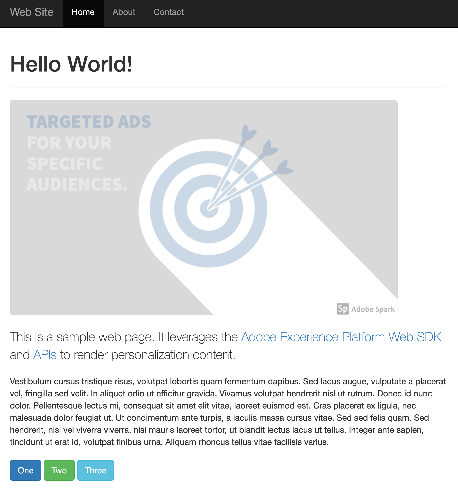
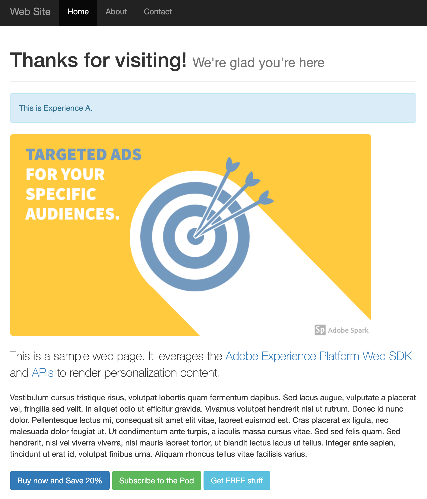

# 使用Edge Network API的伺服器端個人化

## 概觀 {#overview}

伺服器端個人化涉及使用[Edge Network API](https://developer.adobe.com/data-collection-apis/docs/getting-started/)個人化您Web屬性的客戶體驗。

在本文中所述的範例中，個人化內容是使用Edge Network API在伺服器端擷取。 接著，HTML會根據擷取的個人化內容在伺服器端轉譯。

下表顯示個人化及非個人化內容的範例。

| 沒有個人化的範例頁面 | 具個人化的範例頁面 |
|---|---|
|  |  |

## 考量事項 {#considerations}

### Cookie {#cookies}

Cookie可用來儲存使用者身分和叢集資訊。  使用伺服器端實作時，應用程式伺服器會在請求生命週期期間處理這些Cookie的儲存和傳送。

| Cookie | 目的 | 儲存者 | 傳送者 |
|---|---|---|---|
| `kndctr_AdobeOrg_identity` | 包含使用者身分詳細資訊。 | 應用程式伺服器 | 應用程式伺服器 |
| `kndctr_AdobeOrg_cluster` | 指出應使用哪個Edge Network叢集來履行要求。 | 應用程式伺服器 | 應用程式伺服器 |

### 請求刊登 {#request-placement}

需要Personalization請求才能取得主張並傳送顯示通知。 使用伺服器端實作時，應用程式伺服器會向Edge Network API提出這些請求。

| 請求 | 製作者 |
|---|---|
| 擷取主張的互動請求 | 呼叫Edge Network API的應用程式伺服器。 |
| 傳送顯示通知的互動請求 | 呼叫Edge Network API的應用程式伺服器。 |

## 範例應用程式 {#sample-app}

下述程式使用範例應用程式，您可以將其當作實驗起點，並深入瞭解此類個人化。

您可以下載此範例，並根據自己的需求加以自訂。 例如，您可以變更環境變數，讓範例應用程式從您自己的Experience Platform設定中提取選件。

若要這麼做，請開啟存放庫根目錄中的`.env`檔案，並根據您的設定修改變數。 重新啟動範例應用程式，您就可以使用自己的個人化內容進行實驗了。

### 執行範例 {#running-sample}

請依照下列步驟執行範例應用程式。

1. 將[此存放庫](https://github.com/adobe/alloy-samples)複製至本機電腦。
2. 開啟終端機並導覽至`personalization-server-side`資料夾。
3. 執行`npm install`。
4. 執行`npm start`。
5. 開啟您的網頁瀏覽器，並導覽至`http://localhost`。

## 程式概述 {#process}

本節說明擷取個人化內容時所使用的步驟。

1. [Express](https://expressjs.com/)用於精簡伺服器端實作。 這會處理基本伺服器請求和路由。
2. 瀏覽器要求網頁。 包含先前由瀏覽器儲存且前置詞為`kndctr_`的所有Cookie。
3. 從應用程式伺服器要求頁面時，會傳送事件至[互動式資料收集端點](https://developer.adobe.com/data-collection-apis/docs/endpoints/interact/)，以擷取個人化內容。 範例應用程式使用協助程式方法來簡化建立及傳送要求至API的程式（請參閱[aepEdgeClient.js](https://github.com/adobe/alloy-samples/blob/main/common/aepEdgeClient.js)）。 `POST`要求包含`event`和`query`。 先前步驟的Cookie （若有）包含在`meta>state>entries`陣列中。

   ```js
   fetch(
   "https://edge.adobedc.net/ee/v2/interact?dataStreamId=abc&requestId=123",
   {
      headers: {
         accept: "*/*",
         "accept-language": "en-US,en;q=0.9",
         "cache-control": "no-cache",
         "content-type": "text/plain; charset=UTF-8",
         pragma: "no-cache",
         "sec-fetch-dest": "empty",
         "sec-fetch-mode": "cors",
         "sec-fetch-site": "cross-site",
         "sec-gpc": "1",
         "Referrer-Policy": "strict-origin-when-cross-origin",
         Referer: "http://localhost/",
      },
      body: JSON.stringify({
         event: {
         xdm: {
            web: {
               webPageDetails: {
               URL: "http://localhost/",
               },
               webReferrer: {
               URL: "",
               },
            },
            identityMap: {
               FPID: [
               {
                  id: "xyz",
                  authenticatedState: "ambiguous",
                  primary: true,
               },
               ],
            },
            timestamp: "2022-06-23T22:21:00.878Z",
         },
         data: {},
         },
         query: {
         identity: {
            fetch: ["ECID"],
         },
         personalization: {
            schemas: [
               "https://ns.adobe.com/personalization/default-content-item",
               "https://ns.adobe.com/personalization/html-content-item",
               "https://ns.adobe.com/personalization/json-content-item",
               "https://ns.adobe.com/personalization/redirect-item",
               "https://ns.adobe.com/personalization/dom-action",
            ],
            decisionScopes: ["__view__", "sample-json-offer"],
         },
         },
         meta: {
         state: {
            domain: "localhost",
            cookiesEnabled: true,
            entries: [
               {
               "key": "kndctr_XXX_AdobeOrg_identity",
               "value": "abc123"
               },
               {
               "key": "kndctr_XXX_AdobeOrg_cluster",
               "value": "or2"
               }
            ],
         },
         },
      }),
      method: "POST",
   }
   ).then((res) => res.json());
   ```

4. 會從回應中讀取表單式活動的Target選件，並在產生HTML回應時使用。
5. 針對表單式活動，實施中必須手動傳送顯示事件，以指出何時顯示選件。 在此範例中，通知會在請求生命週期期間在伺服器端傳送。

   ```js
   function sendDisplayEvent(aepEdgeClient, req, propositions, cookieEntries) {
   const address = getAddress(req);
   
   aepEdgeClient.interact(
      {
         event: {
         xdm: {
            web: {
               webPageDetails: { URL: address },
               webReferrer: { URL: "" },
            },
            timestamp: new Date().toISOString(),
            eventType: "decisioning.propositionDisplay",
            _experience: {
               decisioning: {
               propositions: propositions.map((proposition) => {
                  const { id, scope, scopeDetails } = proposition;
   
                  return {
                     id,
                     scope,
                     scopeDetails,
                  };
               }),
               },
            },
         },
         },
         query: { identity: { fetch: ["ECID"] } },
         meta: {
         state: {
            domain: "",
            cookiesEnabled: true,
            entries: [...cookieEntries],
         },
         },
      },
      {
         Referer: address,
      }
   );
   }
   ```

6. 已忽略[!DNL Visual Experience Composer (VEC)]個選件，因為它們只能透過Web SDK轉譯。
7. 傳回HTML回應時，應用程式伺服器會在回應上設定身分和叢集Cookie。