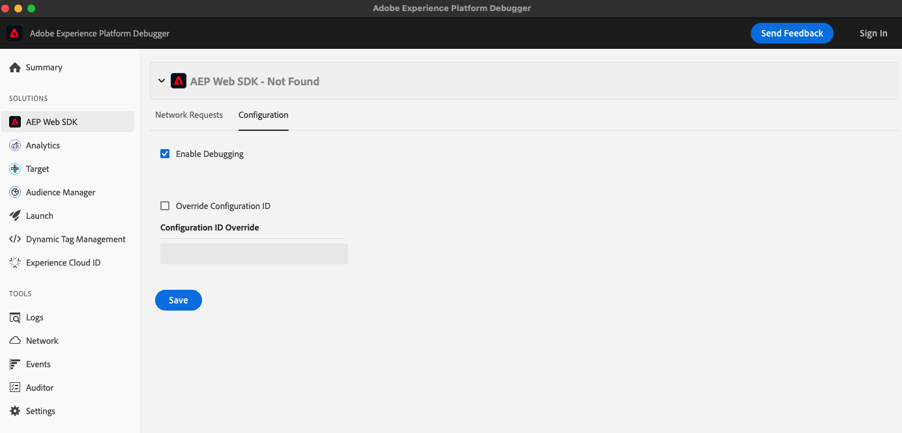

# 偵錯方法

啟用偵錯功能後，Web SDK會輸出訊息至瀏覽器主控台，以協助您對實作進行偵錯。 如果您想要瞭解SDK根據您建立的規則和資料元素的運作方式，除錯就十分實用。

除錯功能預設為停用，但可使用四種不同方式切換。 您可以使用這些方法的任意組合，來啟用或停用對開發工作流程最方便的偵錯。

## 在`configure`命令中使用`debugEnabled`

設定擴充功能時，將`debugEnabled`布林值設為true。 此選項通常用於開發環境，因為它可為造訪您網站上任何頁面的每個人啟用偵錯功能：

```js
alloy("configure", {
  "edgeConfigId": "ebebf826-a01f-4458-8cec-ef61de241c93",
  "orgId": "ADB3LETTERSANDNUMBERS@AdobeOrg",
  "debugEnabled": true
});
```

如需詳細資訊，請參閱[`debugEnabled`](../commands/configure/debugenabled.md)。

## 使用`setDebug`命令

與上述布林值類似，這個命令也會啟用頁面所有訪客的偵錯功能。

```js
alloy("setDebug", {"enabled": true});
```

如需詳細資訊，請參閱[`setDebug`](../commands/setdebug.md)命令。

## 設定查詢字串引數

您可以將查詢字串`?alloy_debug=true`新增到任何URL的結尾以啟用偵錯。 例如：

`http://example.com/?alloy_debug=true`

此方法僅適用於您的本機電腦，可讓您除錯生產網站，而不需為每個人啟用除錯。 以這種方式啟用偵錯功能會在您其餘的瀏覽工作階段中繼續使用，或直到您停用它為止。

## 使用Adobe Experience Platform Debugger

Adobe Experience Platform Debugger是功能強大的工具，可檢查您的網頁，並協助您偵錯Experience Cloud產品的實作。 您可以從AEP Web SDK區段的設定標籤啟用偵錯。



如需詳細資訊，請參閱[Adobe Experience Platform Debugger概觀](/help/debugger/home.md)。
