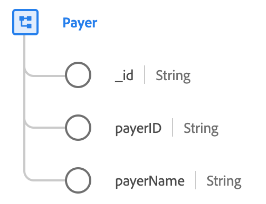

# [!UICONTROL 付款人] 類別

在Experience Data Model (XDM)中， [!UICONTROL 付款人] class會擷取定義付款人商業實體的最低屬性集，該實體會收集與保險公司相關的資料（例如健康保險）。

| 屬性 | 資料型別 | 說明 |
| --- | --- | --- |
| `_id` | [!UICONTROL 字串] | 記錄的唯一、系統產生的字串識別碼。 此欄位用於追蹤個別記錄的唯一性、防止資料重複，以及在下游服務中查詢該記錄。  由於此欄位是系統產生的，因此在資料擷取期間不會向其提供明確值。 不過，您仍然可以視需要選擇提供自己的唯一ID值。 |
| `payerId` | [!UICONTROL 字串] | 付款人的唯一識別碼。 |
| `payerName` | [!UICONTROL 字串] | 付款人的名稱。 |

{style="table-layout:auto"}
