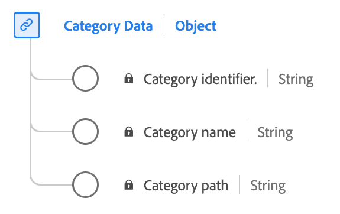

# [!UICONTROL 類別資料]資料型別

[!UICONTROL 類別資料]是標準的體驗資料模型(XDM)資料型別，可描述與產品類別相關的資訊。

| 顯示名稱 | 屬性 | 資料類型 | 說明 |
|-----------------|--------------------|-----------|------------------------------------------|
| [!UICONTROL 類別識別碼] | `categoryID` | 字串 | 產品類別的識別碼。 |
| [!UICONTROL 類別名稱] | `categoryName` | 字串 | 產品類別的名稱。 |
| [!UICONTROL 類別路徑] | `categoryPath` | 字串 | 產品類別的路徑。 |

{style="table-layout:auto"}

如需資料型別的詳細資訊，請參閱公用XDM存放庫：

* [已填入範例](https://github.com/adobe/xdm/blob/master/components/datatypes/categorydata.example.1.json)
* [完整結構描述](https://github.com/adobe/xdm/blob/master/components/datatypes/categorydata.schema.json)
