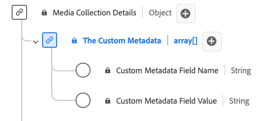

# [!UICONTROL 自訂中繼資料詳細資訊] 集合資料型別

[!UICONTROL 自訂中繼資料詳細資訊] 集合是標準的體驗資料模型(XDM)資料型別，會定義儲存自訂中繼資料的結構。 使用 [!UICONTROL 自訂中繼資料詳細資訊] 用於擷取詳細資料的集合資料型別，例如與內容或互動相關聯的自訂中繼資料的名稱和值。

| 顯示名稱 | 屬性 | 資料類型 | 必要 | 說明 |
|--------------------------------------------|------------------|-----------|----------|-------------------------------|
| [!UICONTROL 自訂中繼資料欄位名稱] | `name` | 字串 | 無 | 自訂欄位的名稱。 |
| [!UICONTROL 自訂中繼資料欄位值] | `value` | 字串 | 無 | 自訂欄位的值。 |

{style="table-layout:auto"}
