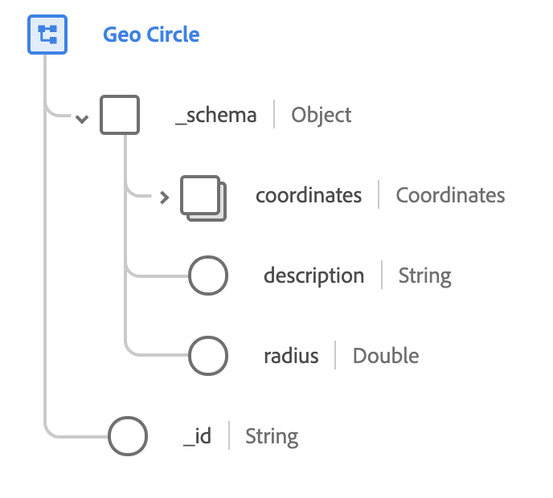

# [!UICONTROL 地域社交圈] (Geo Circle)資料類型

[!UICONTROL Geo Circle] 是標準的XDM資料類型，可描述圓形地理區域，因為特定半徑以特定座標集為中心。 此資料類型基於 [schema.org上記錄的公用規範](http://schema.org/GeoCircle)。

 

| 屬性 | 資料類型 | 說明 |
| --- | --- | --- |
| `_schema.coordinates` | [[!UICONTROL 地理坐標]](./geo-coordinates.md) | 說明圓心的地理座標。 |
| `_schema.description` | 字串 | 社交圈包含的說明。 |
| `_schema.radius` | 雙倍 | 圓半徑的長度。 此值符合 [WGS84基準](http://gisgeography.com/wgs84-world-geodetic-system/) ，以米為單位測量。 |
| `_id` | 字串 | 社交圈的唯一、系統產生的ID。 |
