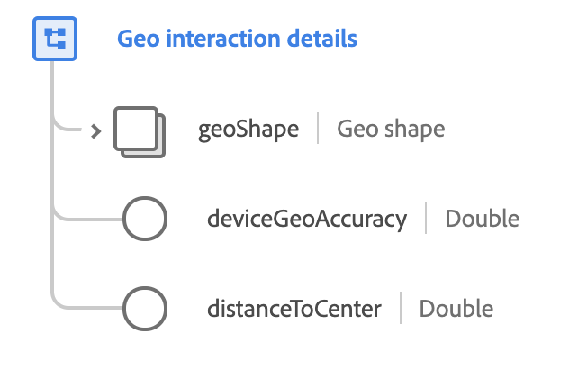

# [!UICONTROL 地理互動詳細資料] 資料類型

[!UICONTROL 地理互動詳細資料] 是標準的XDM資料類型，可說明地理定義區域中包含的目前狀態。

 

| 屬性 | 資料類型 | 說明 |
| --- | --- | --- |
| `geoShape` | [[!UICONTROL 地理形狀]](./geo-shape.md) | 說明要互動之區域的地理形狀。 此欄位可以描述框、圓或多邊形。 |
| `deviceGeoAccuracy` | 雙倍 | 地球測量裝置或機構的準確度，以公尺為單位測量。 |
| `distanceToCenter` | 雙倍 | 以公尺為單位的地理圈與地理中心的距離。 |

{style="table-layout:auto"}

如需資料類型的詳細資訊，請參閱公用XDM存放庫：

* [填入範例](https://github.com/adobe/xdm/blob/master/components/datatypes/geo-interaction-details.example.1.json)
* [完整結構](https://github.com/adobe/xdm/blob/master/components/datatypes/geo-interaction-details.schema.json)
