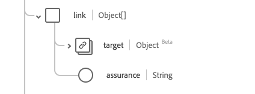

# [!UICONTROL 人員]資料型別

[!UICONTROL 人員]是標準的體驗資料模型(XDM)資料型別，提供一般人員記錄的資訊。 此資料型別是根據HL7 FHIR Release 5規格建立的。

| 顯示名稱 | 屬性 | 資料類型 | 說明 |
| --- | --- | --- | --- |
| [!UICONTROL 位址] | `address` | [[!UICONTROL 位址]](../healthcare/address.md)的陣列 | 人員的一或多個地址。 |
| [!UICONTROL 通訊] | `communication` | 物件陣列 | 可用於與個人溝通有關其健康狀況的語言。 如需詳細資訊，請參閱](#communication)下方的[區段。 |
| [!UICONTROL 識別碼] | `identifier` | [[!UICONTROL 識別碼]](../healthcare/identifier.md)的陣列 | 適用於此人員的人類識別碼。 |
| [!UICONTROL 個人連結詳細資料] | `link` | 物件陣列 | 與相同實際人員相關的資源連結。 如需詳細資訊，請參閱](#link)下方的[區段。 |
| [!UICONTROL 管理組織] | `managingOrganization` | [[!UICONTROL 參考]](../healthcare/reference.md) | 病歷的保管組織。 |
| [!UICONTROL 婚姻狀況] | `maritalStatus` | [[!UICONTROL 可程式碼概念]](../healthcare/codeable-concept.md) | 個人的婚姻（或民事）狀況 |
| [!UICONTROL 名稱] | `name` | [[!UICONTROL 人類名稱]](../healthcare/human-name.md)的陣列 | 與個人相關聯的名稱。 |
| [!UICONTROL 連絡人詳細資料] | `telecom` | [[!UICONTROL 聯絡點]]的陣列 | 聯絡人時可能會使用的聯絡細節。 |
| [!UICONTROL 為作用中] | `active` | 布林值 | 指出人員的記錄是否在使用中。 |
| [!UICONTROL 出生日期] | `birthDate` | 日期 | 個人的出生日期。 |
| [!UICONTROL 已死亡的指標] | `deceasedBoolean` | 布林值 | 指出人員是否已經死亡。 |
| [!UICONTROL 去世的日期時間] | `deceasedDateTime` | 日期時間 | 若人員已故，則為死亡日期和時間。 |
| [!UICONTROL 性別] | `gender` | 字串 | 個人的性別識別。 此屬性的值必須等於下列其中一個已知列舉值。 <li> `female` </li> <li> `male` </li> <li> `other` </li> <li> `unknown`</li> |

如需資料型別的詳細資訊，請參閱公用XDM存放庫：

* [已填入範例](https://github.com/adobe/xdm/blob/master/extensions/industry/healthcare/fhir/datatypes/identifier.example.1.json)
* [完整結構描述](https://github.com/adobe/xdm/blob/master/extensions/industry/healthcare/fhir/datatypes/identifier.schema.json)

## `communication` {#communication}

`communication`是以物件陣列的形式提供。 每個物件的結構如下所述。

| 顯示名稱 | 屬性 | 資料類型 | 說明 |
| --- | --- | --- | --- |
| [!UICONTROL 語言] | `language` | [[!UICONTROL 可程式碼的概念]](../../data-types/healthcare/codeable-concept.md) | 可用來與個人溝通其健康狀況的語言。 |
| [!UICONTROL 是慣用語言] | `preferred` | 布林值 | 指示語言是否為他們的偏好語言。 |

## `link` {#link}

`link`是以物件陣列的形式提供。 每個物件的結構如下所述。

| 顯示名稱 | 屬性 | 資料類型 | 說明 |
| --- | --- | --- | --- |
| [!UICONTROL Target] | `target` | [[!UICONTROL 參考]](../../data-types/healthcare/reference.md) | 此實際人員相關聯的資源。 |
| [!UICONTROL 保證] | `assurance` | 字串 | 與連結關聯的保證等級。 此屬性的值必須等於下列一或多個已知列舉值。 <li> `level1` </li> <li> `level2` </li> <li> `level3` </li> <li> `level4` </li> |
