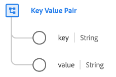

# [!UICONTROL 索引鍵值配對]資料型別

[!UICONTROL 索引鍵值配對]是標準的體驗資料模型(XDM)資料型別，可擷取一般索引鍵值配對的詳細資料。 此資料型別用於[[!UICONTROL Adobe Analytics ExperienceEvent完整擴充功能]欄位群組](../field-groups/event/analytics-full-extension.md)，以說明清單變數的陣列專案。

| 屬性 | 資料類型 | 說明 |
| --- | --- | --- |
| `key` | 字串 | 一般變數或值的索引鍵（名稱）。 |
| `value` | 字串 | 變數的值。 |

{style="table-layout:auto"}

如需資料型別的詳細資訊，請參閱[公用XDM存放庫](https://github.com/adobe/xdm/blob/master/extensions/adobe/experience/analytics/keyvalue.schema.json)。
