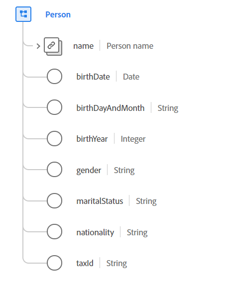

# [!UICONTROL 人員] 資料類型

[!UICONTROL 人員] 是描述個人的標準體驗資料模型(XDM)資料類型。 此資料類型可以表示擔任各種角色的人員，如客戶、聯繫人或所有者。

 

| 屬性 | 資料類型 | 說明 |
| --- | --- | --- |
| `name` | [[!UICONTROL 人員姓名]](./person-name.md) | 描述有關人員全名的詳細資訊。 |
| `birthDate` | 日期 | 一個人出生的完整日期。 日期格式（無時間）應跟在 [RFC 3339，第5.6節](https://tools.ietf.org/html/rfc3339#section-5.6) 標準。 |
| `birthDayAndMonth` | 字串 | 出生日期和月份，格式為MM-DD。 在已知某人出生的日月時，應使用此欄位，但不應使用年份。 此屬性的格式必須符合此規則運算式 `[0-1][0-9]-[0-9][0-9]`。 |
| `birthYear` | 整數 | 一個人出生的年份，包括世紀(例如， `1983`)。 當僅知道該人的年齡，而不知道該人的完整出生日期時，應使用此欄位。 此值必須介於1和32767之間。 |
| `gender` | 字串 | 該人的性別身份。 此屬性的值必須等於以下已知枚舉值之一。 <li> `female` </li> <li> `male` </li> <li> `not_specified` </li> <li> `non_specific` </li> 此值的預設值為 `not_specified`。 |
| `maritalStatus` | 字串 | 描述一個人與重要他人的關係。 此屬性的值必須等於以下枚舉值之一。 <li> `married` </li> <li> `single` </li> <li> `divorced` </li> <li> `widowed` </li> <li> `not_specified` </li> 此值的預設值為 `not_specified`。 |
| `nationality` | 字串 | 使用ISO 3166-1 Alpha-2代碼表示的個人與其國家之間的法律關係。 此屬性的格式必須符合此規則運算式 `^[A-Z]{2}$`。 |
| `taxId` | 字串 | 人員的稅或會計標識，如美國的納稅人標識號(TIN)或西班牙的身份證明稅(CIF/NIF)。 |

{style="table-layout:auto"}

有關資料類型的詳細資訊，請參閱公共XDM儲存庫：

* [填充示例](https://github.com/adobe/xdm/blob/master/components/datatypes/person/person.example.1.json)
* [完整架構](https://github.com/adobe/xdm/blob/master/components/datatypes/person/person.schema.json)
