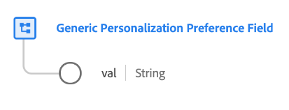

# [!UICONTROL 一般Personalization喜好設定欄位]資料型別

[!UICONTROL 一般Personalization喜好設定欄位]是標準的XDM資料型別，說明客戶為特定個人化喜好設定所做的選擇。

>[!NOTE]
>
>此資料型別旨在使用[[!UICONTROL 同意和偏好設定]欄位群組](../field-groups/profile/consents.md)做為基準，用來自訂您組織的同意結構描述的結構。

| 屬性 | 資料類型 | 說明 |
| --- | --- | --- |
| `val` | 字串 | 此個人化使用案例的客戶提供偏好設定選擇。 如需接受的值和定義，請參閱下表。 |

{style="table-layout:auto"}

下表概述`val`的接受值：

| 值 | 標題 | 說明 |
| --- | --- | --- |
| `y` | 是（選擇加入） | 客戶已選擇加入偏好設定。 換言之，他們&#x200B;**同意**&#x200B;使用相關偏好設定所指示的資料。 |
| `n` | 否（選擇退出） | 客戶已選擇退出偏好設定。 換句話說，他們&#x200B;**不**&#x200B;同意使用相關偏好設定所指示的資料。 |
| `p` | 待處理的驗證 | 系統尚未收到最終偏好設定值。 這最常用於需要兩步驟驗證的同意作業。 例如，如果客戶選擇接收電子郵件，該同意會設為`p`，直到他們在電子郵件中選取連結，以驗證他們是否已提供正確的電子郵件地址，屆時同意會更新為`y`。  如果此喜好設定未使用兩集驗證程式，則可能改為使用`p`選項來表示客戶尚未回應同意提示。 例如，您可以在客戶回應同意提示前，在網站的第一頁自動將值設為`p`。 在不要求明確同意的管轄區中，您也可以使用它來表示客戶尚未明確選擇退出（換言之，假設您同意）。 |
| `u` | 未知 | 客戶的偏好設定資訊不明。 |
| `dy` | 預設為「是（選擇加入）」 | 客戶本身並未提供同意值，且預設會被視為選擇加入（「是」）。 換言之，除非客戶另有指示，否則假定您同意。  請注意，如果法律或您公司隱私權政策的變更導致部分或所有使用者的預設值變更，您必須手動更新包含預設值的所有設定檔。 |
| `dn` | 「否」的預設值（選擇退出） | 客戶本身並未提供同意值，且預設會視為選擇退出（「否」）。 換言之，在客戶指出不同意見之前，他們會被假定為已拒絕同意。  請注意，如果法律或您公司隱私權政策的變更導致部分或所有使用者的預設值變更，您必須手動更新包含預設值的所有設定檔。 |
| `LI` | 合法利益 | 為了特定目的收集和處理這些資料的合法商業利益，壓倒了它對個人造成的潛在傷害。 |
| `CT` | 合約 | 為特定目的收集資料是履行與個人的合約義務所必需的。 |
| `CP` | 遵守法律義務 | 為了符合企業的法律義務，必須針對特定目的收集資料。 |
| `VI` | 個人的重大利益 | 為了保護個人切身利益，必須針對特定目的收集資料。 |
| `PI` | 公共利益 | 為特定目的收集資料是執行符合公眾利益或行使官方權力的任務所必需的。 |

{style="table-layout:auto"}

如需資料型別的詳細資訊，請參閱公用XDM存放庫：

* [已填入範例](https://github.com/adobe/xdm/blob/master/components/datatypes/consent/personalization-field.example.1.json)
* [完整結構描述](https://github.com/adobe/xdm/blob/master/components/datatypes/consent/personalization-field.schema.json)
