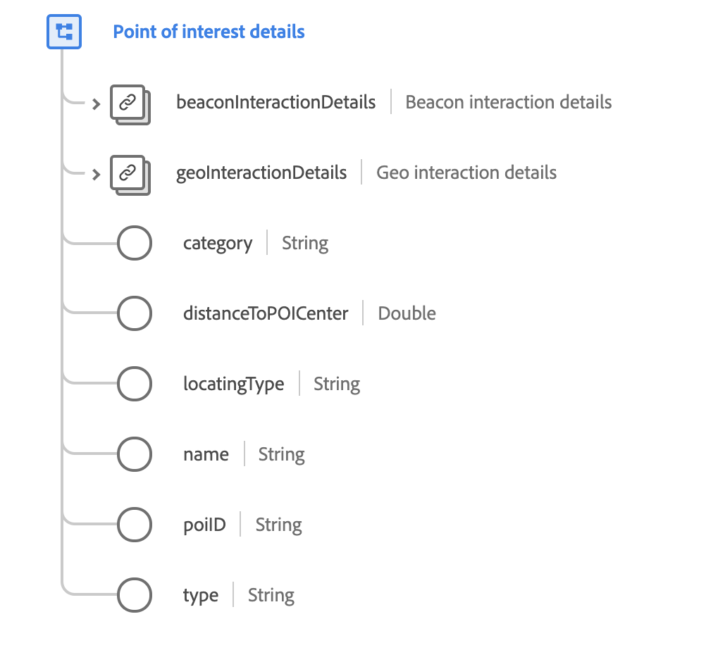

# [!UICONTROL 興趣點詳細資料]資料型別

[!UICONTROL 興趣點詳細資料]是標準的XDM資料型別，可描述發生事件的地理相關資料。

{width=550}

| 屬性 | 資料類型 | 說明 |
| --- | --- | --- |
| `beaconInteractionDetails` | [[!UICONTROL 信標]](./beacon.md) | 說明適用於POI互動的信標詳細資訊。 |
| `geoInteractionDetails` | [[!UICONTROL 地理互動詳細資料]](./geo-interaction-details.md) | 說明適用於POI互動的地理位置細節。 |
| `category` | 字串 | 指派以供POI定義的系統管理員組織POI的一般類別。 |
| `distanceToPOICenter` | 雙精度 | 和POI中心的預估距離（公尺）。 |
| `locatingType` | 字串 | 用來判斷位置的機制。 接受的值包括： <ul><li>`beacon`</li><li>`gps`</li><li>`ip`</li><li>`ip+wifi`</li><li>`wifi-triangulation`</li></ul> |
| `name` | 字串 | 指定給POI的名稱。 |
| `poiID` | 字串 | POI的唯一識別碼。 |
| `type` | 字串 | 使用 POI 定義的系統管理員所選取的輸入結構描述的 POI 一般類型。 |

{style="table-layout:auto"}

如需資料型別的詳細資訊，請參閱公用XDM存放庫：

* [已填入範例](https://github.com/adobe/xdm/blob/master/components/datatypes/poi-detail.example.1.json)
* [完整結構描述](https://github.com/adobe/xdm/blob/master/components/datatypes/poi-detail.schema.json)
