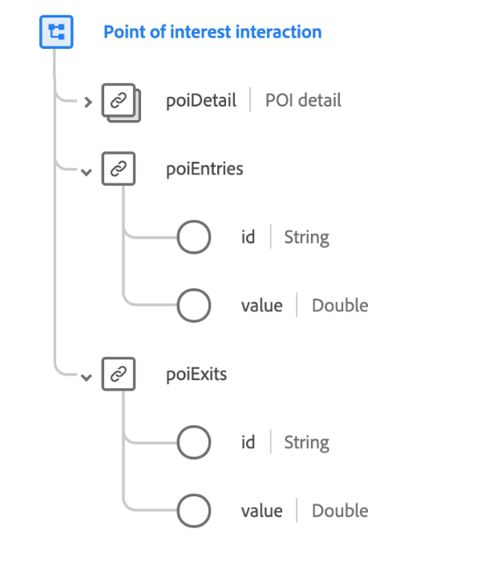

# [!UICONTROL 興趣點互動資] 料類型

[!UICONTROL 興趣點互] 動是標準的XDM資料類型，可描述在行動裝置在範圍內時，將身分資訊傳送至行動應用程式的無線裝置。

 

| 屬性 | 資料類型 | 說明 |
| --- | --- | --- |
| `poiDetail` | [[!UICONTROL 興趣點詳細資訊]](./poi-details.md) | 說明導致事件的POI的詳細資訊。 |
| `poiEntries` | 物件 | 說明人員輸入POI的次數。 包含兩個屬性： <ul><li>`id`:度量的唯一標識符。</li><li>`value`:度量的可量化值。</li></ul> |
| `poiExits` | 物件 | 說明人員退出POI的次數。 包含兩個屬性： <ul><li>`id`:度量的唯一標識符。</li><li>`value`:度量的可量化值。</li></ul> |

有關資料類型的詳細資訊，請參閱公共XDM儲存庫：

* [填入的範例](https://github.com/adobe/xdm/blob/master/components/datatypes/poi-interaction.example.1.json)
* [完整架構](https://github.com/adobe/xdm/blob/master/components/datatypes/poi-interaction.schema.json)
