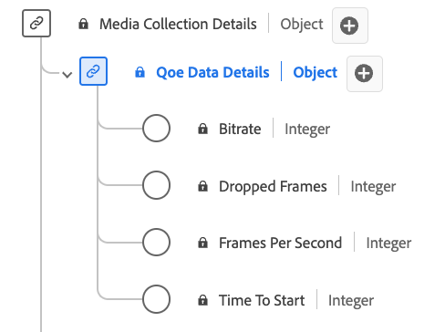

# QoE （體驗品質）資料詳細資料收集資料型別

[!UICONTROL QoE資料詳細資料]集合是標準的體驗資料模型(XDM)資料型別，在媒體播放期間提供與體驗品質(QoE)相關的詳細量度。 使用[!UICONTROL QoE資料詳細資料]集合資料型別來擷取詳細資料，例如位元速率資訊、影格速率、緩衝事件、掉格等。 媒體收集欄位會擷取資料，並將其傳送至其他Adobe服務以供進一步處理。 此資料型別可啟用播放品質分析，深入分析串流效能、使用者體驗和播放工作階段期間遇到的潛在問題。

+++選取此項可顯示「QoE資料詳細資料」資料型別。

+++

>[!NOTE]
>
>每個顯示名稱都包含一個連結，可讓您進一步瞭解其音訊和視訊引數。 連結的頁面包含由Adobe、實作值、網路引數、報表和重要考量收集之視訊廣告資料的詳細資訊。

| 顯示名稱 | 屬性 | 資料類型 | 必要 | 說明 |
|-------------------------------------------------------------------------------------------------------------------------------------------------------------------|--------------------------|-----------|-----------|---------------------------------------------------------------------------------------|
| [[!UICONTROL 位元速率]](https://experienceleague.adobe.com/docs/media-analytics/using/implementation/variables/quality-parameters.html?lang=zh-Hant#average-bitrate) | `bitrate` | 整數 | 無 | 位元速率值（以每秒位元組數為單位）。 |
| [[!UICONTROL 掉格]](https://experienceleague.adobe.com/docs/media-analytics/using/implementation/variables/quality-parameters.html?lang=zh-Hant#dropped-frames) | `droppedFrames` | 整數 | 無 | 播放期間掉格的總數。 |
| 每秒[[!UICONTROL 個影格]](https://experienceleague.adobe.com/docs/media-analytics/using/implementation/variables/quality-parameters.html?lang=zh-Hant#frames-per-second) | `framesPerSecond` | 整數 | 無 | 目前的串流影格速率（以每秒的影格數為單位）。 |
| [[!UICONTROL 開始時間]](https://experienceleague.adobe.com/docs/media-analytics/using/implementation/variables/quality-parameters.html?lang=zh-Hant#time-to-start-1) | `timeToStart` | 整數 | 無 | 視訊載入與開始之間的持續時間（以秒為單位）。 |

{style="table-layout:auto"}
