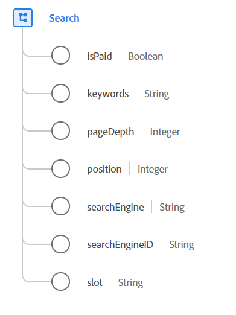

# [!UICONTROL Search] 資料類型

[!UICONTROL Search] 是標準的「體驗資料模型」(XDM)資料類型，包含Web搜尋活動的相關資訊。

 

| 屬性 | 資料類型 | 說明 |
| --- | --- | --- |
| `isPaid` | 布林值 | 用於指出搜尋是否已付費。 |
| `keywords` | 字串 | 搜尋的關鍵字。 |
| `pageDepth` | 整數 | 搜尋結果中的頁面深度。 |
| `position` | 整數 | 清單在搜尋結果頁面中的位置或排名。 |
| `searchEngine` | 字串 | 搜尋所使用的搜尋引擎。 |
| `searchEngineID` | 字串 | 用於識別搜尋引擎的應用程式專用識別碼。 |
| `slot` | 字串 | 顯示搜尋結果之頁面的命名區段。 此屬性的值必須等於您定義的已知枚舉值之一，如`top`、`side`或`bottom`。 |

有關資料類型的詳細資訊，請參閱公共XDM儲存庫：

* [填入的範例](https://github.com/adobe/xdm/blob/master/components/datatypes/search.example.1.json)
* [完整架構](https://github.com/adobe/xdm/blob/master/components/datatypes/search.schema.json)
