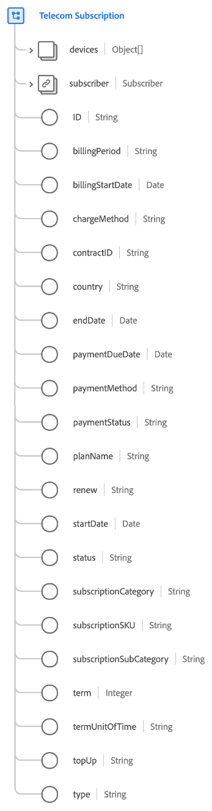
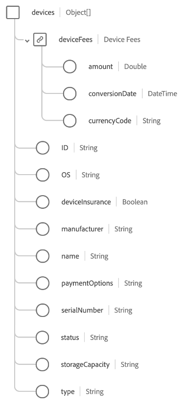

# [!UICONTROL 電信訂閱] 資料型別

[!UICONTROL 電信訂閱] 是標準的體驗資料模型(XDM)資料型別，可說明特定電信訂閱型別的詳細資訊，例如網際網路、行動裝置、媒體或固定電話。

>[!NOTE]
>
>本檔案說明資料型別。 對於相同名稱的欄位群組，請參閱 [[!UICONTROL 電信訂閱] 欄位群組參考指南](../field-groups/profile/telecom-subscription.md).
>
>如果您描述的訂閱型別與電信業無關，請使用一般 [[!UICONTROL 訂閱] 資料型別](./subscription.md) 而非。

| 屬性 | 資料類型 | 說明 |
| --- | --- | --- |
| `devices` | 物件陣列 | 說明與方案相關聯的裝置及/或配件清單。 請參閱 [區段如下](#devices) 以取得每個陣列專案預期結構的詳細資訊。 |
| `subscriber` | [[!UICONTROL 人員]](./person.md) | 說明訂閱的擁有者。 |
| `ID` | 字串 | 適用於訂閱執行個體的唯一識別碼。 |
| `billingPeriod` | 字串 | 計費之間的持續時間。 |
| `billingStartDate` | 日期 | 帳單期間開始的日期。 日期格式（沒有時間）應遵循 [RFC 3339,5.6節](https://tools.ietf.org/html/rfc3339#section-5.6) 標準。 |
| `chargeMethod` | 字串 | 設定開立帳單的方式以向客戶收費。 |
| `contractID` | 字串 | 適用於規範此訂閱之合約的唯一ID。 |
| `country` | 字串 | 訂閱合約和協定條款根源的國家/地區。 |
| `endDate` | 日期 | 目前訂閱期結束的日期。 日期格式（沒有時間）應遵循 [RFC 3339,5.6節](https://tools.ietf.org/html/rfc3339#section-5.6) 標準。 |
| `paymentDueDate` | 日期 | 訂閱付款到期的日期。 日期格式（沒有時間）應遵循 [RFC 3339,5.6節](https://tools.ietf.org/html/rfc3339#section-5.6) 標準。 |
| `paymentMethod` | 字串 | 定期付款的付款方式。 |
| `paymentStatus` | 字串 | 帳戶的付款狀態。 |
| `planName` | 字串 | 適用於此訂閱的可讀取名稱。 |
| `reason` | 字串 | 成員使用訂閱的一般意圖。 |
| `renew` | 字串 | 訂閱在結束日期後可能持續的議定方式。 |
| `startDate` | 日期 | 訂閱開始日期。 日期格式（沒有時間）應遵循 [RFC 3339,5.6節](https://tools.ietf.org/html/rfc3339#section-5.6) 標準。 |
| `status` | 字串 | 訂閱的目前狀態。 |
| `subscriptionCategory` | 字串 | 此類訂閱的主要頂層分類。 |
| `subscriptionSKU` | 字串 | 訂閱的庫存單位(SKU)。 |
| `subscriptionSubCategory` | 字串 | 訂閱的特定子分類。 |
| `term` | 整數 | 訂閱期限的數值。 |
| `termUnitOfTime` | 字串 | 期限期間的時間單位。 |
| `topUp` | 字串 | 說明在計費期間如何重新購買訂閱之可消耗專案的議定條款。 |
| `type` | 字串 | 與訂閱所涵蓋人數相關的權益範圍。 |

{style="table-layout:auto"}

如需資料型別的詳細資訊，請參閱公用XDM存放庫：

* [填入範例](https://github.com/adobe/xdm/blob/master/components/datatypes/industry-verticals/subscription.example.1.json)
* [完整結構描述](https://github.com/adobe/xdm/blob/master/components/datatypes/industry-verticals/subscription.schema.json)

## `devices` {#devices}

`devices` 是一個物件陣列，每個物件都描述與訂閱相關聯的裝置或配件。

| 屬性 | 資料類型 | 說明 |
| --- | --- | --- |
| `deviceFees` | 物件 | 擷取路由器、資料機及接收器等專案之任何裝置費用的物件。 必須是下列屬性：<ul><li>`amount`：貨幣金額，表示為 `currencyCode`.</li><li>`conversionDate`：進行貨幣轉換的日期。</li><li>`currencyCode`：此 [ISO 4217](https://www.iso.org/iso-4217-currency-codes.html) 的貨幣代碼 `amount`.</li></ul> |
| `ID` | 字串 | 裝置的唯一ID。 |
| `OS` | 字串 | 裝置作業系統。 |
| `deviceInsurance` | 字串 | 指出客戶是否已選擇為此裝置投保。 |
| `manufacturer` | 字串 | 裝置製造商。 |
| `name` | 字串 | 裝置的名稱。 |
| `paymentOptions` | 字串 | 指出裝置是分期付款還是以全額零售價付款。 |
| `serialNumber` | 字串 | 裝置序號。 |
| `status` | 字串 | 裝置狀態。 |
| `storageCapacity` | 字串 | 裝置儲存容量。 |
| `type` | 字串 | 裝置型別。 |

{style="table-layout:auto"}
